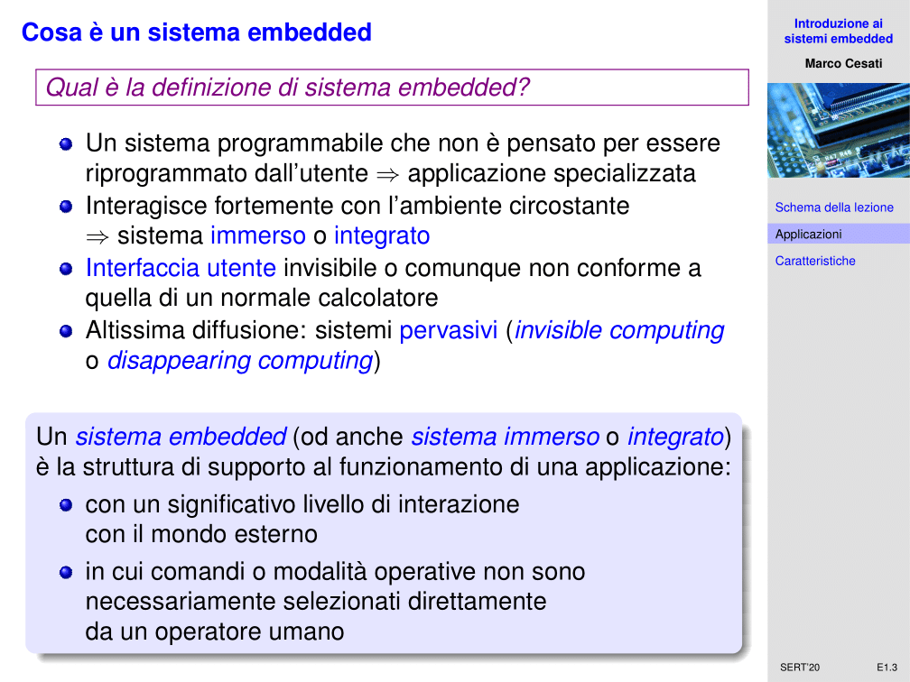
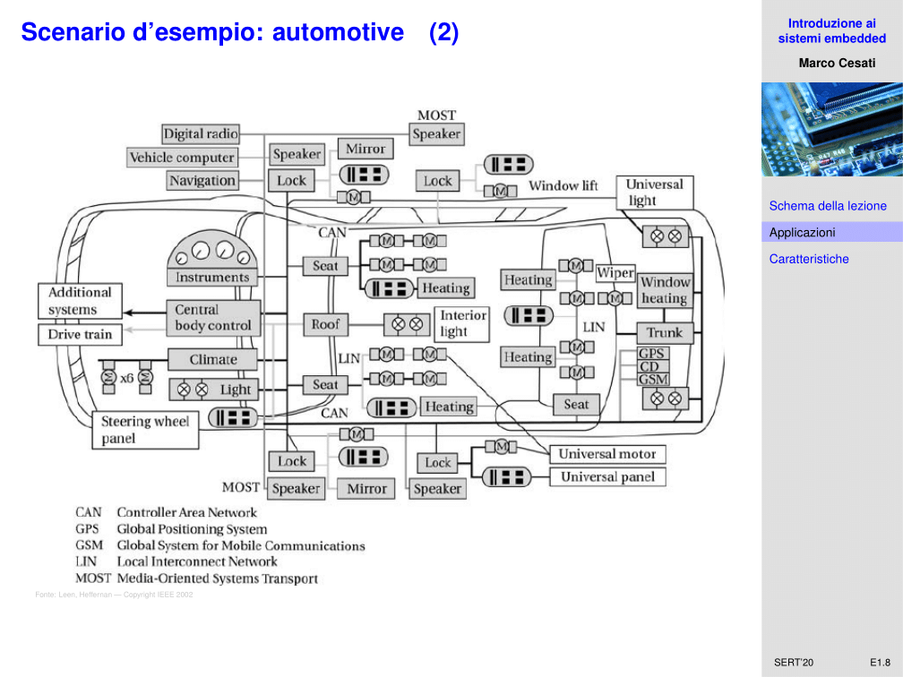
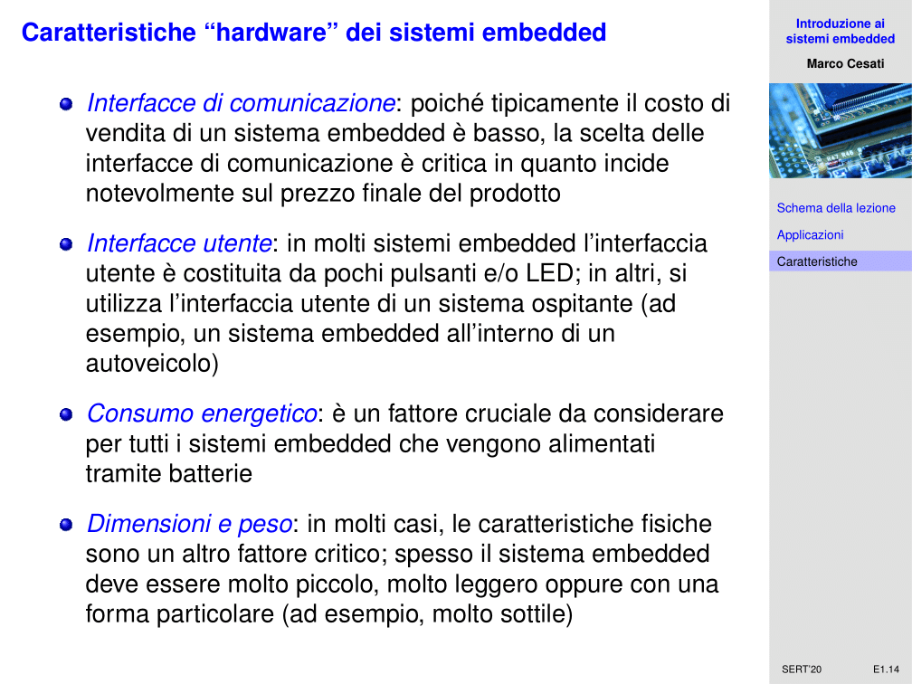

# SERT - 24/09/2020 - Introduzione ai sistemi embedded - E01

In questa oretta che rimane di questa lezione di oggi, cerchiamo di fare una introduzione ai sistemi embedded, cercando di capire cosa sono.

Possiamo partire dando una definizione di sistema embedded. In realtà di risposte se ne possono dare tante. Sintetizzando possiamo dire che un sistema embedded è un sistema programmabile che in relatà però non è pensato per essere riprogrammato dall'utente. E' programmabile, ma non dall'utente finale. Si tratta di un'applicazione specializzata. Fondamentalmente, un sistema embedded è assimilabile ad un calcolatore elettronico, niente altro che una macchina programmabile. Può eseguire un programma, qualunque, e questo programma può essere anche definito dall'utente.

In ogni caso, il programma lo sceglie l'utente. In un sistema embedded invece il sistema è si programmabile ma l'utente finale non sceglie mai il programma. Perché è talmente specifico per il sistema, che non ha proprio senso che lo possa scegliere l'utente. Semplicemente il sistema smetterebbe di funzionare. E' quindi un'applicazione specializzata di un calcolatore elettronico. Un'altra caratteristica che hanno i sistemi embedded è che sono fortemente immersi nell'ambiente circostante. Questo in qualche modo fornisce il nome di sistema embedded. Questa interazione forse con l'ambiente circostante determina molte delle sue caratteristiche. Deve avere chiaramente dei sensori, delle interfacche che permettano di leggere alcune delle caratteristiche in cui è immerso. Un'altra caratteristica è che la sua interfaccia utente è, o invisibile, o se visibile comunque non è conforme a quella di un qualunque calcolatore elettronico. Non c'è una tastiera, un mouse, uno schermo. Possono esserci dei pulsanti, dei LED, un televisore LCD, ma potrebbe anche non esserci nulla di tutto questo.

Potrebbe essere totalmente invisibile all'utente. E quindi un'altra grossa differenza tra un sistema embedded ed un calcolatore elettronico è l'interfaccia utente. Un'altra caratteristica dei sistemi embedded è che sono dei sistemi pervasivi. Si parla di *invisible computing o disappearing computing*. Fondamentalmente stiamo dicendo che ce ne sono una quantità enorme e tendono a scomparire nell'ambiente. Non ci facciamo più caso che ci sono, ma semplicemente funzionano, senza che l'utente debba prestare attenzione. Questo è differente, tipicamente, dall'uso che si fa di un calcolatore elettronico. Quindi, sintetizzando, un sistema embedded è la struttura di supporto al funzionamento di una certa applicazione che ha un significativo livello di interazione con il mondo esterno, ma in cui comandi e modalità operative non sono selezionati direttamente da un operatore umano. Possono essere semplicemente al di là del controllo di un operatore umano. Ma sono sistemi programmabili, sono calcolatori elettronici. Qualcuno deve scrivere il programma di questi sistemi. Hanno un software all'interno

Qual'è la diffusione dei sistemi embedded? In realtà, probabilmente la stima che possiamo dare è una stima in difetto. I dispositivi programmabili presenti nell'ambiente circostante sono molti più di quelli che ci aspettiamo. Davanti a noi magari stiamo fruendo tramite un calcolatore elettronico, laptop o telefono cellulare. Ciascuno di questi dispositivi non ha un solo processore, ma ne ha decine. A parte i core della CPU, ci sono decine e decine di microprocessori secondari, specializzati, sistemi embedded. La tastiera del calcolatore ha un sistema embedded, che svolge un ruolo specializzato. Il monitor LCD che abbiamo davanti, ha un processore specializzato. E' un microcontrollore che svolge una serie di istruzioni macchina, per farlo appunto in modo specializzato. Ce ne sono veramente decine. Un telefono cellulare, oltre alla CPU, contiene diversi controllori, uno dedicato alla comunicazione tramite rete cellulare, controllo del touchscreen ecc. Questo solo per parlare di dispositivi di calcolo "ufficiali", cioè quelli che riconosciamo come calcolatori elettronici. Ma ce ne sono poi molti altri. Se abbiamo al polso un orologio digitale, questo contiene microprocessori. Se abbiamo una chiavetta di memoria, quella contiene un microcontrollore, sempre sistema embedded che esegue un programma. Le statistiche dell'ufficio mondiale del commercio dicono che oggi tra il 98 ed il 99 percento dei dispositivi programmabili sono embedded. 

Attualmente, ci sono circa 1.5 miliardi di dispositivi tablet. Circa 2 miliardi di personal computer, 5 miliardi di cellulari. Ma la stima prudente sui sistemi embedded è che siano dai 75 ai 100 miliardi, un numero enorme. Per ciascun tipo di sistema embedded in uso, qualcuno ha dovuto scrivere il software che questo sistema fa girare. Non sono ad oggi gli ingegneri informatici a scrivere il software dei sistemi embedded, che per la maggior parte è scritto dagli ingegneri elettronici. Questo crea grossi problemi perché fondamentalmente un ingegnere elettronico è specializzato nell'hardware. Questa è la vera motivazione del perché è necessario in un corso di laurea in ingegneria informatica parlare anche di come si sviluppano i sistemi embedded dal punto di vista del software.

Dove vengono maggiormente utilizzati i sistemi embedded? In realtà esce fuori che la maggior parte dei sistemi embedded sono impiegati nel settore delle automobili, ma anche nel sistema delle aviazioni. Circa la metà del costo di un aeroplano è dovuto al costo dei sistemi embedded. E si stima che l'85% di questo costo è dovuto allo sviluppo del software. Un altro campo in cui sono molto diffusi è l'automazione industriale. Un altro settore in cui sono molto diffusi sono le telecomunicazioni. In realtà sono calcolatori elettronici ottimizzati per la trasmissione dei dati. Inoltre, elettronica di consumo e domotica. Infine, molti sistemi embedded trovano applicazione nel campo della salute e degli apparati medicali. In ogni apparecchio elettronico complesso, oggi, è presente un sistema embedded. Sulla motivazione di questo ci torneremo, ma fondamentalmente oggi progettare un dispositivo elettronico sofisticato è diventato così difficile che si cerca di risparmiare in qualche modo implementando un sistema di calcolo programmabile e poi lasciando il problema di risolvere il compito specifico che deve fare quell'apparato al software. E quindi i sistemi embedded si diffondono sempre di più.

Lasciare lo sviluppo, lasciare il nucleo della funzionalità dell'apparecchio al software invece che all'hardware permette di risparmiare nei costi di produzione che nei costi di sviluppo. E quindi, è una tendenza che ha sempre più piede.

Proviamo ad approfondire questo discorso nel caso del settore automobilistico, quello che fa uso del maggior numero possibile di sistemi embedded. Una volta, tutte le automobili erano costruite con una serie di comandi meccanini ed idraulici. Mano a mano tutti questi sistemi vengono sostituiti con sistemi elettrici. Si è assistito ad un certo punto allo sviluppo di automobili in cui fondamentalmente c'erano centinaia di centraline di controllo, ECU. Queste centraline di controllo, ciascuna faceva un singolo compito, come preoccuparsi del controllo di una valvola. Tutte erano collegate tra di loro. Ma il problema è che queste centraline di controllo erano distribuite su tutto il veicolo, e per collegarle tra di loro bisognava utilizzare dei fasci di cavi, tantissimi cavi. I cavi erano pesanti decine e decine di Kg. Gran parte del peso dell'autonobile era dovuto ai fasci di cavi che portavano i segnali alle varie centraline. C'è stata quindi una rivoluzione, quella di sostituire questa fascia di cavi con una rete interna.

Fondamentalmente oggi un automobile non è un altro che una rete di calcolatori. Ovviamente è costruita con particolari criteri, perché l'ambiente di un automobile è un ambiente ostile. Quando devo portare dei pacchetti di rete vicino ad un motore a scoppio ci sono delle interferenze elettromagnetiche molto forti, dei problemi da superare, temperature molto alte. Le reti non sono le stesse che utilizziamo noi nei calcolatori, ma sono comunque reti a pacchetti che permettono di collegare questi ECU, sistemi embedded all'interno dell'automobile. Quest'automobile moderna, sempre più è simile ad una rete di calcolatori che noi conosciamo. Per inciso, ovviamente questa applicazione particolare richiede delle particolari proprietà. Non si può prescindere dal controllare un pacchetto quando parte arrivi in un pacchetto preciso, in quanto potrebbe esserci un servizio critico per la sicurezza delle persone a bordo collegato a quella trasmissione. Quindi ci sono stringenti criteri della qualità del servizio che questi criteri devono offrire. E qui andiamo a toccare il problema dei sistemi real-time, che affronteremo nella prossima lezione. Già iniziamo ad intuire che queste cose non sono completamente scorrelate. Oggi, le automobili moderne racchiudono in se una quantità di centraline elettroniche enorme.

Oggi, se considero un automobile moderna di fascia media, questa automobile possiede una 60ina di microcontrollori. Se vado a mettere insieme il numero di linee di codice di ciascuno di questi microcontrollori, arrivo a 10 milioni di righe di codice. Quando mi sposto su un automobile di fascia alta, questa possiede oltre 100 microcontrollori, ed il numero di linee di codice sale oltre 100 milioni di linee. Un Boeing 787 ha circa 14 milioni di linee di codice. Sono a tutti gli effetti calcolatori elettronici.

Nel 2015, due ricercatori hanno fatto una dimostrazione abbastanza preoccupante, ed hanno attaccato i sistemi elettronici, le ECU, all'interno di un autonobile di fascia alta. Era un FCA. Hanno fondamentalmente preso il controllo dell'automobile a distanza. Uno dei ricercatori era dentro l'automobile e stava in un altro stato. L'altro ricercatore, a distanza, è riuscito a prendere il controllo dei sistemi dell'auto. Come hanno fatto? Questi computer dietro all'automobile sono sistemi programmabili. Usano protocolli come i nostri. Nel momento in cui questi protocolli hanno vulnerabilità ed accesso dall'esterno, come tendenza attuale. In realtà quindi, tutto questo per dire che c'è tanto da lavorare, anche nel settore sicurezza, per questi sistemi embedded.

I sistemi embedded sono calcolatori elettronici, però sono calcolatori elettronici pensati, sviluppati, per scopi particolari. La differenza tra gli uni e gli altri è nel come sono costruiti. Un calcolatore elettronico lo progetto per essere versatile, cioè lo devo far funzionare nel più ampio possibile ambito. Deve poter eseguire il maggior numero possibile di applicazioni. E quindi, gli do quanta più potenza e memoria possibile, perché lo preparo a poter fare qualunque cosa, avendo una certa soglia di costo configurata. Per quel costo, cerco di dare il meglio. Non è così per i sistemi embedded. Questi ultimi sono pensati per svolgere un singolo compito, oppure una classe molto ristretta. Un sistema embedded può essere dedicato a far funzionare il circuito dei freni dell'automobile. Non è necessario dedicargli grande potenza di calcolo, deve fare soltanto quello e molto bene. Deve essere in qualche modo per fare al meglio quel lavoro. Questo permette di ottimizzare prezzo e prestazioni.

I calcolatori elettronici tradizionali tendono a seguire standard ed architetture di riferimento. Viceversa, per ogni sistema embedded abbiamo scelte progettuali radicalmente differenti. Ci si sta arrivando alla standardizzazione, ma molto lunga e difficile.

Quali sono le funzioni tipiche dei sistemi embedded? Innanzitutto la capacità di elaborazione. Quanti calcoli devo fare? Ogni sistema embedded è un sistema che vive interagendo con dei segnali che vengono dal mondo esterno. Quanta potenza serve? Questo è un criterio, una funzione tipica del sistema. Un altro criterio è la capacità di comunicazione. Quanto velocemente devo riuscire a trasferire i segnali, informazione, da e verso il mondo esterno, ed anche all'interno del sistema stesso? Infine, la terza capacità da tenere in mente, è la capacità di memorizzazione. Quante informazioni devo preservare nel tempo all'interno del sistema embedded. Oltre a queste funzioni tipiche, ce ne sono molte altre specifiche dei sistemi embedded. Quello che c'è da sottolineare è che ciascuna singola applicazione del sistema embedded comporta diverse richieste, esigenze, per queste capacità. Anche lo stesso componente da luogo a diverse esigenze. Prendiamo un sensore CCD, che riesce a leggere ed acquisire i fotoni e tramutarli in segnali elettrici che vengono amplificati fino a costruire un'immagine digitale. Ma questo sensore posso usarlo dentro ad una macchina digitale, dentro ad un telefono cellulare, dentro ad una videocamera digitale, una webcam. E' sempre lo stesso componente. Ciascuna di questa incarnazione di questo componente, da luogo a diverse esigenze, di elaborazione, capacità di memorizzazione e comunicazione. Non basta dire che deve avere la capacità di acquisire immagini, ma anche perché deve farlo e come si inserisce questa funzionalità all'interno della funzionalità generale del sistema. Ogni sistema embedded è una storia a se.

Altre caratteristiche del sistema embedded, che si riflettono meno sul software, come il costo finale. Il costo finale del prodotto e del sistema, sono parametri importantissimi. Dovendo stare dentro ad un determinato budget, devo ridimensionare le mie pretese. Altra caratteristica estremamente importante è il time to market. Non tutte le scelte tecnologiche sono adeguate, perché ad esempio bisogna guardare anche questi aspetti. Altro fattore essenziale è il tempo di vita. Una cosa è che io costruisco un sistema embedded che deve durare poche ore, giorni o settimane. Ma anche anni e decenni. Il volume, inteso come quanti pezzi penso di dover produrre di questo sistema. Ne devo prendere 1, 10, 100, 1 milione? Sono in qualche modo legati alle capacità di recupero delle spese che sostengo per sviluppare il progetto. Per ogni pezzo che vendo, ho un ricavo. Questo ricavo in realtà deve andare a coprire le spese di produzione e progetto. Ovviamente il volume atteso è un parametro importante, che dice quanto mi posso permettere nella fase di progetto.

Poi ci sono delle caratteristiche che sono tipicamente dell'hardware. Alcune di queste del software riflettono anche sull'hardware. Che interfacce di comunicazione devono avere? Porta seriale, led, interfaccia LCD? Tutto questo incide sul prezzo finale del prodotto. Che interfacce utente deve avere? Molti sistemi embedded non hanno interfacce utente. Pensiamo alle automobili. Se abbiamo un'autoradio mediamente sofisticata, questa ha uno schermo. Se apriamo la portiera o partiamo senza cintura allacciata, è possibile che il produttore abbia dirottato il messaggio di allarme direttamente sullo schermo dell'autoradio. Non ha solo interfaccia utente per autoradio, ma anche per altri sistemi embedded nascosti. Tutte queste sono scelte di progetto. Un altro parametro importantissimo è il consumo energetico. Quanto deve durare la batteria, se devo andare a batteria? 

Questo ovviamente è un fattore legato a tutti gli altri. Uso batterie di migliore qualità? Alzo il prezzo. Voglio aumentare la durata delle batterie? Abbasso le capacità di calcolo perché queste ovviamente incidono molto sul consumo energetico. Un altro aspetto legato al consumo energetico è la capacità di dissipare calore. Cioè quanto calore si può dissipare da questo dispositivo. Se il dispositivo è molto piccolo tipicamente c'è un problema nel dissipare il calore accumulato nei circuiti elettronici. Pensiamo per esempio se questo dispositivo è dentro ad una pace-maker di un paziente. Non va bene che questa persona abbia al suo interno un componente che dissipa calore così tanto da aumentarne la temperatura. Ci sono dei fatto importanti da considerare, anche per il consumo energetico.

Dimensioni e peso, dimensioni fisiche, il peso fisico. Alle volte i sistemi embedded devono avere una forma particolare, devono essere molto sottili oppure devono essere estremamente resistenti ai traumi fisici, alle cadute, alle accelerazioni e così via. Tutto questo ovviamente incide sul progetto del sistema.

Come vi dicevo, capacità di calcolo, comunicazione e memorizzazione sono tipiche funzionalità del software. La cosa da sottolineare è che devono essere in qualche modo adeguate alla funzione del sistema. Non posso mettere capacità in più a cuor leggero. Lo faccio quando posso permettermi in rapporto al costo, non solo economico, della capacità in più. Allora posso anche fare in modo di progettare un sistema con un po più di capacità di calcolo. Ma purché questo sia fondamentalmente una scelta che non incide pesantemente sul resto dei parametri che abbiamo visto, altrimenti il gioco non vale la candela. Perché il nostro sistema deve fare una cosa sola, quella. Se ho deciso che la riesco a fare con quelle capacità, in prospettiva non ha molto senso mettere capacità in più se sopratutto queste costano. 

Un'altra caratteristica software del sistema è la dimensione del codice. Sono sistemi di calcolo, calcolatori elettronici specializzati. Quindi, devono avere del software a bordo. Le capacità di memorizzazione sono abbastanza limitate, quindi la quantità di linee di codice di ciascun sistema non è enorme, ma comunque è codice che va scritto. E quando lo metto assieme dei tutti sistemi embedded abbiamo visto che il numero di linee di codice può diventare estremamente importante.

E poi ci sono una serie di requisiti del software che sono quelli legati alla qualità del servizio. Molte applicazioni su sistemi embedded hanno dei requisiti di QoS molto stringenti. In particolare, molte applicazioni richiedono servizi in tempo reale. Che vuol dire un servizio in tempo reale? Vuol dire che non soltanto il sistema embedded deve gestire un evento che viene dal mondo esterno nella maniera giusta, ma deve anche adottare questa azione entro dei limiti temporali estremamente rigidi. Non farlo, significa far causare il malfunzionamento di quel sistema o dell'intero apparato. Questo ovviamente è qualcosa che non deve succedere. Tipico esempio: se abbiamo un sistema embedded che controlla i freni dell'automobile, quando la centrale di controllo avvisa che bisogna agire sui freni perché c'è la necessità di frenare la macchina, no è che questo sistema può prendere un tempo arbitrariamente lungo per processare l'evento ed azionare il freno fisicamente. Ha dei vincoli di tempo rigidi da rispettare, altrimenti si corre il rischio di costruire il sistema che funziona male, una macchina che non frena in tempo in questo caso. Ci sono stati esempi di macchine ceh non frenavano in tempo. Un caso curioso è stato in America, diversi anni fa. Si riscontrava che dovunque ci fossero dei posti di blocco, in un certo stato americano, in alcuni casi le macchine cercavano di frenare perché vedevano il posto di blocco ma la macchina alla fine non frenava più. E ci sono stati anche degli incidenti. Proprio davanti ai posti di blocco della polizia, le macchine sbandavano ed andavano a sbattere. Hanno aperto un'inchiesta e si è verificato che la banda di frequenza della radio della polizia, in quel particolare stato, interferiva con il funzionamento di un sistema embedded dedicato al circuito frenante della macchina.

Non sono cose fuori dal mondo. Tutto questo, cioè fallire nel progettare come si deve, sia l'hardware ma anche il software di un sistema embedded, causa grandi, enormi problemi. Anche alla sicurezza pubblica, anche alla sicurezza delle persone. L'ultimo aspetto che vediamo, molti sistemi embedded oggi hanno la capacità di aggiornare il proprio software, il proprio programma in esecuzione. Spesso nei sistemi embedded è utile includere la funzionalità di aggiornamento del software. Perchè? Se c'è un problema da parte del produttore, del costruttore, per lui è molto più semplice permettere l'aggiornamento del software, piuttosto che ritirare il prodotto, sostituirlo con un altro, oppure ritirare il prodotto, effettuare un costoso aggiornamento, sostituendo per esempio il chipset ceh contiene il software. Per lui è molto più semplice dire di usare una procedura per l'aggiornamento del software. Ha risolto il problema di riparare un guasto, senza i costi dovuti al recupero dei pezzi fisici ed alla rispedizione all'utente finale. E quindi la capacità di aggiornare il programma di un sistema embedded è molto importante.

Oltre ai parametri legati al mercato, all'hardware ed al software, ci sono anche dei parametri legati all'affidabilità di questi sistemi. I sistemi embedded spesso devono essere dependable. E' una parola di difficile traduzione. Fondamentalmente dobbiamo far conto che siano disponibili questi sistemi embedded. Il fatto che siano disponibili dipende da tante cose. Per esempio dipende da quanto i sistemi sono affidabili. Bisogna avere una valutazione realistica della probabilità che un certo sistema si guasti. Questa probabilità non è mai 0. Ogni sistema che costruiamo può guastarsi, però dobbiamo avere una valutazione realistica di questa probabilità.

Poi c'è la manutenibilità. Questa è la probabilità che nel caso in cui il sistema si guasti, questo sistema lo posso riparare o sostituire entro un certo tempo. Affidabilità e manutenibilità insieme concorrono a costruire quella che è una misura di disponibilità. Cioè la probabilità che il sistema sia in un istante funzionante. Cioè che il sistema non sia rotto, e nel caso in cui lo sia, non sia in riparazione. Quindi fondamentalmente l'affidabilità e la manutenibilità sono degli indici che concorrono a creare un indice chiamat disponibilità del sistema, la probabilità che il sistema sia funzionante. Ovviamente non è 1 il valore, perché c'è sempre la probabilità che un sistema si rompa, ma io voglio che questa disponibilità sia il più alta possibile.

Un'altra proprietà importante da considerare è la safety. In italiano diremmo sicurezza, è la proprietà legata alla possibilità che un uso incorretto dell'utente nel senso di buonafede, o un guasto del sistema, provochino danni a persone o cose. Per esempio, quando io ho un forno a microonde, devo costruire questo forno in modo tale che se l'utente apre lo sportello mentre il forno a microonde è ancora in funzione, ci deve essere un circuito che interrompe l'interruzione di micro onde, in quanto altrimenti diventano un rischio per l'utente. Ci deve essere un sistema di sicurezza. Se non c'è è un prodotto pericoloso. Questo è legato alla safety del sistema, alla possibilità che questo sistema possa arrecare danni alle persone ed alle cose. 

Poi c'è la security, la sicurezza. In realtà in italiano si traduce sempre con sicurezza, ma è un termine ambiguo, in quanto può essere simile a safety. E' la capacità del sistema di resistere ad usi non autorizzati o anche non preventivati in fase di progetto. Ad esempio, sicurezza potrebbe essere banalmente, non voglio che il mio calcolare venga usato quando non ci sono o senza il mio permesso. Potrebbe anche essere, se costruisco per esempio un lettore di CD-ROM, questo lettore ha all'interno un laser, di una certa potenza. Io non voglio che l'utente smonti facilmente questo laser e lo utilizzi in un altro circuito. Perché non voglio farlo? Perché il laser è un dispositivo pericoloso, e quindi io voglio evitare che questo prodotto che ho, possa essere usato in una modalità pericolosa che io non ho previsto. Questo è un aspetto di security.

Abbiamo fatto una carrellata su quelli che sono i sistemi embedded. E' un mondo a se stante. E' quantomeno doveroso che almeno in un corso di laurea magistrale, qualcosa si dica di questi sistemi. Ci si ponga il problema dello sviluppo del software per questi sistemi. E' un'attività che finora è stata fatta principalmente dagli ingegneri elettronici, da chi progettava l'hardware. Oggi è vitale che il compito dello sviluppo del software dei sistemi embedded sia affidato a chi ha realmente le competenze per costruire sistemi sicuri ed affidabili dal punto di vista del software, cioè gli ingegneri informatici. Questo è il senso anche di questa parte di programma di questo corso.