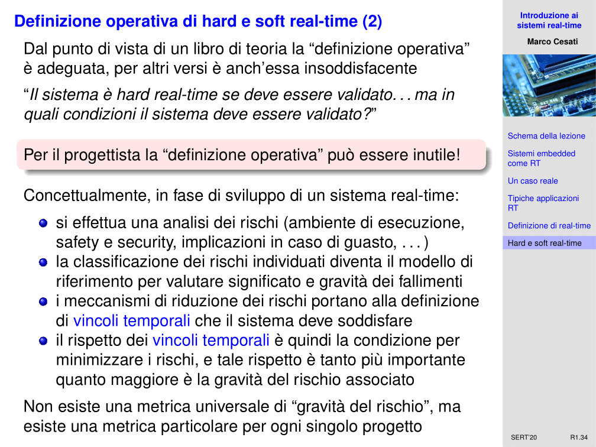

# SERT - 25/09/2020 - Introduzione ai sistemi real-time - R01

Di cosa parliamo oggi? Oggi parliamo di sistemi real-time. Abbiamo fatto una lezione introduttiva sui sistemi embedded, e quindi è giunto il momento di parlare dei sistemi real-time e quindi parleremo in particolare dei sistemi embedded e real-time, perché li mettiamo assieme, e cercheremo di capire cosa sono.

Informalmente, cosa è un sistema real-time? Un sistema RT è fondamentalmente un sistema che deve lavorare secondo dei vincoli temporali ben precisi. Non deve violare questi vincoli temporali. Sappiamo che un sistema, in generale, è corretto se ricevuto un certo input, calcola l'uscita output correttamente. In un sistema RT c'è anche la condizione che questo calcolo venga completato entro vincoli temporali precisi. Questa definizione non è propriamente formale ma cercheremo di precisarla meglio. Perché in questo corso parliamo sia di sistemi embedded che di sistemi RT? L'idea qui è che fondamentalmente la maggior parte dei sistemi embedded è anche RT, e la maggior parte dei sistemi RT è anche embedded. Un'altra idea che dovremo sviluppare è che quando viene progettato un sistema embedded, non possiamo ignorare fin dall'inizio il tipo di sistema operativo e di applicazioni che dovremo eseguire. Quindi non ha molto senso trattare in modo diverso i due sistemi, appunto perché nello sviluppo dei sistemi embedded tutto deve essere capito e compreso fin da subito.

Un altro problema è che in particolare questo è vero per sistemi che sono safety critical, ovvero per i sistemi da cui dipende la sicurezza di beni e vite umane. In tutti questi casi, diciamo, non è soltanto una buona prassi progettare assieme hardware e software, ma è qualcosa di richiesto dalle procedure di certificazione di questi dispositivi. Per tutti questi motivi che adesso cerchiamo di approfondire, è di fatto conveniente lavorare insieme. Cioè trattare assieme nello stesso corso i due sistemi. Il motivo più stringente, forse, è che, come vedremo, la teoria della schedulazione real-time studia cosa è possibile ottenere in termini di rispetto dei vincoli temporali di un applicazione, avendo a disposizione risorse di calcolo limitate. Se assumessimo di avere risorse di calcolo infinite, è ovvio che in qualche modo riusciremmo a soddisfare i vincoli temporali. Sarebbe molto più semplice. Il problema però è che questo nei sistemi embedded non si può fare, in quanto pone determinati vincoli anche relativamente alla potenza di calcolo. Non sono dispositivi che hanno una potenza enorme, ma anzi molto limitata. Quindi capire cosa si può fare con questa potenza di calcolo diventa cruciale.

Vediamo comunque un po più in dettaglio questi temi. Abbiamo visto che i sistemi embedded sono sistemi immersi nell'ambiente circostante, quindi in qualche modo interagiscono fortemente con questo ambiente. Quindi hanno il compito di agire rapidamente ai risultati che vengono dall'esterno. Il caso classico, nell'esempio classico, è l'airbag di un automobile. Dietro questo dispositivo c'è effettivamente un sistema embedded. C'è un dispositivo che, collegato ad un sensore, nel momento in cui rileva la rottura dell'accelerometro, in tempi abbastanza rapidi cerca di aprire la valvola che gonfia l'airbag in modo tale che l'essere umano colpisca il cuscino pieno d'aria. Il problema è che questo dispositivo deve lavorare con dei tempi ben precisi. Perché se l'airbag fosse rilasciato in ritardo, succederebbe che, prima il corpo della persona andrebbe a colpire l'abitacolo duro. subito dopo scoppia l'airbag, che quando si apre può essere molto pericoloso. L'apertura avviene ad una velocità tale che in qualche modo i frammenti dell'abitacolo duro possono colpire un'altra volta la testa delle persone e provocare dei danni molto gravi. Questo è un rischio enorme. Il sistema embedded che controlla l'airbag deve rispettare dei vincoli temporali estremamente precisi.

Un altro dei punti che abbiamo toccato era su come viene pensato il software nei sistemi embedded. Abbiamo visto che quando sviluppo un sistema embedded devo tenere in considerazione i parametri fondamentali: economia di scala, mantenimento ecc. Ma in tutto questo, in realtà, significa che non posso sviluppare l'hardware separatamente dal software. Devono essere progettati assieme nel sistema embedded. Di conseguenza, fin da subito bisogna stabilire che tipo di applicazione e quindi che tipo di sistema RT va posto sul sistema embedded. Ha senso considerarli insieme, quantomeno nello stesso corso, in quanto non sono argomenti scorrelati. Vedremo che alla fine i discorsi vanno a confluire. Di fatto, sia che ci sia un sistema operativo, sia che sia bare-metal, il problema di costruire il sistema embedded va considerato sia dal lato hardware che dal lato software insieme. 

A maggior ragione se il sistema embedded è safety critical. Allora quello che risulta è che il processo per convincere qualcuno che il sistema safety critical è veramente sicuro, e può essere adottato, richiede un processo di certificazione del sistema che impone di fare le cose in una certa maniera e quindi di procedere pari passo nello sviluppo hardware e software.

Infine, la teoria della schedulazione real-time, sono una una serie di risultati fatti così: se tu hai un processore che ha una certa potenza di calcolo, ed esegui un certo numero di processi che richiedono uso del processore ed hanno questi vincoli, allora con questo sistema riuscirai certamente le scadenze. 

Questo è il risultato della teoria della schedulazione real-time. Cioè sta cercando di modellare un sistema reale in modo tale da avere una conclusione. Se il modello è accurato, il sistema reale è tale per cui i task avranno comunque la possibilità di completare il loro lavoro rispettando le scadenze temporali date. Ora tutto questo si basa sul fatto di avere un sistema che utilizza un processore con una certa potenza di calcolo. Ma se uno ammettesse di avere un sistema di calcolo più veloce, ovviamente tutti i tempi di esecuzione sarebbero ridotti. E questo aiuterebbe certamente a rispettare le scadenze. Quando questa teoria della schedulazione è stata introdotta, negli anni 70-80, molte critiche erano sull'inutilità della cosa, in quanto basterebbe aumentare la potenza. In realtà non è così, ci sono casi in cui aumentare la potenza di calcolo non aiuta a rispettare le scadenze, anzi. Vedremo dei casi paradossali in cui aumentare la potenza di calcolo, ovvero aumentare il numero dei processori, non aiuta ma anzi peggiora. Inoltre, nei sistemi embedded in particolare questa assunzione non possiamo farla. Non possiamo aumentare la potenza di calcolo all'infinito, ma avremo dei limiti imposti dai vincoli fisici del sistema. Devo mettere questo sistema di calcolo in un volume di 1 centimetro cubo. 

Il problema di capire cosa riesco ad eseguire rispettando le scadenze all'interno di un sistema di calcolo così ridotta, è esattamente il problema che si pone questa teoria. Ha senso quindi considerarli insieme in questo conto. Ci sono diversi motivi per cui ha senso parlare assieme di sistemi embedded e schedulazione RT.

Perché mi serve una teoria formale, analitica, per risolvere questo problema di controllare che tutte le scadenze sono rispettate? Nel '91, siamo in piena prima Guerra del Golfo. L'Iraq invade i paesi confinanti (Iran, Arabia Saudita ecc). Questi paesi ovviamente vengono sostenuti dagli Stati Uniti, mentre l'Iraq, anche se in maniera molto velata, è allineato con il blocco sovietico. Il 25 Febbraio del '91, un missile iracheno Scud è lanciato verso l'Arabia Saudita. Lo Scud è un missile con una testata esplosiva che è montato sopra un vettore derivato da un razzo russo che serviva a mettere in orbita i satelliti. Quindi è un grosso missile, con velocità e gittata molto elevate. Nel '91, viene sperimentato un nuovo tipo di arma da parte degli americani e degli alleati. Questa arma è fondamentalmente la batteria anti-missili Patriot. Sono delle stazioni mobili ed un radar. Queste stazioni fondamentamente controllano con il radar che non ci sia alcun missile in arrivo. Se vedono un missile, lanciano un altro missile più piccolo per intercettare quello che sta viaggiando e distruggerlo. E' la prima volta che veniva usato un sistema del genere, non sapendo se il tutto funzionasse bene o no.

Abbiamo il camion con la stazione, che contiene un computer principale, integrato nel Patriot, che calcola la traiettoria del missile in arrivo, capisce dove dovrebbe stare il missile in futuro, e lancia un altro missile in modo da intercettarlo. Tutto questo richiede dei calcoli complicati e richiede una certa tempistica. Il 25 Febbraio del '91, una batteria di Patriot vedere il missile che sta viaggiando. Che cosa fa? Il radar fa una serie di scansioni, fa un po di calcoli, ed in una successiva scansione si aspetta che il missile si trovi in una specifica posizione. Se il missile si troverà li, nel fratempo ho allineato la batteria di missili, e ne lancerò uno in modo da andarlo ad intercettare in un terzo punto. Il problema è che nel momento in cui la batteria cerca il missile nel punto in cui sarebbe dovuto essere, non trova nulla e la batteria segnala un falso allarme. In realtà il missile c'era, non in quel punto. Il missile colpisce la città, causa vittime e danni. 

Il problema di fondo è: perché il sistema Patriot ha fallito? Rapidamente si capisce perché. Ha fallito perché era presente un bug del software, nel sistema operativo del computer principale del Patriot. Questo bug causava un ritardo sistematico nell'aggiornamento di una certa variabile che conteneva l'orologio di sistema. Ogni minuto, questa variabile perdeva 57 microsecondi. Sembrano niente. Il problema è che l'ultima volta che questa batteria di Patriot aveva fatto un reboot, era stato 100 ore prima. Quindi 100 ore, convertito in minuti e moltiplicato per 57 microsecondi, fa qualcosa come 343 millisecondi di ritardo accumulato dall'orologio di sistema. Quindi fondamentalmente tra il computer principale e del sistema di controllo del radar e lancio missili, c'era un ritardo di 343 millisecondi. Questo ritardo è la causa del problema. In 343 millisecondi un missile Scud fa 687 metri. Quando, quindi, il radar ha cercato il missile in una certa posizione, non lo ha trovato perché stava quasi a 687 metri di distanza. 

Questo è il motivo del perché il sistema è fallito. Questo banale bug del software ha causato 28 morti. A rendere la questione più tragica, gli israeliani avevano scoperto il bug l'11 Febbraio. E l'avevano segnalato agli americani. La casa madre che produceva i Patriot non aveva ancora rilasciato le patch per correggere il bug. Aveva fatto una sola cosa, molto italiana: aveva mandato una specie di circolare a tutti i comandanti delle stazioni Patriot sul campo di battaglia dicendo "ogni tanto fate un reboot". Ogni tanto, per una persona che sta su un campo di battaglia, non ha nessun senso. Mettetevi nei panni di un comandante di una batteria di Patriot. Ogni quanto fare reboot? Il comandante aveva deciso che 100 ore era ancora un tempo tollerabile prima di fare il reboot, e quindi è successo quello che è successo.

L'altra domanda che dobbiamo farci è: ma chi ha costruito quest'arma, avrà fatto dei test prima di metterla sul campo di battaglia? I test sono stati fatti. E tutti i test sono stati fatti con successo. Perché il test non ha trovato il bug? Perché nessuno dei test ha replicato precisamente le condizioni in cui si è trovato quel sistema ad operare ed a fallire, cioè l'ultimo reboot fatto 100 ore prima. Il punto è che spesso noi affidiamo ai sistemi informatici risorse preziose, vite umane. E spesso e volentieri, chiaramente prima di farlo sottoponiamo a test questi sistemi informatici, ma nessun test può essere davvero esaustivo. Nessun test può davvero replicare ogni possibile circostanza. In particolare, uno dei fattori critici di tutti questi test è il fattore tempo. E' per questo che parliamo di sistemi real-time. I test in questi sistemi non sono sufficienti, non possiamo affidarci esclusivamente ai test di funzionamento per escludere che ci siano gravi difetti. I test non possono essere esaustivi. I test vanno fatti ed il più possibile, ma non sono sufficienti. In un sistema RT, i test non sono sufficienti. Dobbiamo essere certi, matematicamente certi, che chi ha progettato il sistema lo ha fatto in maniera corretta e che in nessuna circostanza il software possa avere un bug e fallire. Questo è difficile, ma è in qualche modo necessario. 

Cosa sono, quindi, i sistemi RT? Sono sistemi progettati per operare entro parametri temporali ben definiti. Questi parametri temporali ben definiti sono in qualche modo conosciuti a priori, da chi produce il sistema. Un certo task deve essere completato entro certa scadenza. Se questa cosa non viene rispettata, il sistema non è corretto e fallisce. Prima di dare una definizione rigorosa, proviamo a fare una panoramica su quali sono i tipici ambiti applicativi in cui vengono impiegati i sistemi RT. Ci soffermeremo in particolare su sistemi di controllo digitale, sistemi di controllo ad alto livello, processamento di segnali, basi di dati temporali ed applicazioni multimediali. Sono semplicemente degli esempi di ambiti applicativi.

Cominciamo dai sistemi di controllo digitale. Tutti i sistemi basati su un sistema che legge dei segnali da sensori, calcola una certa legge di controllo, e manda segnali agli attuatori per riportare lo stato del sistema verso lo stato obiettivo, sono in realtà sistemi di controllo digitale. E quindi fondamentalmente si esegue un ciclo senza fine in cui leggo il dato dal sensore, lo converto nella logica digitale, da questo insieme di input capisco lo stato del sistema, lo confronto con lo stato obiettivo che voglio raggiungere, tramite una certa legge di controllo capisco come devo dare dei segnali di uscita agli attuatori che cercano fisicamente di riportare il sistema più vicino allo stato obiettivo. Questo è il classico schema del feedback control loop, visto che dopo tutto ricomincia.

Ci sono feedback control loop a frequenza unica, multi-frequenza. Questo tipo di sistemi funzionano bene se i dati dei sensori sono accurati, se i dati permettono di dare una buona idea dello stato del sistema e se la dinamica del sistema è conosciuta con sufficiente approssimazione. Se queste ipotesi non sono verificate, le cose si complicano parecchio con logiche di controllo molto più sofisticate. 

Quello che preme sottolineare è che tutto questo discorso in realtà, ogni sistema di controllo digitale, effettivamente è un sistema RT. Perché? Ogni volta che io eseguo un iterazione di questo ciclo, in realtà ho dei vincoli ben precisi sui tempi con cui devo compiere ogni passo. Se completare a completare la legge di controllo fosse un task che richiede tanto tempo, e quindi lavoro sui dati vecchi prodotti dai sensori, quando produco un output e lo applico al sistema, sto cercando di pilotare il sistema verso uno stato obiettivo ma partendo uno stato che non è più quello con cui ho calcolato le uscite. Quindi probabilmente sto peggiorando la situazione, in quanto non è più efficace il controllo che sto adottando. Per poter essere efficace, la legge di controllo deve essere calcolata così rapidamente che lo stato del sistema cambia poco da quando leggo i dati a quando applico il valore ai sensori, altrimenti in qualche modo perdo il controllo del sistema. Quindi, vincolo temporale, sistema RT. I sistemi di controllo digitale sono sistemi RT.

Vediamo un esempio. Questo particolare caso, facciamo un esempio particolare per un motivo. Fino a qualche anno fa i sistemi di controllo digitale, basati su feedback control loop, erano il metodo principale con cui si realizzavano sistemi RT. I sistemi RT nascono proprio nell'ambito nei sistemi di controllo digitale. Per spiegare questo fatto, consideriamo l'esempio di un elicottero un po vecchio come concezione, ma reale. Il flight controller è una specie di scatola nera al cui interno è presente un processore. Questo processore deve fare tanti calcoli. Possiamo suddividere tutte le cose che deve fare in task. Questi task vengono ripetuti ciclicamente. C'è ad esempio il task T1 che valida i dati dei sensori. I sensori dicono come sta messo l'elicottero nello spazio. Lo scopo del flight controller è quello di avere un volo stabile. Per poter funzionare deve avere degli input che dicono quale è lo stato attuale dell'elicottero. Quindi questo task valida i dati dei sensori, ed in caso di dati errati riconfigura il sistema. E' un task che viene eseguito ogni 1/180 di secondo.

Poi abbiamo un task T2 che in realtà racchiude diverse sotto-procedure, così dette funzioni avioniche. Il task di per sè viene eseguito ogni 1/180 di secondo, ma ogni volta esegue una funzione differente. Queste funzioni sono:

1. Campiona i controlli del pilota: ciascun controllo del pilota è digitale, come fossero dei joystick. Devono essere campionati, letti, e questa è una sotto-procedura di questo task
2. Esegue normalizzazione dei dati e trasformazione di corrdinate: task di servizio che serve a fare dei calcoli per convertire le varie letture in un formato che può essere usato per le leggi di controllo
3. Aggiorna la posizione del velivolo: c'è una specie di database che contiene lo spazio in cui si muove l'elicottero, e bisogna aggiornare la posizione del velivolo in questo spazio

In alternativa a T2, viene eseguito un task T3 che esegue una di queste tre funzioni di controllo:

1. Calcolo della legge di controllo esterna per pitch (rotazione frontale)
2. Calcolo della legge di controllo esterna per roll (rotazione laterale)
3. Calcolo della legge di controllo esterna per yaw e movimento (posizione del muso e movimento)

Poi abbiamo un altro task, che esegue una delle seguenti funzioni di controllo, ciascuna con frequenza 90 Hz. Queste funzioni non sono indipendenti, ma lavorano sui risultati prodotti da T2 e T3:

1. Calcolo della legge di controllo interna per pitch
2. Calcolo della legge di controllo interna per roll e per il movimento

C'è un altro task, che viene eseguito con una frequenza di 180 Hz, che calcola la legge di controllo interna per lo yaw utilizzando i risultati prodotti da T4. Poi abbiamo il task T6, che fornisce i segnali di output agli attuatori. Ogni ciclo di questo feedback control loop devo dare segnali agli attuatori, sulla base di tutti i calcoli fatti in precedenza. Un ultimo task, T7, esegue dei test interni di consistenza.

La prima domanda è: cosa sono queste leggi di controllo interne ed esterne? Questo controllo di volo è in qualche modo dentro una specie di box che in realtà è un computer, che ha una capacità di calcolo molto limitata. Devo eseguire questo FCL, ogni 1/180 secondi, ma in questo 1/180 di secondo non riesco a fare tutti i calcoli che mi servono. Il processore non ce la fa proprio. In particolare, il calcolo della legge di controllo è troppo lungo. Che trucco usiamo allora? Distinguiamo due leggi di controllo. Distinguiamo leggi di controllo interne, che sono approssimazioni delle leggi di controllo esatte e computazionalmente leggere ed introducono un errore grave, da quelle esterne, che danno risultati esatti ma sono computazionalmente più pesanti permettendo di annullare gli errori.

In realtà per un po accumulo errori, poi però per una volta ogni tanto eseguo una procedura più lunga che azzera gli errori. A regime gli errori si creano, ma ogni tanto rimetto a posto le cose e rendo gli errori tollerabili. Questa è una delle tecniche che si usavano per risolvere il problema della potenza di calcolo quando ho dei requisiti RT. Non posso fare a meno di dare i segnali giusti agli attuatori ogni 1/180 di secondo. La legge di controllo interna per lo yaw viene calcolato con una frequenza di 180 Hz, il doppio per il pitch ed il roll. Qualunque sistema embedded va pensato rispetto all'applicazione che deve risolvere. Ogni sistema embedded è pensato in modo specifico per l'applicazione che deve risolvere.

Vediamo un riassunto di queste procedure che vengono eseguite dal controllore digitale. Il punto è che ogni ciclo non eseguo tutti. Il numero di volte che invoco il job in una sequenza di 6 cicli, da la frequenza di esecuzione del job. Ogni job ha una propria sequenza di esecuzione. In ogni iterazione c'è un numero costante, non superiore a 6, di job. Pensando alle cose in questo modo, il processore pur lavorando al 100%, riesce a fare tutto ciò che si deve fare. Questo era il modo con cui si costruivano i sistemi RT fino a non molti anni fa. Ancora oggi ci sono sistemi RT costruiti con questo approccio, i sistemi più semplici e costruiti attorno ad un FCL particolarmente semplici o con risorse di calcolo particolarmente limitate. Ancora ora tutto questo non è passato di moda, ma diciamo che la tendenza è di avere sistemi embedded con potenze di calcolo superiore. La potenza di calcolo, pur se limitata, non è più un vincolo così penalizzante come lo era 40 anni fa. Quindi possiamo permetterci in molti casi di superare questo schema e di fare sistemi RT con degli algoritmi un po più sofisticati e flessibili.

Un altro ambito di applicazione sono i sistemi di controllo ad alto livello. Genericamente sono sistema gerarchici. L'esempio classico è quello di una sala di terapia intensiva di un ospedale. Ci sono un certo numero di letti, in ciascun letto c'è un paziente. Quali sono i sistemi RT, di controllo, dentro questa sala di terapia intensiva? Possiamo partire dal basso. Sistemi di controllo all'interno dei dispositivi che controllano i parametri vitali del paziente. Questi apparecchi dialogano con dei sistemi di controllo per gli impianti che somministrano ossigeno, medicinali ecc. C'è una gerarchia superiore di sistemi di controllo che in qualche modo ricevono gli ingressi dai sistemi di controllo a basso livello e quindi attuano delle decisioni a livello superiore per cercare di mantenere i parametri vitali adeguati. Dopodiché, accanto a ciascun letto, c'è un altro sistema di controllo generale che fornisce il quadro clinico di ciascun paziente. Può anche lui operare monitorando e controllando i sistemi di controllo di basso livello. E poi c'è una sala di controllo. Se ho 10 letti, non metto 10 persone, una su ciascun letto. Ma ho una o più persone che controllano l'intera sala. Ovviamente questo è un sistema di controllo collegato ai sistemi di controllo di ciascun letto. Se un paziente ha una crisi, scatta un allarme alla sala di controllo. Questi sistemi di controllo ovviamente sono gerarchici e generalmente quelli di livello più basso sono sistemi embedded, mentre quelli di livello più alto computer normali che eseguono particolari funzioni. 

Sono sistemi RT? Se un paziente va in sofferenza, ha una crisi, io debbo essere sicuro che l'allarme arrivi alla sala di controllo entro un tempo ben preciso. Non vuole dire che deve arrivarci in 1 ms, ma vuol dire che quando progetto la sala devo definire dei vincoli temporali stringenti. Il sistema deve garantire che l'operatore possa intervenire entro un tempo prefissato. Se l'operatore non ha l'allarme entro una scadenza ben precisa, vuol dire che il sistema di controllo sta fallendo nel suo compito.

Altro esempio è quello del processamento di segnali. Consideriamo il radar. Come funziona? Punto un antenna in una direzione, lancio un impulso elettromagnetico che deve essere elaborato in tempi ben precisi altrimenti il radar non funziona. Quando lancio l'impulso, lo lancio sapendo esattamente quando lo lancio e la frequenza dell'impulso. Dopodiché commuto l'antenna e la metto in stato di ricezione. Ascolto l'arrivo di eventuali segnali di eco, riflessi da un ostacolo a distanza. Innanzitutto se misuro il tempo che passa da quando mando l'impulso a quando arriva l'eco, sapendo la velocità di trasmissione, posso capire qual'è la distanza dell'ostacolo. In realtà posso capire di più. Perché se misuro la frequenza dell'onda che rimbalza, a causa dell'effetto doppler, riesco a capire la velocità relativa dell'oggetto rispetto a me. Se non c'è spostamento di frequenza, l'oggetto è fermo. Se l'oggetto si sposta con velocità relativa, la frequenza si abbassa o si alza. Il punto qual'è? Dopo aver capito la distanza e la velocità relativa dell'oggetto, i problemi iniziano adesso. Perché il radar ha un database con tutti gli oggetti che ha rivelato nelle scansioni precedenti. Adesso deve fare tutto un lavoro se questo è un nuovo oggetto, o se è un oggetto rivelato precedentemente e magari si è spostato. Questo è un lavoro non banale, e va fatto in tempi rapidi, prima che l'antenna si sposti per scandire un altra sezione di spazio. Se accumulo ritardi, dopo qualche giro il sistema non è più in grado di processare i dati correttamente. Fondamentalmente tutto questo va fatto in tempo reale, prima che l'antenna si muova. Il radar, e quindi tutte le applicazioni che fanno processamento di segnali elettromagnetici, sono sistemi RT.

Vediamo un altro ambito applicativo, le basi di dati temporali. Quale è la differenza tra una base di dati temporale ed una normale? Fondamentalmente in una base di dati tradizionale, la validità dei dati rimane la stessa fino a che il dato non viene cancellato. Il valore del dato non dipende dall'istante in cui è stato inserito, ma l'inserimento stesso rende il dato prezioso. In una base di dati temporale, invece, le cose vanno diversamente. Il valore dei dati è direttamente o inversamente proporzionale al momento in cui il dato è stato inserito nella base di dati. Potrebbe dunque valere molto o poco in base all'inserimento. Tipici esempi sono il controllo del traffico aereo, il controllo di missione di un velivolo, il controllo di un satellite o anche il controllo del mercato finanziario.

Consideriamo il mercato finanziario. E' regolato da grandi basi di dati che in ogni istante memorizzano il valore attuale di ogni titolo. Questo valore viene aggiornato in continuazione, ed il dato è tanto più significativo quanto più il dato è stato aggiornato. Se io ho il valore di un titolo inserito un secondo fa, il valore è abbastanza aggiornato. Se in realtà, invece, il titolo è stato inserito un minuto fa, la validità del dato è molto minore. Se è stato inserito un ora fa, è praticamente nullo. Nelle basi di dati temporali, in realtà si fa un discorso di selezionare i dati in base alla loro freschezza. Di fatto, chi opera sui mercati finanziari, spesso lo fa non tramite agenti umani, ma tramite programmi automatici. Ci sono programmi automatici che guardando all'andamento del valore dei titoli del mercato, decidono quale titolo vendere o comprare. Anzi in realtà ci sono dei programmi che guadagnano usando questo meccanismo: riescono a capire quando un certo titolo sta per cambiare di valore, salire o scendere. Perché correlano l'andamento del titolo con quello di altri titoli vicini a questo. E quindi nel momento in cui sta per fare una fluttuazione nel valore, operano vendendo o acquistando quel titolo in modo tale da poterci guadagnare subito dopo. Per ognuna di queste operazioni si guadagnano pochissimi centesimi, ma il punto è che questi programmi sono operativi in continuazione e svolgono milioni di operazioni, tutte in modo automatico. Di fatto, la grande maggioranza delle transazioni che avvengono sul mercato finanziario sono stimolate da questi programmi. Sono fatte in modo automatico, e vengono costruite macchine specializzate per operare sui mercati in questo modo. Si tratta di macchine RT. Le decisioni vanno prese in ms.

Un altro ambito di applicazione dei sistemi RT sono le applicazioni multimediali. Anche questa è una classe di applicazioni vasta. La tendenza è quella di costruire delle applicazioni software multimediali, e quindi in qualche modo troviamo dei programmi che si interfacciano con il pc e permettono di fruire di una piattaforma di comunicazione digitale. D'altra parte servono comunque degli apparati hardware che permettono di vedere audio e video, come il televisore. Oggi non è altro che un calcolatore elettronico specializzato, con all'interno un sistema embedded. Tutta questa classe di applicazioni, sono applicazioni RT. I flussi audio e video sono flussi estremamente sofisticati. Se fossero semplicemente sequenze di immagini e pacchetti audio in realtà sarebbero ingestibili, e quindi sono compressi con algoritmi altamente sofisticati. Le operazioni sui flussi vanno fatte in tempo utile. Se perdo troppo tempo a decodificare il frame, alla fine potrebbe esserci un ritardo rispetto al sonoro che deve essere in sincrono con il video. Se succede è un problema. Noi ci accorgiamo con molto fastidio quando vediamo uno sfasamento tra la bocca di una persona e la voce, se maggiore di 160 millisecondi. Di fatto, realizzare un'applicazione multimediale significa realizzare un sistema RT. Certamente mancare le scadenze in applicazioni multimediali non è "grave", ma ciò non significa che sia lecito farlo. 

Vediamo di dare delle definizioni un po più formali ed accurate. Un sistema è un associazione tra un insieme di ingressi (input) ed un insieme di ingressi (output). Di fatto, in informatica generalmente gli ingressi sono costituiti dai dati che diamo ai programmi, e le uscite sono i risultati dell'elaborazione. In realtà, la correttezza logica di un applicazione è il corretto risultato per determinati ingressi. Questo si applica anche ai sistemi RT. Un sistema RT è corretto se la correttezza logica non dipende solo da quale risposta da in risposta all'input, ma anche dall'istante temporale da cui è disponibile la risposta. Un applicazione RT è un programma (o insieme di programmi) che ha un insieme di vincoli temporali ben definiti. Un sistema RT tecnicamente è l'insieme di dispositivi hardware e software che permettono l'esecuzione corretta dell'applicazione RT. In questo corso ci concentriamo principalmente su sistemi. Non vediamo come scrivere l'applicazione RT, ma vediamo come un sistema operativo può essere costruito in modo che un'applicazione RT riesca a soddisfare i requisiti che il programmatore richiede. Di fatto, se il sistema RT fa il suo lavoro, scrivere un'applicazione real-time è molto semplice. Se il sistema RT fallisce nel dare le garanzie di predicibilità che l'applicazione si aspetta, diventa impossibile realizzare un sistema capace di rispettare le scadenze. E' molto più importante concentrarsi sulla progettazione di sistemi piuttosto che sulle applicazioni.

Come possiamo suddiviere i sistemi RT esistenti? Si possono categorizzare in diversi modi. Ci sono i sistemi che sono puramente ciclici. Ogni task nel sistema viene eseguito periodicamente, il periodo è fisso. Tipici esempi di questa categoria sono i sistemi di controllo digitale come visto prima. Un controller reale dovrebbe essere un sistema per lo più ciclico. Ci sono la maggior parte dei task che sono ciclici, ma ogni tanto esistono dei task che devono essere comunque gestiti che però non devono così impattare sul rispetto delle scadenze dei task ciclici. Un esempio di questo tipo di sistemi sono i sistemi aviotici. Ci sono i sistemi che sono asincroni ma grossomodo predicibili. Tipico esempio è il radar, sistema che elabora segnali elettromagnetici. Non è detto che si sappia quando arriva un eco del segnale trasmesso, però se arriva si sa quando arriva bene o male. Grossomodo sono predicibili anche se gli eventi sono asincroni. Potremmo fare rientrare in questa categoria anche le applicazioni multimediali, in quanto i flussi di compressione audio e video non sono perfettamente periodici, ma grossomodo possiamo predire i vari elementi della struttura del flusso. Poi ci sono i task asincroni ed impredicibili. Cioè sistemi per cui non si sa quando arriverà un certo task da eseguire. Non si sa nemmeno se arriverà, ma nel momento in cui arriva ci sono dei vincoli temporali estremamente definiti che devono essere rispettati. Pensiamo ad una centrale nucleare ed al suo sistema di controllo per la sicurezza.

Che cos'è un job? E' una unità di lavoro che può essere schedulata ed eseguita da un sistema real-time. E' la singola unità schedulabile nel sistema. Esempio di job sono il processo eseguito da una CPU. All'interno di questo corso i vari termini non hanno lo stesso significato degli altri corsi di ingegneria informatica. Ub Job può essere qualsiasi compito che deve essere portato a termine in un sistema RT, che non è per forza legato ad un processo da eseguire. Per esempio un job potrebbe essere la spedizione di un frame su un canale ethernet. Questo è un job. Farlo richiede un certo tempo, velocità e magari abbiamo una certa scadenza. Un altro job potrebbe essere leggere un file da un dispositivo di memoria di massa. Anche questo è un job. Ad un certo punto, per andare avanti il sistema deve completare questo job.

Diverso dal concetto di job è il concetto di task. Cosa sono? Un task è un insieme di job ceh tutti assieme realizzano una certa funzione nel sistema. Ad esempio possiamo fare aun job che acquisisce valori da alcuni sensori, un altro job che concerte tali valori in modo appropriato ed un altro ancora che aggiorna con questi valori delle opportune strutture dati. Sono dei job che fanno cose differenti ma, in qualche modo, sono correlati tra di loro. C'è una caratteristica fondamentale che caratterizza i job di un task. La regola è che in uno stesso task, un job non può iniziare se prima non è terminato il job che lo precede nel task. Quindi il task può essere visto come una sequenza di job. Ciascun job non può iniziare ad essere eseguito se il job precedente in questo task non è terminato. Ci sono quindi dei vincoli di dipendenza esplicita tra i job del task. 

Cos'è un processore? Un processore non è semplicemente una CPU, ma una componente attiva del sistema RT che è in grado di eseguire un job. E' una CPU se un job è un processo da eseguire, ma potrebbe essere un canale di rete se il job è la spedizione di messaggi o un disco rigido, se il job è l'accesso a file. Quindi processore non vuol dire necessariamente CPU. Astrarre vuol dire in qualche modo modellare il sistema e quindi essere in grado di ragionarci sopra lasciando perdere i dettagli che renderebbero la discussione troppo specifica.

Cosa sono le risorse passive? Le componenti del sistema RT la cui disponibilità è necessaria per l'esecuzione dei job. Questa definizione sembra essere coincidente con quella di processore. Il processore è una componente attiva, mentre la risorsa è una componente passiva. La risposta sta che in un processore, la componente attiva è dotata di una velocità intrinseca. Può essere più o meno buono, ed una CPU migliore esegue i job in un tempo minore. Un canale di rete può essere più o meno veloce. Viceversa, una risorsa è un elemento del sistema in cui la velocità non incide. Cioè è importante che in quel momento il job ce l'ha oppure no, non importa come è fatta. Tipico esempio è un semaforo che permette di gestire l'accesso a risorse condivise. Un altro tipico esempio di risorsa è la memoria. La memoria è generalmente di caratteristiche tali per cui l'unica cosa che conta è che i job abbiano memoria sufficiente per l'esecuzione, non andando ad incidere sui tempi. Anche se questo non è vero, in quanto una memoria veloce permette di concludere il job in un tempo minore, ma il punto è che qui stiamo modellando. Se i tempi di risposta dei job sono di ordini di grandezza tali per cui quella differenza di velocità di memoria è irrilevante, allora la modelliamo come una risorsa passiva. Tutto dipende dal problema in esame.

L'istante di rilascio di un job è l'istante di tempo in cui il job diventa disponibile per l'esecuzione. Attenzione, non vuol dire che viene eseguito. Ad esempio arriva il dato su un sensore, quindi si può eseguire il job che legge i dati da un sensore. Ma questo non vuol dire che lo schedulatore assegni il processore proprio a questo job, potrebbe farlo aspettare. Dal momento in cui arriva un job a quando questo viene eseguito, può passare molto tempo. 

La scadenza di un job è l'istante temporale entro cui il job deve avere completato l'esecuzione. Classico esempio, il docente da agli studenti un progetto da svolgere. Il progetto è il job, con un'istante di rilascio ed una scadenza. Spesso è conveniente ragionare di tempo di risposta di un job, cioè l'intervallo di tempo che passa tra l'istante di rilascio del job e l'istante in cui viene completato. In altri termini, il job rispetta la scadenza se il suo tempo di risposta è minore o uguale della differenza tra la scadenza e l'istante di rilascio. Questo concetto è importante e si chiama scadenza relativa. E' il massimo tempo di risposta ammesso da un job, ed è ovviamente dato dalla differenza della scadenza assoluta a cui sottraiamo l'istante di rilascio.

Terminiamo questa lezione discutendo delle definizioni di sistemi hard e soft RT, che sono definizioni tanto diffuse quanto poco concordate. In realtà, esistono tanti tipi di risposte. Tutte hanno qualche problema. Alcune risposte sono basate su: quanto è tollerabile violare i vincoli temporali di un job? Oppure, quanto è utile completare uun job dopo la scadenza imposta? Oppure ancora, quanto è statisticamente frequente violare i vincoli temporali di un job. Cerchiamo di capire come funzionano queste definizioni e perché nessuna di questa è realmente soddisfacibile.

Una definizione molto diffusa di hard RT è quella per cui si dice: se hai un sistema in cui qualcosa non rispetta i vincoli temporali, allora quel sistema è guasto e questo ultimo è fatale. Se non ci sono queste condizioni, è un sistema soft RT. Pensiamo al sistema che controlla i freni del treno. Se il job non completa entro un certo tempo ben preciso, può succedere che il treno comincia a frenare troppo tardi. Frenare troppo tardi vuol dire esporre al rischio di una catastrofe. Mancare la scadenza è come dire che si è rotto il circuito dei freni del treno. E quindi equipariamo il mancato vincolo della scadenza ad un guasto fatale. Quando questo non avviene, chiamo il sistema soft RT. Quale è il problema di questa definizione? Il limite della definizione è che c'è un criterio soggettivo. Quando un guasto si definisce fatale o non fatale? Su che base facciamo l'asserzione?

Un altra critica forte si può rivolgere all'asserzione secondo cui un sistema è hard RT quando la funzione di utilità di un certo job si abbatte in maniera brusca quando il job arriva in ritardo, oltre la scadenza. Che cosa è la funzione di utilità? Esprime quanto è utile completare il job oltre la scadenza. In realtà posso definire la tardività di un job, il ritardo con cui completa oltre la scadenza. In un job soft RT, l'utilità del job continua a decrescere ma in modo graduale dopo la scadenza, quindi decresce gradualmente in funzione della sua tardività. In un sistema hard RT la funzione di utilità si annulla quando la tardività cresce, o addirittura l'utilità diventa negativa. Cosa si intende per utilità negativa? Ovviamente è quando il sistema si accorge di essere oltre scadenza ha convenienza a non completarlo piuttosto che completarlo in ritardo, come l'esempio della macchina. Pensiamo anche ad un dispositivo, sistema RT, che controlla lo sgancio di una bomba. E' ovvio che c'è una scadenza per portare a termine il task. Se sono oltre la scadenza, vuol dire fondamentalmente che sono in ritardo per sganciare la bomba. Anche sganciassi adesso, la bomba colpirebbe qualcosa che è oltre il bersaglio prefissato. Si tratta comunque di una valutazione soggettiva. Mettiamoci nei panni di chi costruisce la bomba ed i sistemi di sgancio, non c'è mai utilità negativa.

Abbiamo poi un'altra posizione, che dice: parlo di sistemi hard real-time quando dico che un job non deve mai violare il vincolo temporale. Non mi importa di utilità, delle conseguenze. Non mi importa del perché, non deve mai farlo. Se invece può farlo, occasionalmente, con una determinata probabilità o dei parametri, parlo di soft real-time. Questo tipo di posizione in realtà è comunque argomentabile, criticabile. Perchè? Quando vado a fare un discorso ingegneristico, la parola "mai" non esiste. "Mai mancare le scadenze" non è un concetto ingegneristico. Significa associare la probabilità 0 ad un evento, che non è un valore che può esistere nella realtà dei fatti. Supponiamo di avere progettato a regola d'arte il software di un sistema RT, per cui usando tutto ciò che andremo a descrivere nel corso, abbiamo la dimostrazione matematica che i job non mancheranno mai le scadenze. Ma questo significa che ciascun job non mancherà mai la scadenza? No. Abbiamo progettato il software del sistema basandoci su un assunzione, cioè che l'hardware faccia il suo lavoro. I problemi dell'hardware però possono essere molto più sottili. Chi progetta l'hardware deve fare in modo che questa cosa non succeda, però resta il fatto che se io definisco hard real-time come "questo evento non capita mai", questa cosa oggettivamente non potrò mai applicarla. Ci sarà sempre una probabilità che quell'evento si verifichi, per quanta piccola possa essere. In questa classificazione non esistono sistemi hard real-time, ma solamente soft real-time. Quindi anche questo modo di distinguere non sembra modo intelligente. Più che altro è criticabile.

Di fatto, però, ci serve un modo per definire cosa è hard real-time e soft real-time. Noi seguiamo il libro di testo e diciamo che un job è hard RT se è richiesta una validazione che i vincoli temporali di questo job siano rispettati. A quel punto non solo il vincolo, ma anche il job e tutto il sistema diventano hard real-time. Che cosa è una validazione? In una validazione bisogna fare una dimostrazione matematica. Modello il sistema in questo modo ed in questo altro modo, e poi faccio vedere, tramite teoremi matematici, che in nessun caso possibile le sequenze di job che si alternano sul processore possono fallire e mancare la scadenza. Devo dimostrarlo matematicamente. La validazione è una procedura efficiente corretta per dimostrare che i job non mancano le scadenze. Oppure, c'è questa alternativa, dell'evidenza sperimentale ma prodotta da adeguate metodologie di test. Ma questi test devono essere esaustivi. Devono catturare ogni possibile configurazione. In tutti i casi normali è impossibile fare test esaustivi. Fare test esaustivi vuol dire fare test all'infinito. In molti casi, in quasi tutti i casi, l'unico metodo per validare un sistema è fare una dimostrazione formale. Questo non vuol dire che non bisogna fare test, però non bastano. Per validare il sistema serve questa dimostrazione formale.

Il vincolo temporale di un job diventa soft RT se non è richiesta una validazione, o se è sufficiente una dimostrazione che il job soddisfa le proprie scadenze entro precisi limiti statistici.

In realtà anche questa definizione dal punto di vista di un libro è soddisfacente, ma in pratica non molto. Quando è che devo effettuare la validazione? Chi progetta un sistema ha tutta una metodologia di analisi dei rischi, e da questa classificazione dei rischi crea un modello di riferimento per valutare la gravità dei fallimenti. Da questo modello di riferimento deriva una serie di vincoli temporali per minimizzare i rischi che le cose vadano male. Il rispetto dei vincoli temporali diventa la condizione per minimizzare i rischi, e quindi è il rispetto è tanto più importante quanto maggiore è la gravità del rischio associato. Questa metrica è fondamentalmente associata al singolo progetto.