# SERT - 01/10/2020 - Modello di riferimento per i sistemi real-time - R02

Oggi cerchiamo di capire quale sia il modello di riferimento con il quale studieremo i sistemi RT. Possono esistere tantissimi tipi di sistemi RT, ma noi non vogliamo studiarli uno ad uno. Vorremmo definire un modello che ci permetta poi di realizzare questi sistemi e fare in modo che i risulatti teorici che troviamo sul modello possano essere poi applicati a qualunque sistema RT. E' il classico metodo dell'ingegneria. Costruiamo dei risultati sulla base di modelli teorici, e poi cerchiamo di capire come è possibile applicare questi modelli al caso reale in questione.

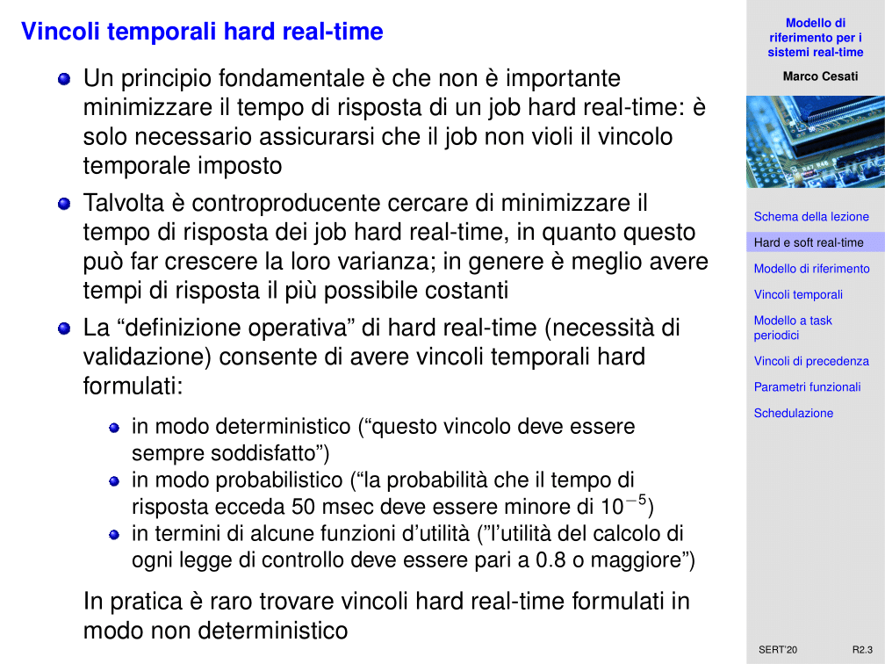

Chiariamo alcuni punti fondamentali per fissare le idee. Quando parliamo di sistemi RT, in particolare di sistemi hard-RT, non dobbiamo pensare di costruire dei sistemi che sono i più rapidi possibili. Questo è un concetto spesso frainteso. I tempi di risposta non devono essere quanto più bassi possibile, ma l'unica discriminante, considerazione, che bisogna fare quando si valuta la correttezza di un sistema RT è il rispetto o meno dei vincoli temporali che il progettista ha definito. Non importa quale sia la misura esatta del vincolo temporale (microsecondi, secondi, minuti ecc.). L'importante è che qualunque cosa succeda quel sistema riuscirà a rispettare il vincolo temporale.

Minimizzare i tempi di risposta non è l'obiettivo. A questo punto potremmo pensare che se progettiamo un sistema per minimizzare i tempi di risposta, automaticamente i vincoli temporali tendono ad essere soddisfatti. Questo tipo di impostazione in realtà non funziona assolutamente. E' valida soltanto quando nel sistema ho un singolo task, un singolo job da portare avanti. Quando ce ne sono più di uno, l'obiettivo di minimizzare i tempi di risposta è in conflitto con il rispetto delle scadenze. Se io tento di minimizzare i tempi di risposta, in questi casi in realtà quello che faccio è inevitabilmente aumentare la varianza, le deviazioni nei tempi di risposta dei job. Questo complica il problema di far rispettare le scadenze. Non voglio che un certo job rispetti la scadenza. Voglio che tutti i job rispettino la scadenza. E questo obiettivo non riesco a conseguirlo se mi limito a pensare di dover semplicemente minimizzare i tempi di risposta. L'unico modo per essere sicuri che tutti i job rispettino le scadenze è progettare un sistema fatto apposta per il rispetto delle scadenze.

In realtà per noi la definizione di hard e soft RT è vincolata al fatto che un certo sistema debba essere o meno certificato da qualcun altro. Questo lascia libero il campo a quale tipo di certificazione si vuole ottenere:

- In modo deterministico ("questo vincolo deve essere sempre soddisfatto")
- In modo probabilistico ("la probabilità che il tempo di risposta ecceda 50 msec deve essere minore di $10^{-5}$)
- In termini di alcune funzioni di utilità ("l'utilità del calcolo di ogni legge d controllo deve essere pari a 0.8 o maggiore")

In pratica è raro trovare vincoli hard real-time formulati in modulo non deterministico. Questa è l'ottica in cui ci muoviamo in questo corso. Diverso il discorso è per i vincoli temporali soft-RT.

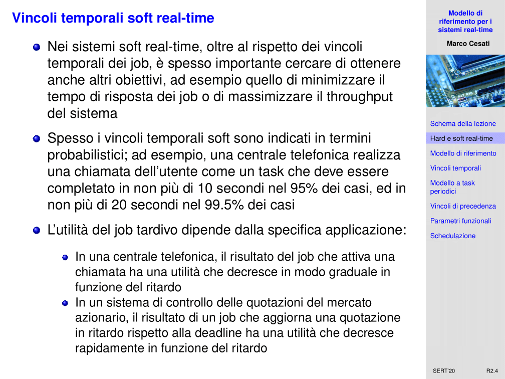

Nel momento in cui parlo di sistemi soft, il rispetto del vincolo temporale non è più così importante, essenziale, per la validità del sistema. L'ente certificatore non guarda più davvero se quel singolo job manca o meno la scadenza, a questo punto posso permettermi di ottimizzare altri parametri. Del tipo, minimizzare i tempi di risposta, oppure massimizzare l'uso delle risorse nel sistema. Quando si parla di vincoli temporali soft-RT guardiamo ad altri parametri. 

Questi vincoli temporali soft-RT possono essere anche in questo caso formulato in termini probabilistici, cosa molto più frequente nel caso dei sistemi hard-RT. Un altro aspetto che possiamo considerare è l'utilità del job quando va oltre la scadenza. Quindi, se parlo della centrale telefonica, l'utilità del job decresce in modo graduale in base al ritardo che accumula; mentre invece quando controllo le quotazioni del mercato azionario, il risultato di un job che arriva in ritardo rispetto alla scadenza, l'utilità decresce molto rapidamente rispetto al ritardo.

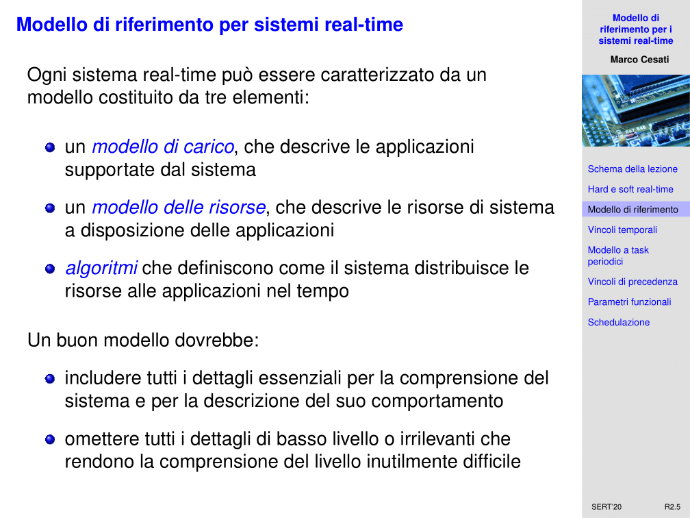

Come costruiamo un modello di riferimento per i sistemi RT? Ogni modello è costituito da tre elementi:

- **Modello di carico:** il modello delle applicazioni che quel sistema deve eseguire
- **Modello delle risorse:** che cosa il sistema mette a disposizione a queste applicazioni perché siano eseguite
- **Algoritmi:** definiscono come le varie risorse del sistema vengono assegnate alle varie applicazioni nel corso del tempo

Questi tre componenti riescono a modellare questo sistema reale. Se descrivo modello del carico, modello delle risorse ed algoritmi, in qualche modo ho catturato la complessità del mio sistema.

Attenzione. In realtà il modello deve essere abbastanza dettagliato da includere tutti gli aspetti che sono essenziali per comprendere il sistema e per la descrizione del comportamento. Ma non dovrebbe nemmeno essere così dettagliato da includere dettagli di livello troppo basso. O comunque dettagli che sono irrilevanti al fine di comprendere se il sistema RT è progettato bene o male. Fondamentalmente un modello con tanti dettagli diventa un modello con tante informazioni difficile da utilizzare. In secondo luogo perché più un modello è semplice, più c'è speranza che il risultato che ottengo possa essere applicato a sistemi RT simili.

Che cosa sono le risorse del sistema? Esistono due tipi di risorse di sistema:

- **Risorse attive:** sono dette anche server o processori. Attenzione, un processore non è una CPU in senso informatico. E' un qualsiasi elemento che possa assicurare l'avanzamento di qualche job
- **Risorse passive:** sono tutto ciò che è necessario nel sistema per far progredire nell'avanzamento i task. Come ad esempio la memoria, il numero di sequenza di un pacchetto, una primitiva di sincronizzazione

A differenze delle risorse passive, la velocità o capacità intrinseca dei *processori* influenza il tempo di esecuzione dei job. Per le risorse passive non è così. Ma se io seguo questo filone di pensiero, non posso dire che il semaforo influenza il tempo di esecuzione di un job? Nel momento in cui la risorsa è assegnata ad un job, allora le caratteristiche intriseche della caratteristiche passive non influenzano il tempo di esecuzione del job. La memoria è una risorsa attiva o passiva? Se veramente abbiamo dei tempi delle scadenze che sono nell'ordine dei microsecondi allora certo, le caratteristiche del chip di memoria influiscono in modo significativo sul tempo di ri-esecuzione tanto da poter rispettare la scadenza oppure no, ed in quel caso modellerò il sistema con la memoria come risorsa attiva. Fondamentalmente possiamo costruire un'approssimazione di un sistema reale in cui la memoria è una risorsa passiva.

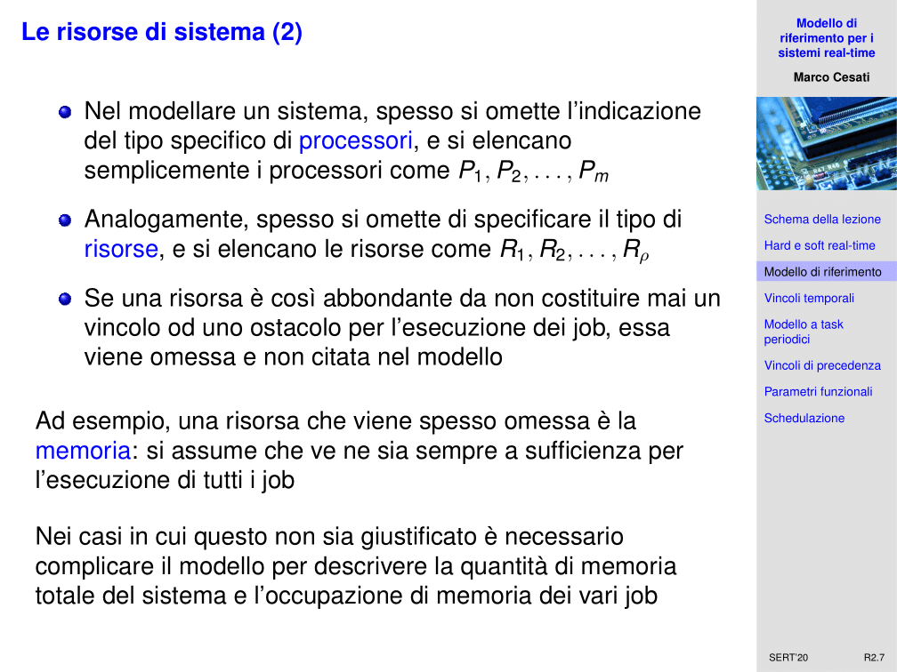

Nel modellare un sistema, spesso si omettono le indicazioni del tipo specifico di processori che sto in qualche modo utilizzando. Parlo di processori, genericamente con $P_1,\ P_2,\ ...,\ P_m$. Analogamento, spesso si omette di specificare il tipo di risorse, e si elencano le risorse come $R_1,\ R_2\, ...,\ R_{\rho}$. Quando la risorsa è così abbondante che la sua disponibilità non è mai un problema, allora non la modello. Quando invece ho un sistema reale in cui anche la disponibilità di memoria può diventare qualcosa che può influire sui tempi di risposta dei job, allora devo modellarla come risorsa (attiva o passiva) del job.

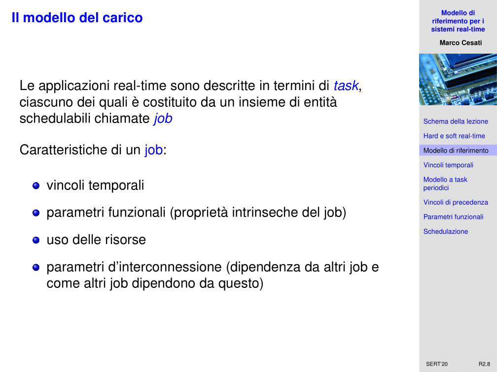

Vediamo come è il modello del carico, ossia il modello delle applicazioni RT che girano sul sistema. Le applicazioni RT sono descritte in termini di task. I task li possiamo definire come dei contenitori di job, entità schedulabili. Quali sono le caratteristiche di un job?

- Vincoli temporali
- Parametri funzionali (proprietà intrisenche dei job)
- Uso delle risorse
- Parametri di interconnessione (dipendenza da altri job e come altri job dipendono da questo)

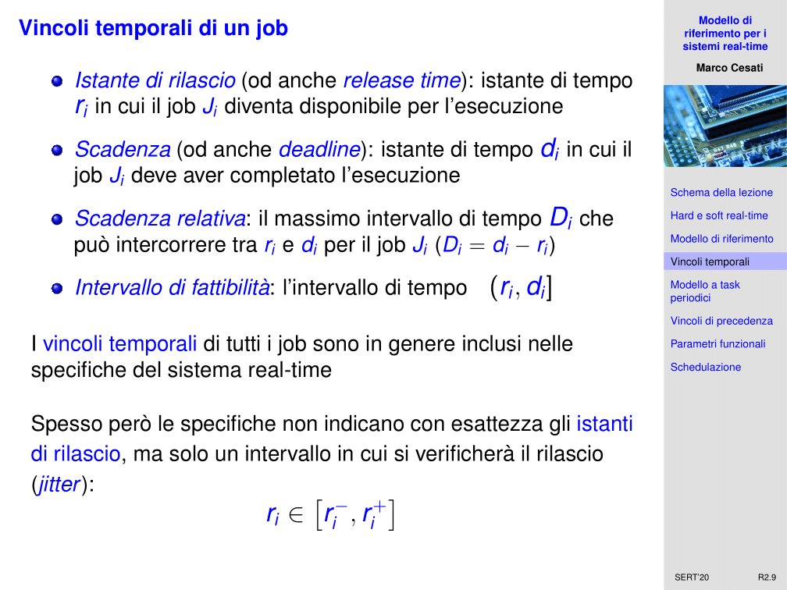

Di fatto, quello di cui ci occupiamo principalmente sono i vincoli temporali del job. Questi ci sono sempre. 

- **Istante di rilascio:** qual'è l'istante di tempo assoluto in cui il job diventa disponibile per l'esecuzione
- **Scadenza:** l'istante di tempo in cui il job deve aver terminato l'esecuzione
- **Scadenza relativa:** la differenza fra l'istante di scadenza e l'istante di rilascio. Il massimo tempo di risposta ammissibile per il job
- **Intervallo di fattibilità:** intervallo di tempo tra l'istante di rilascio e la scadenza. Per motivi tecnici, irrilevanti per noi, questo intervallo è semi-aperto. Non comprende l'intervallo di rilascio ma quello di scadenza. Un tempo può completare in un qualunque istante dal rilascio all'istante di scadenza, incluso

I vincoli temporali di tutti i job sono in genere inclusi nelle specifiche del sistema real-time. Spesso le specifiche non indicano con esattezza gli istanti di rilascio, ma solo un intervallo in cui si verificherà il rilascio (*jitter*). 

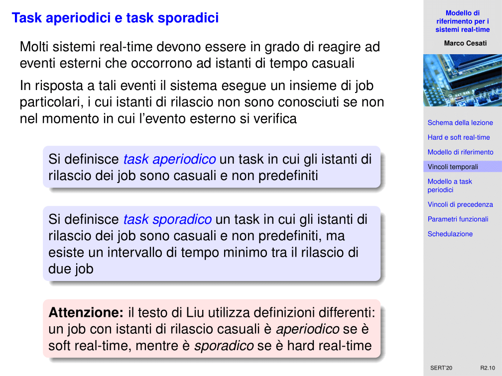

Ci sono fondamentalmente, come abbiamo visto, molti sistemi real-time sono di tipo periodico. Però, nel sistema, bisogna essere anche in grado di gestire task che arrivano a tempi casuali. Chiaramente l'arrivo di un job in un istante casuale pone un problema: non permette al sistema di sapere quante risorse riservare a questo task. Sistemi che hanno questo tipo di job, che arrivano in maniera non regolare, sono sistemi problematici da gestire. C'è però una differenza. Noi definiamo **task aperiodico** un task in cui gli istanti di rilascio dei job sono casuali e non predefiniti.

Diverso è invece il caso di **un task sporadico**. Non so dire quando arriverà, con esattezza, però esiste comunque qualche cosa che so. So che tra un arrivo ed il successivo, passa un intervallo minimo di tempo. Un task sporadico, in cui i job arrivano ad intervalli minimi di un secondo, comunque sapere che c'è un task sporadico fatto così, permette al sistema di riservare abbastanza risorse per gestirli. Mentre, avere un task di cui non so assolutamente nulla, questo pone un problema grosso di schedulazione. Quindi, molto importante le due definizioni.

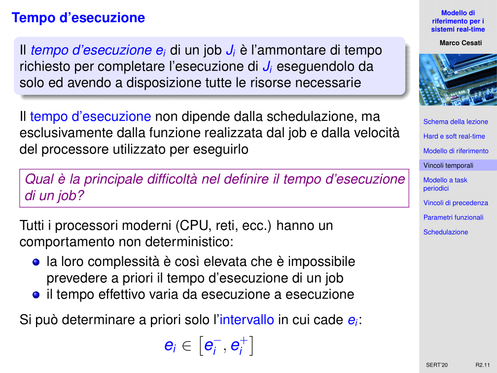

Si definisce **tempo di esecuzione** l'ammontare di tempo che il job richiede per completare quando ha a disposizione tutte le risorse necessarie del sistema. Questo è delicato come punto. Vuol dire che non posso dire che un job ha un tempo di esecuzione $x$ contemplando anche i tempi che deve aspettare perché una risorsa non è disponibile, perchè il processore è stato dato a qualcun altro ecc. Non è questa la definizione. Il tempo di esecuzione di un job è il tempo che il job impiega a completare dall'inizio alla fine nel momento in cui tutte le risorse del sistema sono date a quel job. Come se quel job fosse l'unico task da eseguire nel sistema. 

Il tempo di esecuzione di un job non dipende dalla schedulazione che ho sul sistema, ma esclusivamente dalla funzione realizzata dal job e dalla velocità del processore utilizzato per eseguirlo. Quale è la principale difficoltà nel definire il tempo di esecuzione di un job? Questa definizione è chiara ma è estremamente difficile ottenere questo dato da un sistema reale per introdurlo nel modello. Perché? Tutti i processori moderni hanno un comportamento non deterministico: la loro complessità è così elevata che è impossibile prevedere a propri il tempo di esecuzione di un job. La CPU ha un comportamento altamente non deterministico. E' impossibile prevedere a priori il tempo di esecuzione di un job.

Si possono scaricare i manuali di un processore moderno. Molti anni fa, accanto ad ogni istruzione macchina, il processore elencava il tempo di esecuzione dell'istruzione. Oggi i manuali dei processori moderni non contengono queste informazioni. Troviamo le descrizioni delle istruzioni macchina, ma non troviamo il tempo impiegato dal processore. Il motivo? Non lo sanno nemmeno i progettisti dei processori. I processori moderni sono così sofisticati che il tempo di esecuzione dipende dallo stato del processore interno, che a sua volta dipende da tutte le altre istruzioni che hanno contribuito a portare il processore in quello stato. Tipicamente, fondamentalmente, è così complessa la situazione che non è possibile definire a propriori un tempo di esecuzione, e quindi non fanno nemmeno un tentativo per dare un tempo medio. Se io non so dare la tempistica di una singola istruzione macchina, come posso dare la tempsitica esatta di un programma che è fatta di esecuzioni di milioni o miliardi di esecuzioni macchina? Ovviamnete è molto difficile.

Questo vuol dire che in pratica se misuro i tempi di esecuzione di ciascun programma, i tempi di esecuzione variano da esecuzione ad esecuzione, anche se li eseguo in isolamento.  L'unica cosa che si può sperare di determinare è un *intervallo del tempo di esecuzione*, da un minimo ad un massimo. Ogni volta che misurerò, avrò un tempo che cadrà in questo intervallo.

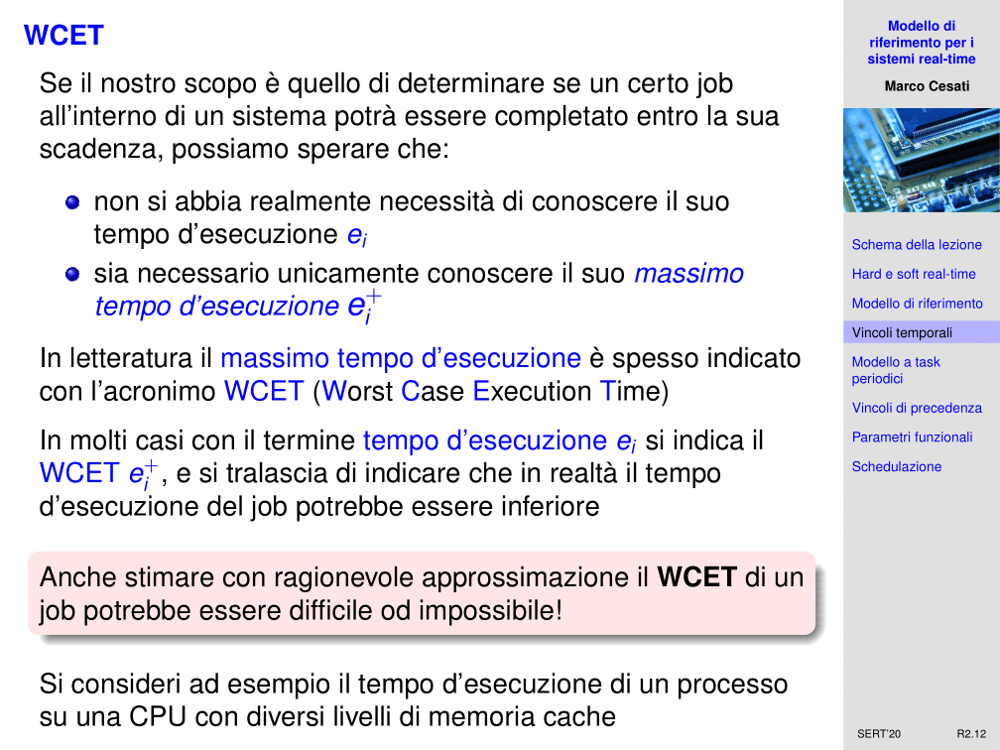

In realtà per rispettare le scadenze, ciò che conta realmente è il worstcase, cioè il caso peggiore (*WCET - Worst case execution time*). Se io definisco un intervallo di tempo minimo, questo è facilmente superabile come problema, tramite un'attesa attiva del job. Aspettare per dare un risultato già pronto non sembra un problema. Il grosso problema si ha quando bisogna rispettare la scadenza superiore, in quanto non dipende dal singolo job ma da come il sistema fa procedere l'esecuzione dei vari job tutti assieme. Il grosso problema è avere delle valutazioni realistiche di quello che è il tempo massimo di esecuzione di un job. Sapere il tempo di esecuzione massimo di un job, è sufficiente per studiare se, nella maggior parte dei casi e non tutti, se il sistema rispetterà le scadenze oppure no. Io so che il tempo di esecuzione cade in un certo intervall, ma non è detto che per studiare il rispetto delle scadenze debba sapere in modo preciso il tempo di risposta. La speranza è che mi sia unicamente necessario conoscere il tempo massimo in cui risponderà, e dunque il **Worst case execution time**. Anche calcolare il *WCET* è un compito difficile. C'è molta ricerca anche sulle metodologie, grazie alle quali si possono derivare dei worst case per il job che siano realistici.

Quale è il worst case? Non è affatto facile definirlo. D'ora in poi, quando si parla di esecuzione si intende il tempo massimo di esecuzione di un job. Il job potrebbe terminare in un tempo inferiore, ma in realtà quello che si intende sicuramente non supera quel tempo di esecuzione.

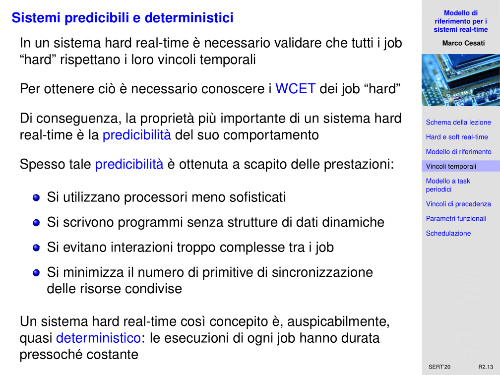

Dobbiamo in qualche modo poi capire questo fatto importante. Io ho un sistema hard-RT. Questo sistema richiede una certificazione che tutti i job rispettano i loro vincoli temporali. Questo implica sapere innanzitutto quale è il tempo di esecuzione dei job hard. Ma il loro tempo di esecuzione, si intende il loro tempo in isolamento. Il punto è che siccome è difficile avere quest arisposta, cioè i sistemi moderni sono così sofisticati che il worst case può cambiare da esecuzione ad esecuzione anche in isolamento, questo vuol dire che ho difficoltà anche a definire i parametri temporali dei job che dopo dovrò studiare per garantire il rispetto delle scadenze. Non riesco neanche a modellare il sistema se non so definire il worst case dei job.

Tutto questo implica che quando costruisco un sistema hrd-RT, non è tanto importante che sia veloce, perché la velocità di esecuzione non è la cosa più importante. La cosa più importante è il rispetto delle scadenze e dimostrarla come cosa. La proprietà più importante di un sistema hard-RT è quanto questo sia predicibile. Quanto posso ripetere le misurazioni, per esempio del worst case di uno stesso job, ed ottenere vicini, consistenti fra loro. Questa cosa è talmente importante che influenza anche il modo in cui costruisco i sistemi hard-RT. Invece di metterci un processore che ha 3 livelli di cache, ci metterò processori meno sofisticati. Certo più lento, ma più predicibile. Ha un comportamento in cui quando eseguo un job in isolamento da solo, il tempo è più consistente. Oppure si scrivono programmi senza strutture di dati dinamiche. Quando scrivo questo programma per un sistema hard-RT, cercherò di farlo con le dovute attenzioni. Perché la struttura di dati dinamica è per sua natura impredicibile per i tempi di esecuzione. Il dinamismo delle strutture di dati comporta una variazione dei tempi di esecuzione. Devo evitare di avere interazioni troppo complesse tra i job. Non impatta sul worst case, ma impatta sulla predicibilità del sistema in generale. Oppure devo minimizzare il numero di primitive di sincronizzazione delle risorse condivise. Un sistema hard-RT così concepito è, auspicabilmente, *quasi deterministico*.

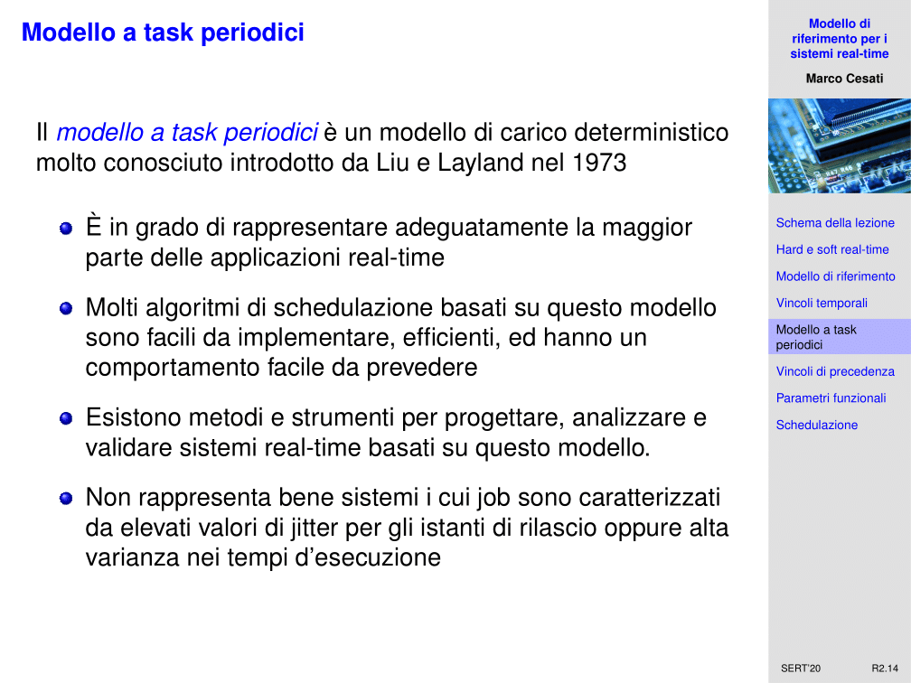

Sempre parlando del modello del carico di un sistema, in realtà in questo corso facciamo riferimento ad un modello di carico deterministico introdotto da Liu e Layland nel 1973, il **modello a task periodici**. Abbiamo visto che molti sistemi RT eseguono dei job che si ripetono con regolarità. Questo modell è in grado di rappresentare la maggior parte dei sistemi RT esistenti. Un altro pregio di questo modello è che gli algoritmi che implemento su questo modello sono facili da capire, analizzare ed implementare. Facilitano il processo di costruzione e validazione del sistema RT. Un altro grosso vantaggio è che esiste una teoria matematica, degli strumenti formali analitici, che permettono di studiare i sistemi basati su questo modello. E quindi permettono di poter dimostrare a qualcuno che il sistema che ho costruito rispetterà le scadenze. Ovviamente ha dei limiti. Non si applica in tutti i casi; non si applica bene per esempio quando ho dei job da eseguire che hanno istanti di rilascio variabili, o tempi di esecuzione con varianza molto alta. In questi casi il sistema non riesce a cogliere bene la realtà di quel sistema. In questi casi dovrò fare o un modello pessimistico, e questo pessimismo si rifletterà sulle risorse di calcolo di cui dovrò dotare il sistema reale, oppure dovrò adottare altri modelli.

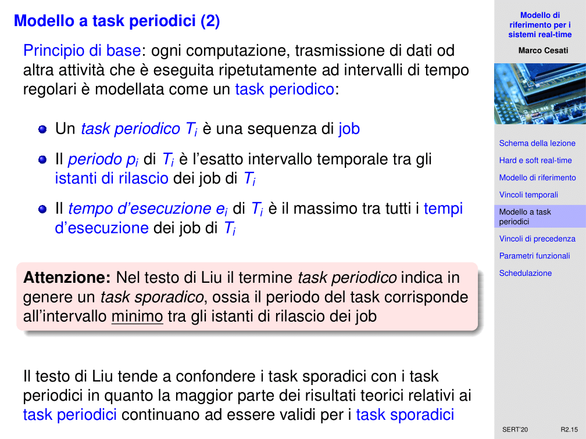

Il principio di base del modello a task periodici è che ogni computazione, attività che si esegue ad intervallo di tempo regolari, è modellata come un task periodico. Si parla dunque di task periodici. E' quindi una sequenza di job. Vale sempre la regola che non può partire un job di questo task se il job precedente del task non è terminato. I task periodici li indico con la lettera maiuscola $T_i$. Il periodo di un task periodico è l'esatto intervallo temporale fra i rilasci dei job del task, $p_i$. Sono task periodici, non c'è fluttuazione nei tempi di arrivo. Il tempo di esecuzione $e_i$ è il massimo tra tutti i tempi di esecuzione dei job di $T_i$. Il modello a task periodici non definisce un tempo di esecuzione dei job, ma del task, ed il massimo tempo di esecuzione di tutti i job di quel task.

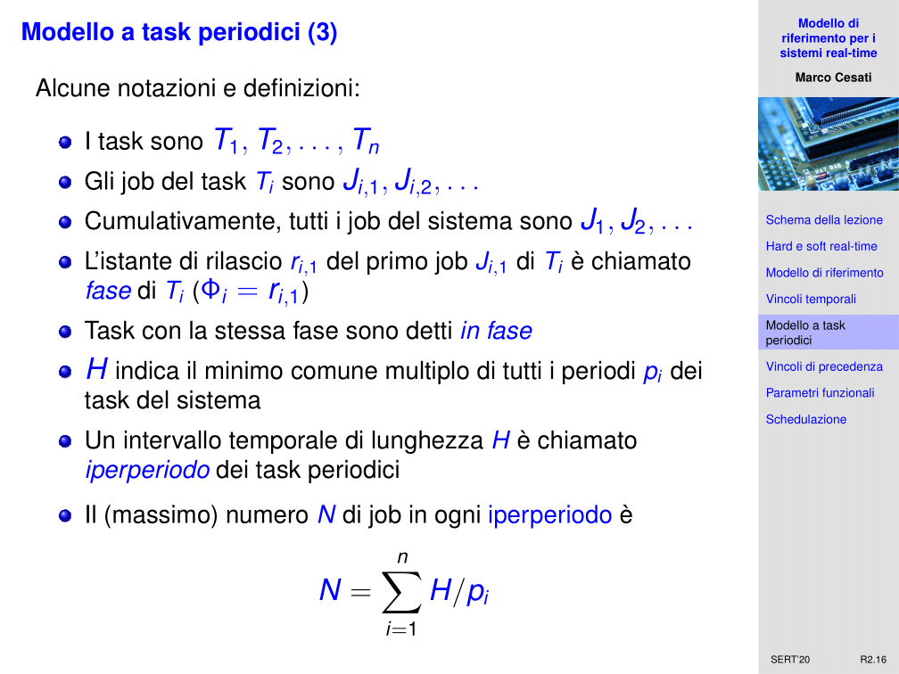

Abbiamo un modello a task periodici in cui abbiamo un certo numero di task $T_1,\ T_2,\ ...,\ T_n$ ed un certo numero di job di ciascun task, $J_{i,1},\ J_{i,2},\ ...$. Possiamo anche spesso denotare tutti i job del sistema, e quindi parleremo di $J_1,\ J_2,\ J_3,\ ecc$. L'istante di rilascio del primo job di un certo task è chiamato **fase del task $T_i$**, $\phi_i = r_{i, 1}$. Task che hanno la stessa fase sono detti **in fase**, quando il primo job di tutti i task avviene in modo contemporaneo. Questo non vuol dire che tutti i job dei task vengono rilasciati contemporaneamente, perché i task possono comunque avere periodi differenti. Ma se il primo job di un task viene rilasciato nello stesso momento, allora i task sono in fase. 

Con la lettera $H$, indico il minimo comune multiplo di tutti i periodi $p_i$ dei task del sistema. Un intervallo temporale di lunghezza H è chiamato **iperperiodo** dei task periodici. Quanto è il numero di job che vengono eseguiti in ogni iperperiodo? Lo indico con il numero $N = \sum_{i=1}^{n} \frac {H} {p_i}$. Prendo la lunghezza dell'iperperiodo, e lo divido per il periodo del primo task. Questa divisione è esatta in quanto $H$ è il minimo comune multiplo di tutti i periodi. Questo è il numero di periodi, e quindi di job, rilasciati durante l'iperperiodo.

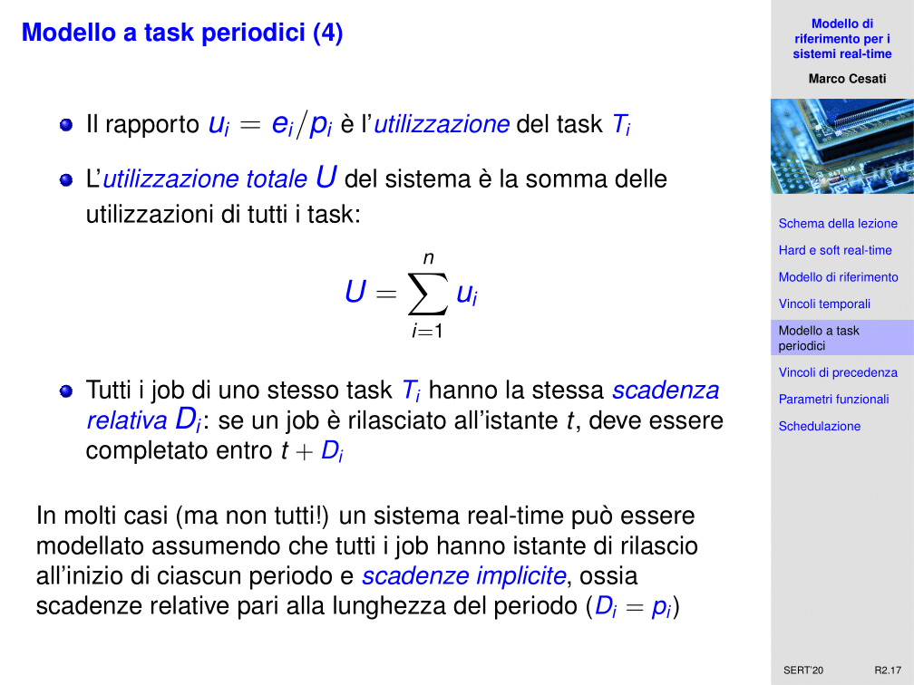

Il rapporto $u_i = \frac {e_i} {p_i}$, dove $e_i$ è il tempo di esecuzione del task (tempo massimo) e $p_i$ è il periodo del task. Il rapporto è chiamato $u_i$ ed è l'utilizzazione del task $T_i$. In modo intuitivo, un task che ha utilizzazione uguale ad 1, è un task che, quando un job viene rilasciato, occuperà il processore per un tempo uguale esattamente alla lunghezza del periodo. Quindi non appena quel job finisce, viene rilasciato un altro job dello stesso task, e quindi il processore potrebbe essere impegnato ancora, sempre per eseguire il secondo job di quel task e così all'infinito. Un task che ha utilizzazione uguale ad 1, impegna un processore per tutto il tempo. Ha un impatto sul processore che lo satura. L'utilizzazione del task è un modo per vedere quanto un task pesa sul processore che lo deve eseguire. 

L'utilizzazione totale U del sistema è la somma delle utilizzazioni di tutti i task: $U = \sum_{i=1}^n u_i$. Tutti i job di uno stesso task $T_i$ hanno la stessa scadenza relativa $D_i$. Un altro delle semplificazioni di questo modello è che non distinguo tra le scadenze di job dello stesso task. Se due job del task nel sistema reale avessero scadenze differenti, semplifico e pongo come scadenza relativa di tutti i job del task il valore minimo fra le due scadenze. In questa maniera, se rispetto la scadenza relativa del task, rispetto le scadenze relative di ogni singolo job. Ma io semplifico il modello, in questo modo è più semplice ragionarci. Il parametro temporale **scadenza relativa** è un parametro del task: se un job è rilasciato all'istante $t$, deve essere completato entro $t + D_i$. In molti casi, un sistema real-time lo posso modellare assumendo che ciascun job di un task ha come scadenza il rilascio di un altro job dello stesso task. Fondamentalmente posso dire che il periodo del *task* coincide con la scadenza relativa del task. Il job rilasciato deve concludersi, come scadenza, prima che scada il periodo di quel task e quindi venga rilasciato un nuovo job. Si parla di **scadenze implicita**, perché non è necessario specificare la scadenza relativa in quanto è uguale al periodo. Non tutti i sistemi RT possono essere modellati in questo modo.

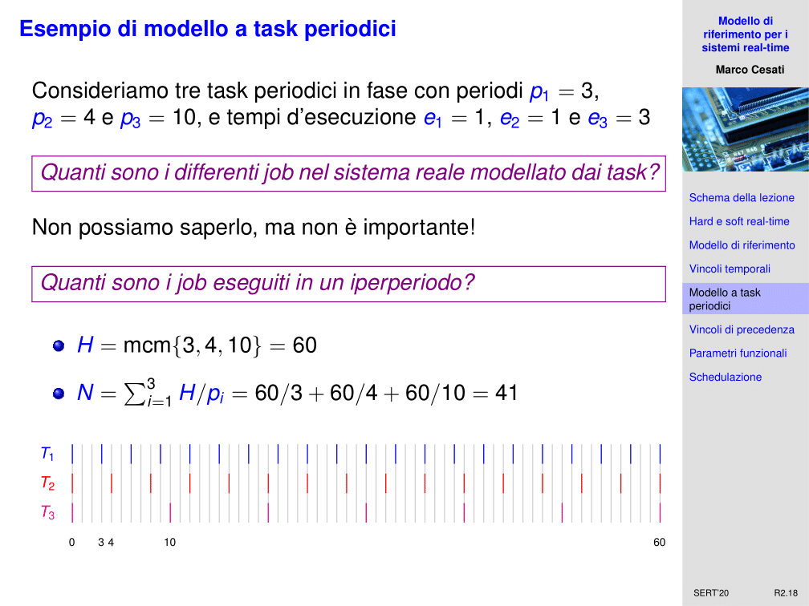

Consideriamo un esempio. Abbiamo tre task periodici in fase con periodi:

- $p_1 = 3$ 
- $p_2 = 4$
- $p_3 = 10$
- $e_1 = 1$
- $e_2 = 1$
- $e_3 = 3$

Se io volessi andare a capire nel sistema RT reale che sto cercando di modellare quanti erano i differenti job nel sistema, è possibile dare una risposta a questa domanda? La risposta è no, in quanto dal passare dal sistema reale ad un modello, ho perso la capacità di distinguere i vari job differenti che il sistema doveva gestire. Se ho questi job differenti, li ho raggruppati in uno stesso task, allora nel modello sono diventati tutti uguali. Distinguo task differenti, ma non distinguo job appartenenti allo stesso task. Il punto è che si tratta di una domanda alla quale non sappiamo rispondere e non ci importa nemmeno. Quello che vogliamo è che se decidiamo e dimostriamo che il modello di task periodici è tale per cui riesco a dimostrare che esiste un algoritmo che rispetta tutte le scadenze, allora posso trasportare questo risultato ad un sistema reale e e dire *tutti i task reali rispettano le sc^3adenze*. Questo passaggio è importante da fare, ma non il resto.

Cosa possiamo però sapere? Per esempio quanti job sono eseguiti in un ipeperiodo. Non sappiamo il numero di job reali, ma nel modello sappiamo il numero di job nell'iperperiodo.

- $H = mcm(3,\ 4,\ 10) = 60$
- $N = \sum_{i=1} \frac {H} {p_i} = 41$
  - In un iperperiodo, bisogna eseguire 41 job. Se ne eseguo 40 vuol dire che un job non lo eseguo, e questo vuol dire che potrebbe mancare la scadenza, se le scadenze sono implicite.

E' utile graficamente provare a capire quello che succede. Supponiamo che all'istante 0 tutti i task sono in fase. E quindi $T_1,\ T_2,\ T_3$ rilasciano il primo job. Dopo 3 unità di tempo, $p_1$ rilascia un altro job. Quanti sono questi periodi, quindi job rilasciati da $T_1$ nell'iperperiodo? $\frac {20} {60} = 20$. Il concetto di iperperiodo e di minimo comune multiplo è l'istante in cui tutti i periodi tornano ad essere coincidenti; tornando ad avere lo stesso istante iniziale. Se io avessi iniziato da 60 e non da 0, non sarebbe cambiato nulla in quanto da un punto in poi tutto si ripete uguale.

Qual'è l'utilizzazione totale del sistema? Le utilizzazioni dei tre task sono:

- $\frac {e_1} {p_1} = \frac 1 3$
- $\frac {e_2} {p_2} = \frac 1 4$
- $\frac {e_3} {p_3} = \frac 3 {10}$

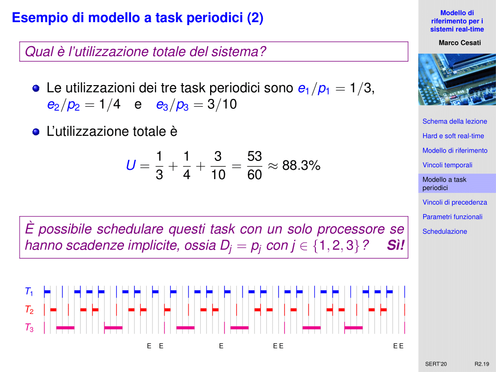

L'utilizzazione totale è dunque $U = \frac 1 3 + \frac 1 4 + \frac 3 {10} = \frac {53} {60} = 88.3%$. E' possibile schedulare questi task con un solo processore e se ho scadenze implicite in maniere che tutti i task rispettino le scadenze? La scadenza di ciascun task è il periodo. E' possibile combinare l'esecuzione di questi job in modo che tutti rispettino la scadenza? La domanda può essere sia si che no. In questo caso è si, ma in questo momento l'unico modo per convincerci che la risposta è si è vedere una schedulazione. Si può fare e vediamo come si fa. Senza mai interrompere i job, si riesce a piazzare tutti i job in modo tale che tutti vengano conclusi prima del rilascio del job successivo.

Attenzione però. Questo è molto interessante da notare. Ci sono degli intervalli di tempo in cui il job non ha nulla da fare. Per esempio dove abbiamo la lettera E, abbiamo che non c'è nulla da fare. Quanti sono questi intervalli vuoti? $7$ nel nostro caso. Ce lo potevamo aspettare? Si in quanto l'utilizzazione totale del sistema è $\frac {53} {60}$. Dunque abbiamo $7$ intervalli nellì'iperperiodo non occupati dal processore, quindi non viene utilizzato.

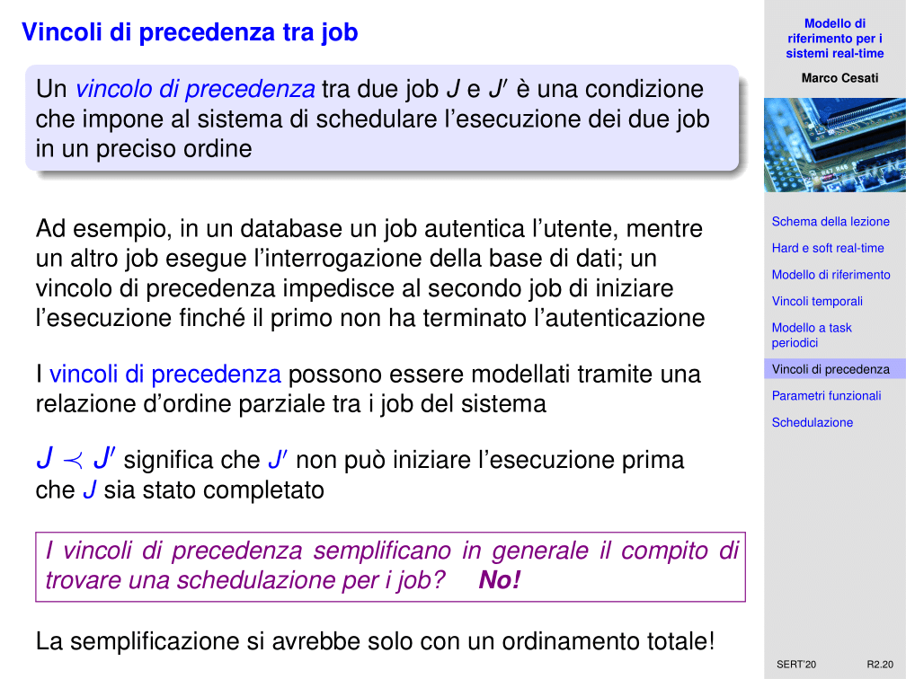

Altri esempi di vincoli temporali tra i job. Un **vincolo di precedenza** è una condizione che impone di schedulare un job in un preciso ordine. Un certo job non può iniziare se prima un altro job non è terminato. Ho due job, uno per interrogare la base di dati e l'altro per autenticare l'utente. Come posso modellare questi vincoli di precedenza? Come una relazione di ordine parziale tra i job. "Questo viene prima di questo altro", ma è parziale in quanto i due job possono anche non avere nessuna relazione di ordine. Quando scrivo $J < J'$, significa che $J'$ non può iniziare priima che $J$ sia stato completato. I **vincoli di precedenza** semplificano il compito di trovare una schedulazione per i job? La risposta non è semplice.

Se i vincoli di precedenza costituiscono una sequenza di ordine totale, cioè posso definire per ogni coppia di job una precedenza, allora effettivamente questi vincoli di precedenza semplificano il problema di trovare una schedulazione. Ma in generale, quando i vincoli di precedenza sono un ordine parziale, allora questo vincolo di precedenza non semplifica il problema di trovare una schedulazione, ma sono una complicazione di cui tenere conto.

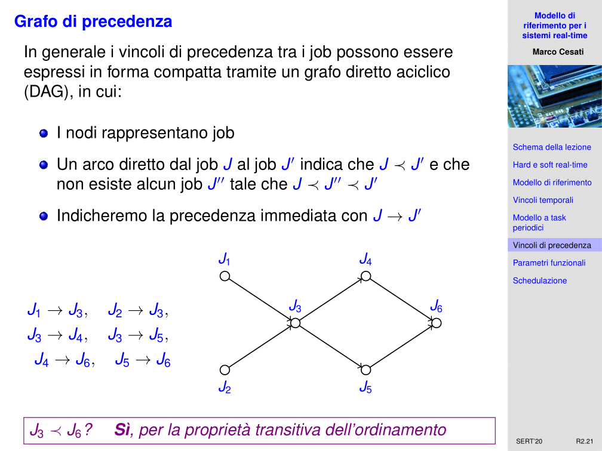

Posso rappresentare questi vincoli di precedenza con un grafo. In genere un grafo diretto aciclico, in cui i nodi rappresentano i job ed un arco diretto da un job all'altro rappresenta che un certo job ne precede un altro, ma che non esiste nessun job intermedio tra i due. Gli archi rappresentano le precedenze i mmediate. Di fatto diciamo che se $J$ precede $J'$ e non c'è nessun $J''$ in mezzo, allora è una precedenza immediata. Nel grafo delle precedenze rappresentiamo solamente quelle immediate. Nel grafo è vero che $J_3 < J_6$? Si! Per la proprietà transitiva.

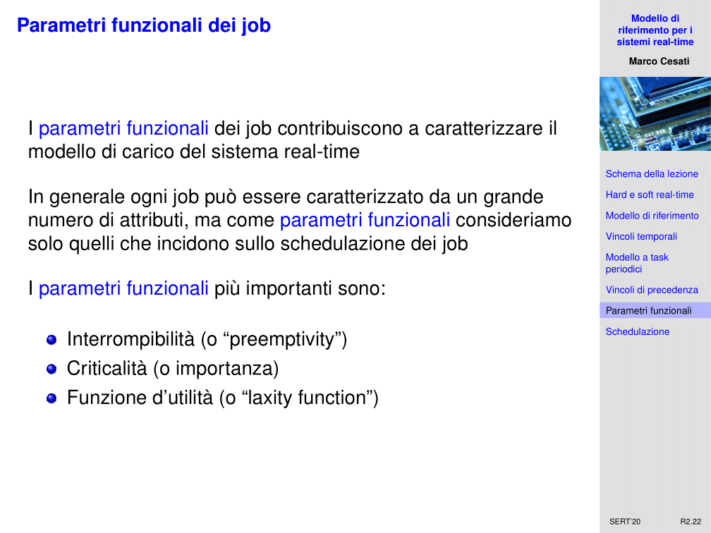

Poi abbiamo i parametri funzionali dei job. Fondamentalmente tutto ciò che in qualche modo caratterizza gli attributi del job. Qui noi dobbiamo considerare nel modello sopratutto quelli che incidono sul fatto che il job mantengano le scadenze oppure no. Quali sono questi parametri funzionali?

- **Interrompibilità** (*preemptivity*): quando un job è partito e sta in esecuzione, lo posso interrompere in modo da poterlo recuperare dal punto in cui era arrivato?
- **Criticalità** (*importanza*):
- **Funzione di utilità**: quanto è utile terminare il job quando è in ritardo?
  
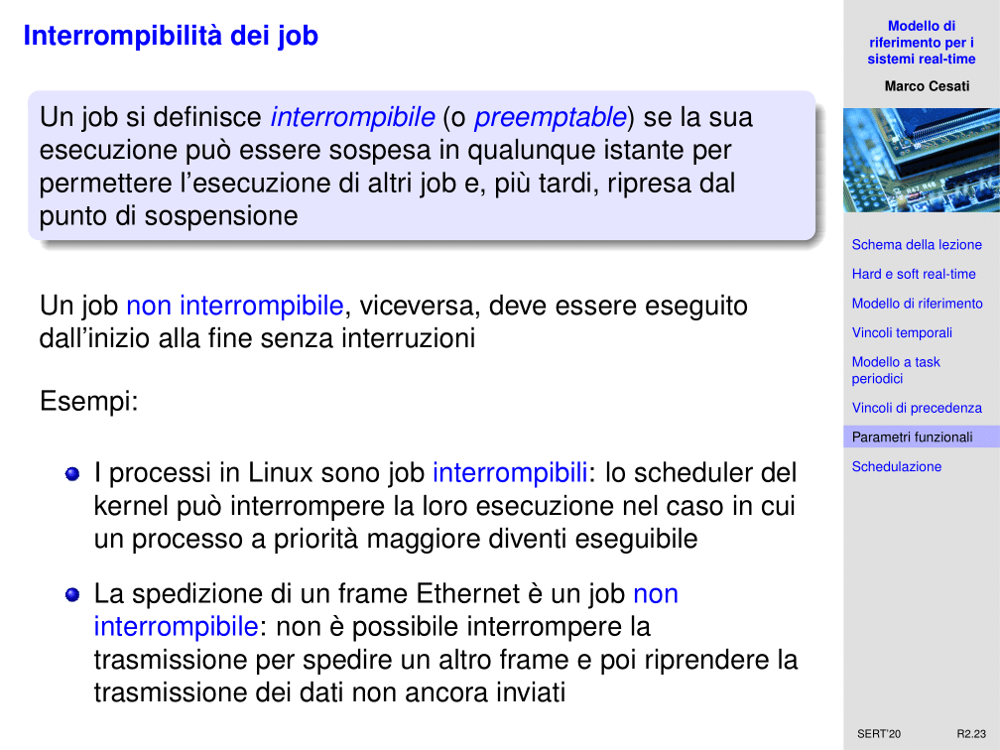

Di questi l'unico veramente importante per noi è l'interrompibilità del job. Un job è detto **interrompibile** se la sua esecuzione può essere sospesa in qualunque istante per permettere l'esecuzione di altri job e, più tardi, ripresa dal punto di sospensione. Un job che **non è interrompibile** non può dare spazio ad altri job ed essere ripreso da dove era arrivato.

Tipico esempio, il sistema Linux è fatto di processi che sono interrompibili. Posso modellare il tutto come job interrompibili. La spedizioen di un frame Ethernet è un job **non interrompibile**. Quando parto, non posso interrompere a metà la trasmissione del frame. Quando un frame è partito, quel frame deve arrivare prima che si possa trasmettere un altro frame.

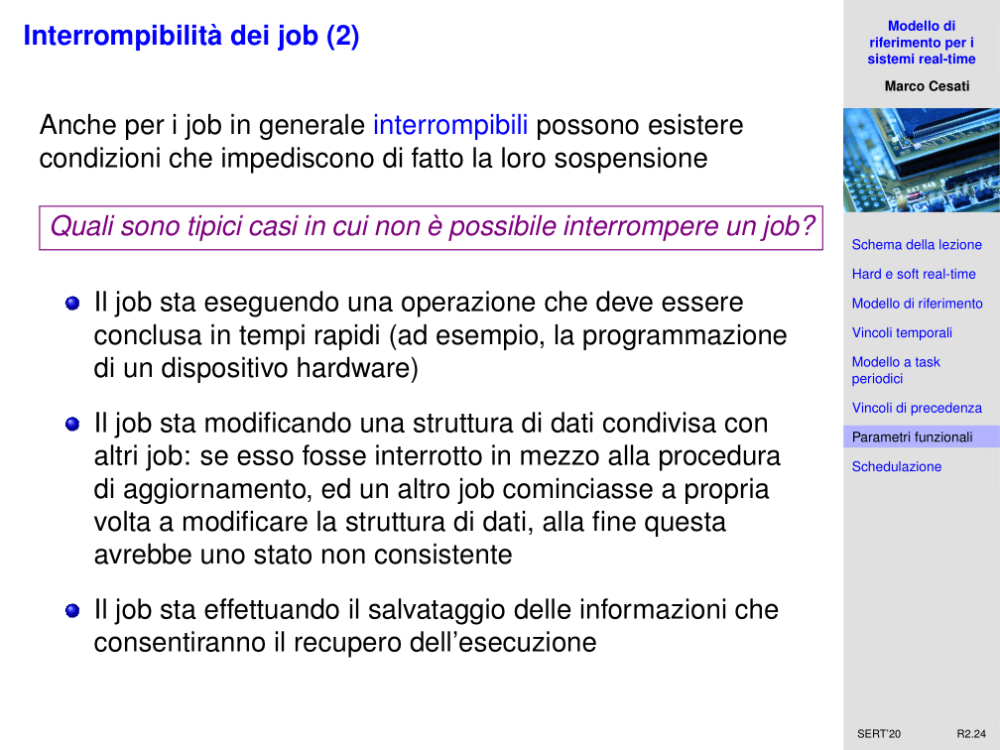

E' vero in assoluto, nella realtà, che non esistono job che sono sempre interrompibili. Ci sono sempre delle condizioni che possono far si che il job sia non interrompibile. Quali sono tipici casi di queste condizioni? 

- Sto eseguendo un operazione che deve essere conclusa in tempi molto rapidi. Per esempio sto programmando un dispositivo hardware. In quel caso, devo rispettare delle tempistiche ben precise in quanto l'hardware stesso ha dei tempi di risposta ben precisi. Quindi non voglio sospendere questa attività in quanto l'hardware nel frattempo va avanti e quando toccherà al job sospeso le cose non funzionano più
- Sto modificando una struttura di dati condivisa con altri job. Se io vengo interrotto in mezzo alla modifica di questa struttura di dati ed un altro job comincia ad eseguire una modifica sulla stessa struttura dati, quello che succede è  che quando recupero l'esecuzione si trova la struttura dati in uno stato inconsistente con quello che stava facendo lui. Me la *cavo* dicendo che un job che sta modificando una struttura dati condivisa **non può essere interrotto**
- Sto salvando le informazioni che proprio gli consentono di recuperare l'esecuzione se dovesse essere interrotto (*context switch*)

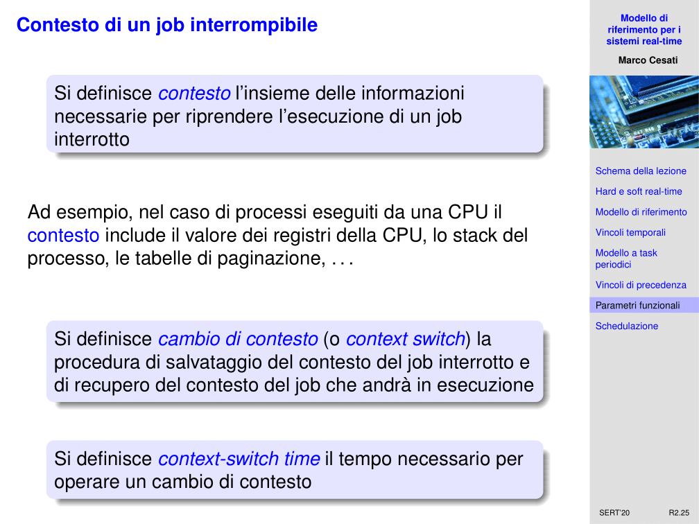

Si definisce **contesto** l'insieme delle informazioni che sono necessarie per recuperare l'esecuzione di un job interrotto. Se io prendo una CPU, il contesto di un processo in esecuzione sono: il valore dei registri, il contenuto dello stack, le tabelle di paginazione ecc. Tutte le informazioni che devono essere ripristinate per poter in qualche modo rifar ricominciare quel processo dall'istante in cui si era fermato. Con il termine **cambio di contesto** si definisce la procedura per salvare queste informazioni per quanto riguarda il job che sto togliendo dal processore. Ed il recupero del contesto di queste informazioni per il job che devo mettere in esecuzione. Queste sono definizioni analoghe ai concetti che conosciamo per sistemi operativi. Attenzione però, in quanto li diamo a queste definizioni un ambito più grande. Il job non è detto che sia un processo su una CPU, ma può essere qualsiasi cosa. Noi studiamo dei modelli di calcolo che non sono semplicemente la CPU ed il processo, ma possono essere più ampli.

Un parametro cruciale è il tempo che impiego a fare il cambio di contesto. Questo è cruciale perché ovviamente anche se un job è interrompibile, probabilmente non conviene interromperlo troppo spesso se il *context switch time* è elevato. Si tratta di tempo in cui il processore è occupato a fare cose che non sono eseguire i job. E' tutto tempo perso per quanto riguarda il rispetto delle scadenze dei job del sistema. E' da valutare bene quando e come il job può essere interrotto.

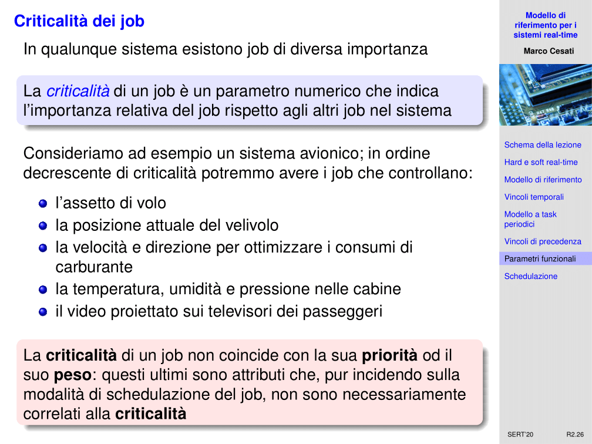

Parametri che menzioniamo ma che non entreranno direttamente nel nostro studio sono ad esempio la **criticalità** del job. E' un parametro che indica l'importanza relativa del job, dei task, rispetto agli altri job/task nel sistema. Per esempio, prendiamo l'aereo. L'aereo decolla. In questo momento, nell'aereo ci sono in funzione tanti sistemi, che però hanno criticalità differenti. Per esempio, in ordine decrescente:

- L'assetto di volo
- La posizione attuale del velivolo
- La velocità e direzione per ottimizzare i consumi di carburante
- La temperatura, umidità e pressione nelle cabine
- Il video proiettato sui televisori dei passeggeri

Posso assegnare anche dei valori di importanza ai vari task. Però, attenzione. Assegnare una criticalità al job non significa assegnargli una priorità sugli altri o un peso che deve essere in qualche modo valutato. Priorità e peso sono concetti che incidono sul modo in cui i job possono essere schedulati, ma non necessariamente questo è correlato alla criticalità. Questo è un punto molto importante. Tutta la teoria dei sistemi RT che andiamo a studiare, nasce nel momento in cui ci si rende conto che l'unico modo per costruire dei sistemi che sono dimostrabilmente corretti, è evitare di fare assunzioni arbitrarie su ciò che è importante e su ciò che non lo è. Se dico che l'assetto di volo è più importante della posizione attuale, in realtà sto facendo una valutazione soggettiva. Se costruisco un sistema sulla base di questa valutazione soggettiva e le mie considerazioni di partenza erano sbagliate, in quel contesto ed in quelle circostanze può succedere una catastrofe. Per costruire un sistema dimostrabilmente corretto, devo rinunciare a dire in modo soggettivo cosa è importante e cosa no. Devo semplicemente definire parametri temporali che sono indiscutibili. *Quale è il periodo di questo task? Il periodo massimo di esecuzione del job? Quale è la scadenza?* Questi sono i parametri indiscutibili. Come questi job verranno eseguiti nel sistema non deve dipendere da quanto sono importanti, ma dai parametri temporali oggettivi e basta. Da questo momento in poi nascono i veri e propri sistemi RT.

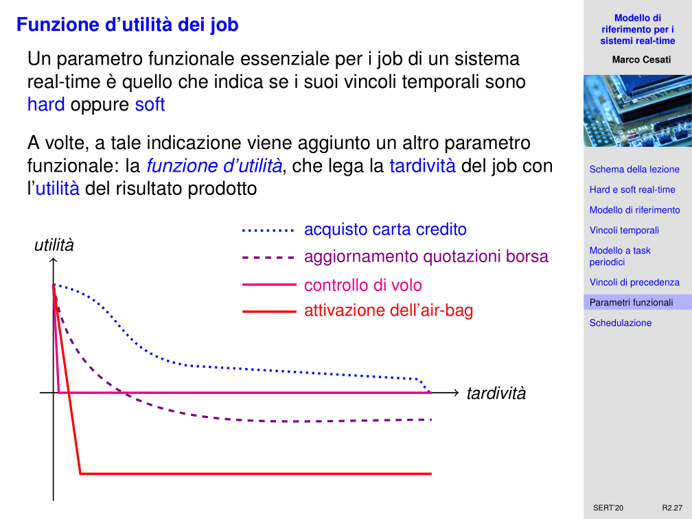

Stesso discorso si applica alla funzione di utilità del job. Fondamentalmente sappiamo che noi distinguiamo i job in hard-RT (*devo dimostrarti che tutto funziona*) e soft-RT (*non devo dimostrare, quindi posso permettermi di non rispettare le scadenze per considerare altri aspetti*). A volte, si può aggiungere alla distinzione fatta tra hard e soft, la funzione di utilità. Se un job è in ritardo, quanto è utile completare questo job man mano che mi allontano dalla scadenza?  

Queste valutazioni di utilità sono soggettive. Non posso basare la schedulazione di un sistema RT su queste funzioni di utilità. Sicuramente posso dimostrare che tutto funziona se queste funzioni di utilità hanno senso, ma si tratta di una scelta soggettiva. Se queste funzioni di utilità non hanno senso in alcune circostante, in quei momenti li il sistema potrebbe fallire. Quindi, soltanto i parametri temporali oggettivi possono essere considerati come parametri sui quali decidere in che modo i sistema si deve comportare. Tra questi, non è inclusa la funzione di utilità.

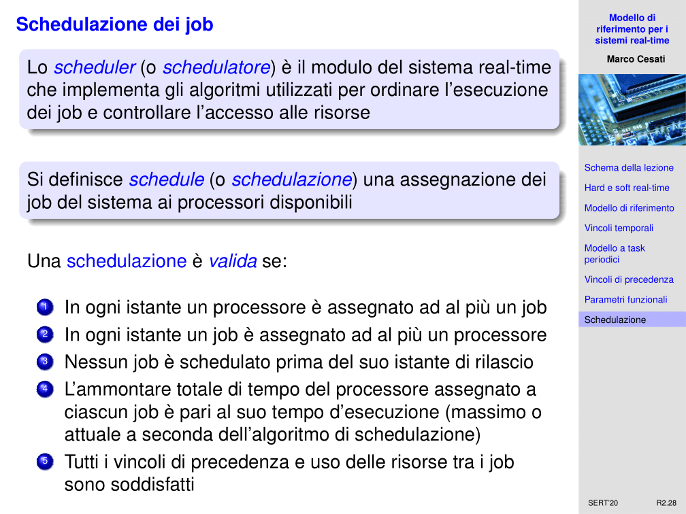

Stiamo parlando continuamente di componenti del sistema che decidono in che modo i job devono essere eseguiti. In realtà questo componente si chiama **scheduler (o schedulatore)**. Si tratta del componente che implementa gli algoritmi che decidono come i job devono essere eseguiti, in che ordine, come devono avere le risorse. Si definisce **schedule (o schedulazione)** un'assegnazione dei job del sistema ai processori disponibili. 

Una schedulazione è **valida** se:

- Ogni processore in un certo momento esegue al più un job. La schedulazione non è valida se dico che due job sono eseguiti contemporaneamente su un singolo processore. Il job è l'unità schedulabile, e non ha senso porne più di una su un singolo processore
- Non è possibile assegnare un job a più di un processore. Non può essere eseguito da un altro, una volta che è in esecuzione su un processore. I job non sono applicazioni parallele. Non posso far andare pià veloce un job eseguendolo su più di un processore alla volta
- Se un job viene rilasciato in un certo istante, il processore non lo può eseguire prima. In una schedulazione qualunque posso assegnare i job ai processori come mi pare, ma non è valida la schedulazione che esegue un job prima che sia rilasciato
- Non è possibile assegnare un job ad un processore per più del suo tempo di esecuzione. Supponiamo che i task rappresentino il tempo massimo di esecuzione di ciascun job. Non ha senso dire che un job viene eseguito da un processore per un tempo pari a più del tempo di esecuzione del job. Quello è il tempo massimo che il job richiede per essere eseguito, e quindi non ha senso dare quel job al processore per più di quel tempo
- Se ho dei vincoli di precedenza fra i job, vanno rispettati. Non posso far partire un job se so che questo job deve aspettare il completamento di un altro

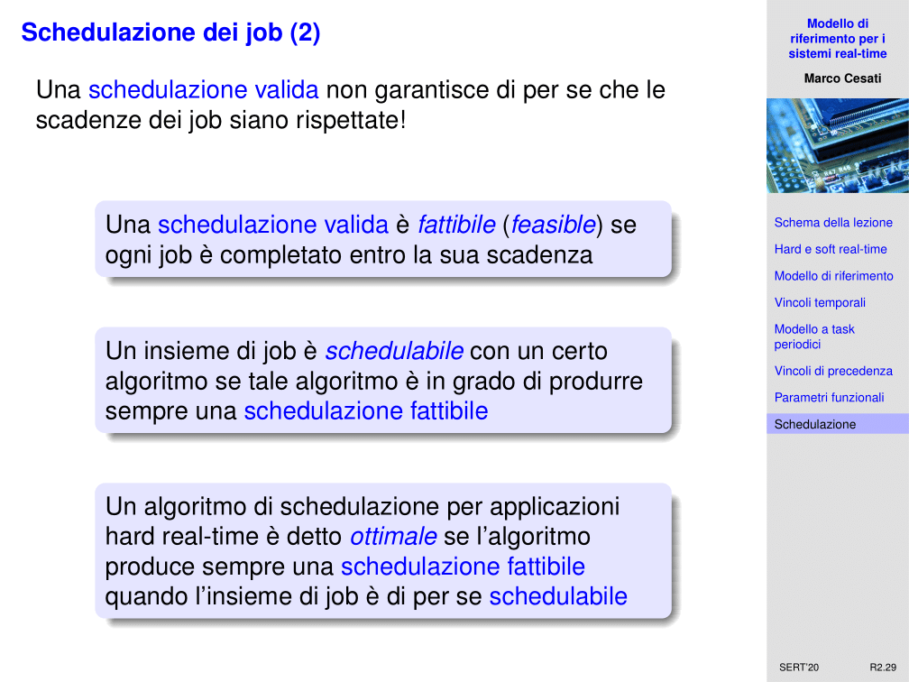

In tutto questo, non si parla di rispetto delle scadenze. Una schedulazione è valida se valgono queste cinque condizioni. Ma in una schedulazione valida non è detto che le scadenze siano rispettate. Posso avere schedulazioni valide in cui un job va oltre alla sua scadenza.

Una schedulazione valida si dice **fattibile (feasible)** se ogni job è completato entro la sua scadenza. Quando tutti i job, se sono schedulati con un certo algoritmo, rispettono la scadenza, allora si dice che **l'insieme di job è schedulabile con quell'algoritmo**. Un insieme di job è schedulabile con un certo algoritmo se questo algoritmo può sempre produrre una schedulazione fattibile. Cioè può sempre dire un ordine con cui mettere i job in esecuzione tale che tutti i job rispettino che le scadenze.

Un algoritmo di schedulazione è detto **ottimale** se l'algoritmo produce sempre una *schedulazione fattibile* a condizione che l'insieme di job sia di per se schedulabile; cioè che possa esistere una schedulazione fattibile. Posso definire un insieme di job in cui c'è un solo processore e l'utilizzazione totale è maggiore di 1. Cosa vuol dire? Che se sommo le utilizzazioni di tutti i task, ed ho maggiore di 1, vuol dire che in un periodo non faccio in tempo a finire tutti i task che ho rilasciato. Ciascuno di questi task si *mangia* una fetta del processore, e quando le somme tutte sono più del 100%. Un processore solo non ce la fa a schedulare un sistema di task in cui l'utilizzazione totale è maggiore di 1. A maaggior ragione qualcuno mancherà la scadenza, e l'insieme di task non ha un esecuzione fattibile. L'algoritmo si dice ottimale se, quando gli do un insieme di task in cui i job possono, dal punto di vista teorico, essere schedulati; allora l'algoritmo trova una schedulazione che rispetta le scadenze. 

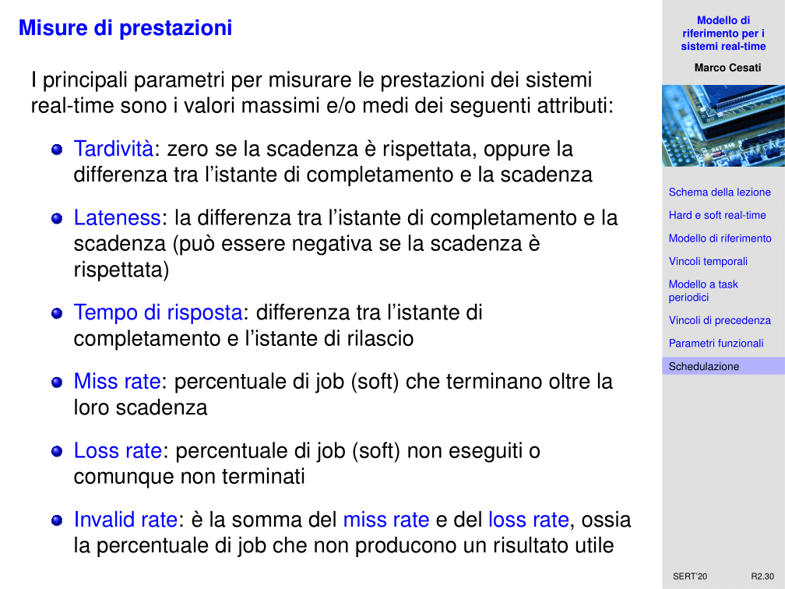

Quando valutiamo i sistemi RT, possiamo cercare quanto bene o male si comportano. Le principali misure di prestazioni di sistemi RT sono i valori massimi, medi di alcune metriche:

- **Tardività:** è 0 se la scadenza è rispettata. Oppure è la differenza tra quando completo e la scadenza. Potrei cercare di valutare quando bene va un sistema RT misurando la tardività del sistema. Ma ovviamnete se un sistema è hard-RT, la tardività deve essere 0
- **Lateness:** la differenza tra l'istante di completamento e la scadenza (può essere negativa se la scadenza è rispettata). Il punto è che se completo in anticipo rispetto alla scadenza, ho una lateness negativa. Se completo troppo lontano dalle scadenze, ritorniamo al discorso che l'obiettivo è il rispetto delle scadenze, e non ce l'ho facendo sistemi che tentano di minimizzare questi parametri. Ma li ho cercando di rendere il sistema predicibile. Una misura di prestazione potrebbe essere il valore assoluto della lateness. Anche un job che completa molto prima della sua scadenza può essere visto come un fattore negativo
- **Tempo di risposta:** la differenza fra l'istante di completamento e l'istante di rilascio
- **Miss rate:** percentuale di job (soft) che terminano oltre la loro scadenza
- **Loss rate:** percentuale di job (soft) non eseguiti o comunque non terminati
- **Invalid rate:** è la somma del *miss rate* e del *loss rate*, ossia la percentuale di job che non producono un risultato utile

Qui noi parliamo fondamentalmente di sistemi hard-RT, in cui le scadenze vanno rispettate in modo deterministico, certo. Debbo dimostrare che tutti rispettano le scadenze. E quindi, la tardività deve essere 0. Non ha molto senso affrontare il discorso basandosi sulle misure di prestazioni. In questo corso, le menzioniamo in quanto hanno un ruolo in altri ambiti, non le prenderemo in considerazione. Il nostro obiettivo è cercare di dimostrare che in maniera deterministica tutte le scadenze sono rispettate. Siamo finalizzati a questo singolo obiettivo.