# SERT - 02/10/2020 - Modello di riferimento per i sistemi real-time - R03

Oggi parliamo di scheduler clock-driven. Sono fondamentalmente una classe di algoritmi di schedulazione molto semplici come formulazione, molto semplici da implementare.

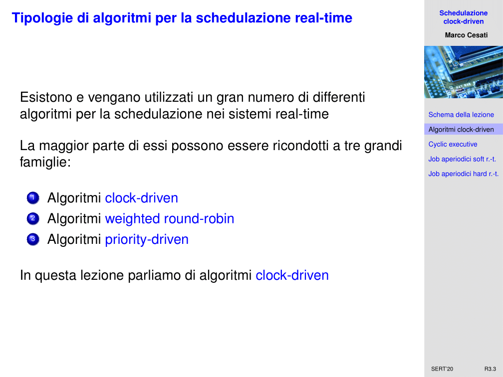

In effetti esistono tanti tipi di algoritmi di schedulazione. Gli algoritmi di tipo **clock-driven** che vediamo oggi. Gli algoritmi **round-robin pesati**, che sono tipicamente utilizzati nei sistemi operativi general purpose ma che effettivamente sono una classe di algoritmi più grande. In generale, per i sistemi RT moderni, si tende oggi ad usare algoritmi clock-driven. In effetti oggi parliamo di algoritmi clock-driven.

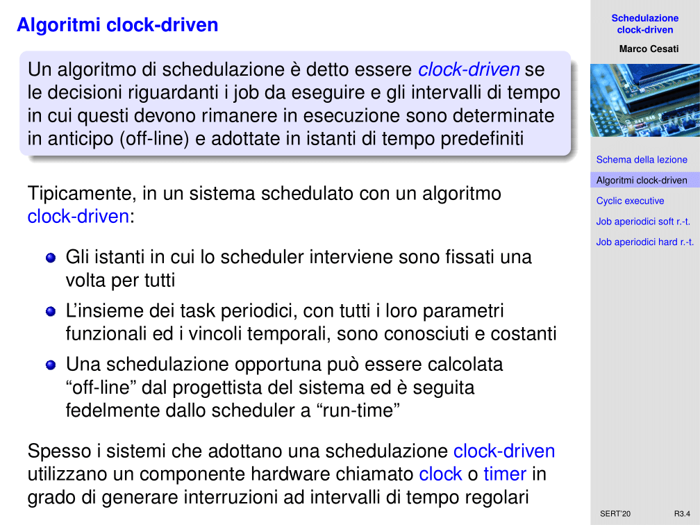

Come sono definiti? Le decision di un algoritmo di schedulazione *clock-driven* sono prese dallo scheduler soltanto limitatamente a controllare quali job effettivamente siano disponibili per essere eseguiti. In un algoritmo clock-driven è il progettista del sistema che decide quale, tra tutti i job che possono essere eseguiti, debbono effettivamente essere messi in esecuzione. E' il progettista del sistema, quando progetta il sistema, che decide la schedulazione. Lo scheduler, in realtà, non decide chi deve essere messo in esecuzione. Si limita a controllare che i job che effettivamente il progettista ha deciso di mettere in esecuzione, quei job siano  presenti. Altrimenti lo scheduler predispone l'esecuzione di altri job, ma sempre tra quelli che il progettista ha detto che devono essere eseguiti. 

Lo scheduler interviene, prende queste decisioni sui job che però ha deciso il progettista, ad intervalli di tempo ben definiti. Il tempo viene partizionato, viene suddiviso in tanti istanti, ed in quei istanti lo scheduler interverrà. Lo scheduler interviene in istanti prefissati. Non è uno scheduler che interviene quando succede qualcosa nel sistema. Lo scheduler non ha la libertà di prendere un altro job eseguibile, fuori dall'insieme definito, ed eseguirlo. Per poter realizzare un sistema *clock-driven*, il progettista deve conoscere l'insieme dei task che rappresentano il carico del sistema. Deve conoscere i parametri funzionali come l'istante di arrivo, il tempo di esecuzione, le mutue dipendenze. Tutto deve essere conosciuto dal progettista. E' lui che decide lui l'ordine con cui i job si avvicenderanno sul processore. E' veramente difficile costruire un sistema in cui qualche cosa non è conosciuto nel momento in cui lo progetto. Si tratta di una schedulazione *off-line*, costruita a priori, quando già tutto è noto sui task che caratterizzano il sistema.

Si tratta di un paragone denigratorio, però possiamo pensare al progettista del sistema come al compositore di un'opera orchestrale. Ed allo scheduler come a quel componente che prende la battitura, l'opera, e la esegue, la fa eseguire all'orchestra. Si tratta di un esempio denigratorio e totalmente falso dal punto di vista della logica, ma come esempio può aiutare a capire che il direttore d'orchestra non ha la libertà di prendere scelte se il compositore non lo aveva previsto. Non può prendere iniziative.

Spesso, lo scheduler deve intervenire ad intervalli di tempo prefissati, che sono stabiliti in fase di progetto. Spesso per realizzare fisicamente questo sistema ci si appoggia a dei componenti hardware che sono dei chip che possono generare dei segnali hardware ad un certo istante di tempo, come i clock ed i timer. Il nome di questa classe di algoritmi deriva proprio da questo.

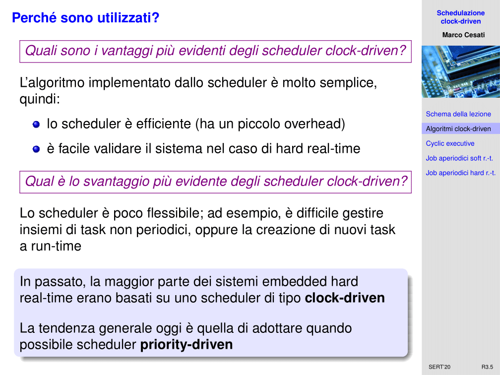

Quali sono i vantaggi più evidenti degli scheduler *clock-driven*? Non è difficile capire che il loro vantaggio principale è l'essere molto semplici. Fondamentalmente lo scheduler è così semplice che è piccolo, occupa poca memoria ed è efficiente. Non deve prendere decisioni o fare calcoli complicati, deve semplicemente *fare l'appello*. E' molto semplice e quindi poca memoria.

L'altro enorme vantaggio è che siccome la schedulazione è fatta a priori quando progetto il sistema, non c'è più questione sul rispettare o meno le scadenze. Se eseguo il job in quel preciso momento allora avrò il rispetto della scadenza. Se non è arrivato non può rispettare la scadenza. Da parte del progettista, convincere l'ente certificatore che il sistema rispetta le scadenze è facile. Non può succedere qualcosa di differente dal punto di vista del software che non faccia rispettare le scadenze. E' facile validare un sistema hard-RT.

D'altra parte però questi scheduler hanno degli svantaggi. Quello più evidente è la mancanza di flessibilità. Se io devo progettare un sistema, ma devo conoscere tutto il sistema, non posso aspettarmi che il tutto possa gestire dei task non previsti in fase di progetto. La differenza è tra costruire un sistema RT, specializzato, tale per cui devo definire in modo completo qualunque task che quel sistema dovrà portare avanti. Altrimenti non posso fare la schedulazione off-line. Oppure un sistema che si, è progettato per un certo ambito, ha certe caratteristiche, ma ho una certa libertà nel definire i parametri fondamentali del carico che andrò ad eseguire. Il progettista ha progettato il sistema in modo tale che certi parametri possano essere decisi, entro certi limiti, quando il sistema verrà utilizzato. Questa seconda possibilità offre molta più flessibilità.

Nella maggior parte dei casi, in passato si progettavano sistemi hard-RT basati su scheduler clock-driven. Per tutti questi motivi. Ma ultimamente le cose sono cambiate. Ultimamente la tendenza è quella di progettare sistemi RT che siano **priority-driven**. Cioè in cui la schedulazione non è scelta dal progettista ma dall'algoritmo mentre il sistema è in funzione. Perché? Sono più flessibili. L'altro fattore che ha contribuito alla diffusione dei sistemi *priority-driven* è che oggi i sistemi embedded hanno potenze calcolo superiori rispetto al passato. Quindi il vantaggio dell'avere uno scheduler semplice si sta attenuando. Ultimamente i sistemi embedded acquisiscono sempre più potenza di calcolo. Oggi la tendenza è di usare sistemi *priority-driven*. Non è un caso che noi ai sistemi *clock-driven* dedichiamo una singola lezione. 

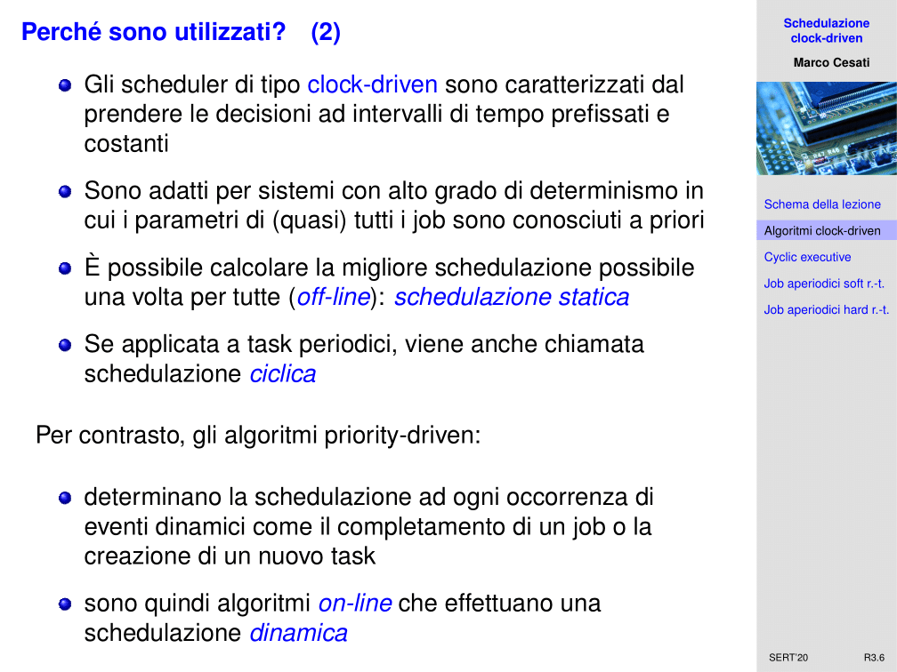

Ricapitolando, gli scheduler di tipo *clock-driven* prendono le decisioni ad intervalli di tempo regolari prefissati, costanti. E le decisioni sono: "E' arrivato o no un job?", ma non quale job devo eseguire. Quindi sono adatti per sistemi con un grado di parallelismo abbastanza alto in cui i parametri di quasi tutti i job sono conosciuti a priori già dalla fase di progetto. E quindi, in fase di progetto, posso calcolare quale è la miglior schedulazione possibile una volta per tutte (**schedulazione statica**). Quando applico questi sistemi *clock-driven* al modello a task periodici, questo tipo di schedulazione viene chiamata **schedulazione ciclica**. Invece, gli algoritmi *priority-driven*, ad ogni invocazione dello scheduler ricalcolano quale è il miglior task da eseguire. Ed intervengono sugli eventi, non conosciuti dal progettista.

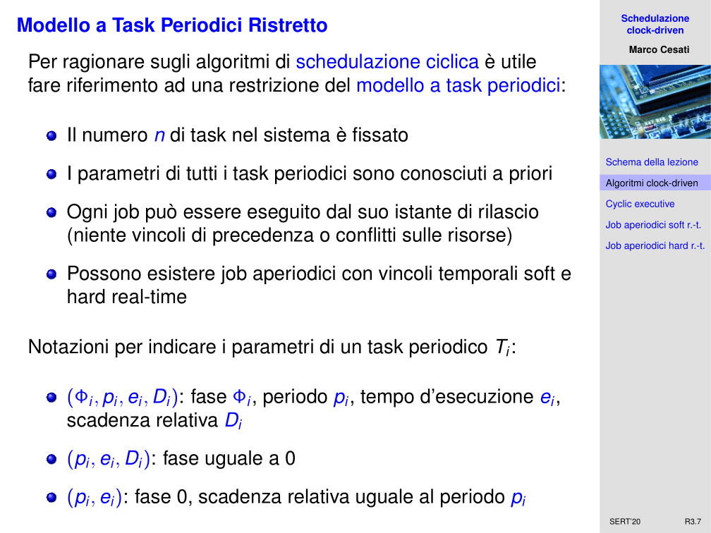

Come possiamo ragionare sui sistemi di schedulazione ciclica? E' utile fare riferimento ad una restrizione del modello a task periodici. Nel modello a task periodici abbiamo detto che ci sono tanti task. In realtà il numero di task può cambiare. Nel modello a task periodici ristretto abbiamo un numero $n$ di task periodici fissati. Inoltre, i parametri di tutti i task periodici sono conosciuti a priori. Posso costruire un algoritmo di schedulazione a priorità, anche non conoscendo ad esempio il tempo di esecuzione di un job. Per validarlo lo devo in qualche modo conoscere, ma posso progettare un algoritmo che funziona a prescindere dai tempi di esecuzione dei job. Non devo necessariamente conoscerli in anticipo.

Inoltre, facciamo un'assunzione. Non ci sono vincoli di precedenza, non ci sono conflitti sulle risorse. Ogni job può essere eseguito dal suo istante di rilascio. Questo per studiare questi algoritmi. In effetti non è difficile tenere in considerazione questi vincoli sulle risorse quando progetto il sistema. Però, per fissarci le idee, pensiamo che non ce ne siano.

L'esistenza di job aperiodici, cioè job che possono arrivare in qualsiasi momento, può essere presa in considerazione. Vedremo come è possibile cercare di realizzare scheduler *clock-driven* in cui altri job, oltre a quelli periodici, possono arrivare quando vogliono. Saranno abbastanza semplici da gestire per i job soft-RT, in cui il rispetto delle scadenze è secondario. Saranno molto più complicati da gestire quando dovrò gestire hard-RT, in cui dovrò rispettare le scadenze.

Vediamo un po di introdurre qualche notazione per ragionare su questi sistemi. Quando parliamo di task periodico lo definiamo con parametri che sono:

- Fase
- Periodo $p_i$
- Tempo di esecuzione $e_i$
  - Il tempo massimo di esecuzione di tutti i job del task
- Scadenza relativa
  - Ciò che determina, per ogni rilascio di un job, la scadenza assoluta. La scadenza assoluta è istante di rilascio più scadenza relativa

Molte volte indico una terna di numeri. Se abbiamo la terna di numeri, indica che la fase è uguale a 0. Una coppia di numeri indica fase uguale a 0 e scadenza relativa uguale al periodo, cioè la scadenza esplicita.

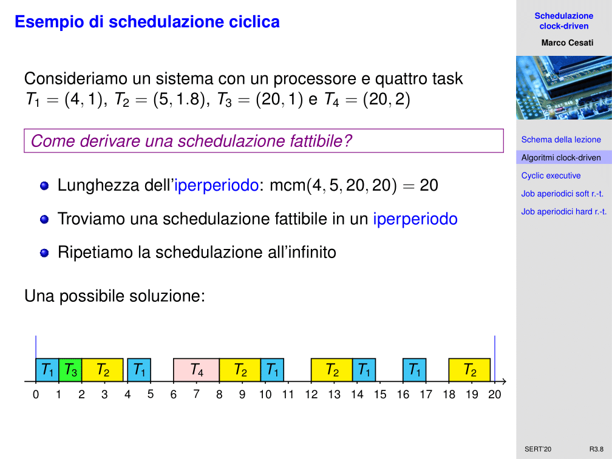

Consideriamo un sistema con 4 task ed un solo processore. Questi task hanno:

- $T_1 = (4,\ 1)$
- $T_2 = (5,\ 1.8)$
- $T_3 = (20,\ 1)$
- $T_4 = (20,\ 2)$

Io sono il progettista e devo progettare l'algoritmo *clock-driven* di questo sistema di 4 task. Come si può fare? La prima cosa da fare è calcolare l'iperperiodo:

- **Iperperiodo:** $mcm(4,\ 5,\ 20,\ 20) = 20$

Cerco all'interno dell'iperperiodo una schedulazione fattibile, stando attendo però. In realtà devo anche tenere in considerazione le fasi dei task. Tutti questi task stanno in fase, tutti cominciano all'istante 0 i primi rilasci, quindi questo non è un problema. 

Quando ho trovato una schedulazione fattibile, che rispetta le scadenze implicite, poi è facile. Prendo questa schedulazione che funziona in questo iperperiodo e la ripeto all'infinito. L'iperperiodo è il blocco che ripeto all'infinito.

Quindi, ad esempio, nell'immagine è presente una possibile soluzione. Quello che esce fuori è che in realtà, se vado a controllare, tutti i task rispettano le scadenze. Come facciamo ad implementare via software questa schedulazione?

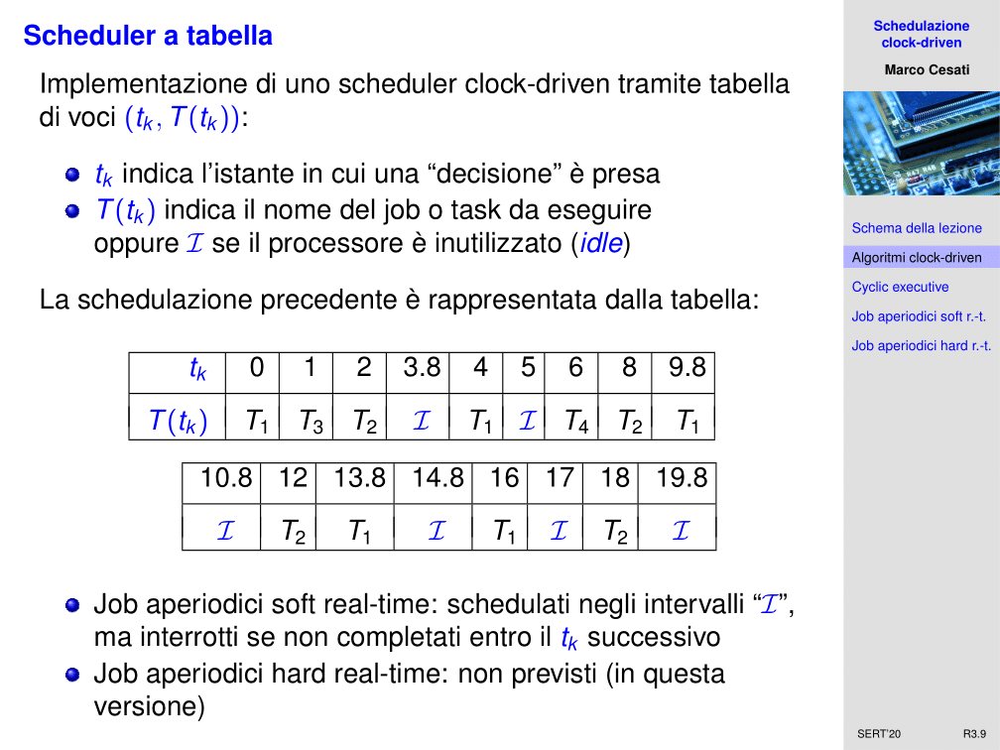

Potrei costruire una tabella, in cui ho due voci. Una voce indica $t_k$, l'istante in cui una decisione è presa, e $T(t_k)$, che rappresenta il nome del job o del task che deve essere eseguito in quell'istante. Oppure $I$, che indica che il processore non viene utilizzato. La figura di prima in realtà la possiamo descrivere con questa tabella. Questa è esattamente la descrizione vettoriale della figura di prima.

Dopo di che, quando posso gestire i job aperiodici soft-RT? Ovviamente in tutti gli intervalli con $I$ il processore non sta facendo nulla, e posso sfruttarlo per eseguire job aperiodici soft-RT. In realtà però, quando arrivo al $t_k$ successivo, i job vengono interrotti se non completati. I job aperiodici devono essere interrompibili, sia quelli soft che hard RT. In questa versione però, non possiamo tenere conto dei job aperiodici per i job hard-RT. 

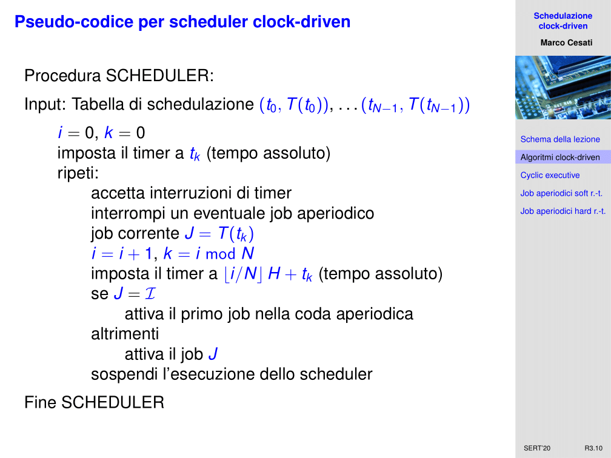

A causa di questa tabella, questi sono anche chiamati scheduler a tabella. Fondamentalmente questo è lo pseudocodice. Ho come input la tabella di schedulazione, che sarebbe la *partitura orchestrale*, e successivamente abbiamo l'esecuzione dello scheduler. Abbiamo degli indici $i$ (contatore che viene incrementato per ogni intervallo), mentre $k$ è l'intervallo all'interno dell'iperperiodo. Abbiamo detto che lo scheduler deve intervenire ad intervalli di tempo prefissati. Possiamo farlo andando ad impostare il timer ad un determinato istante di tempo.   

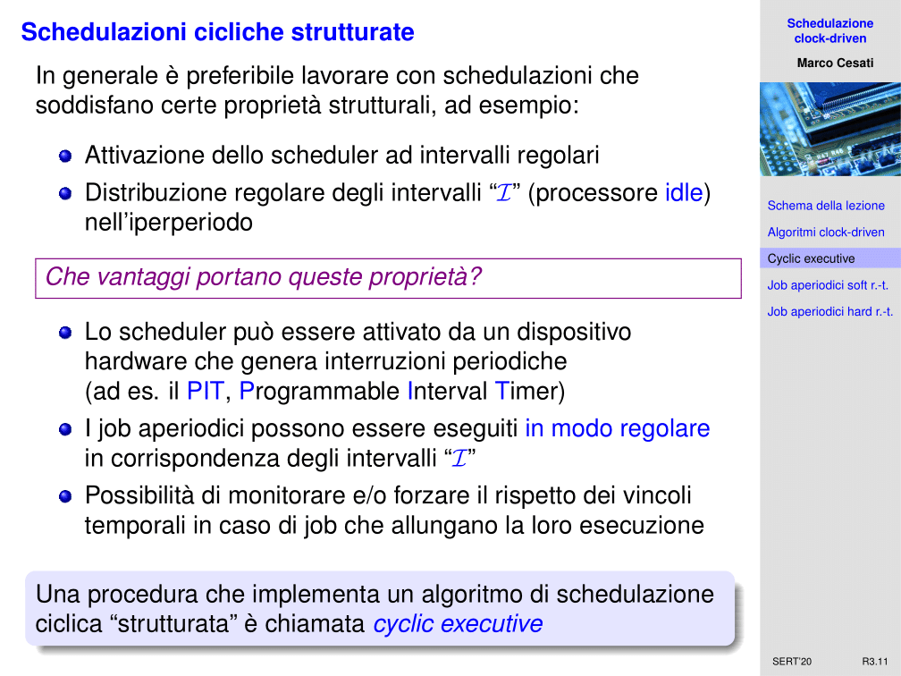

In realtà quando si progettano questo tipo di scheduler conviene lavorare con scheduler progettati in maniera un po più sofisticata. Vorrei che le schedulazioni vadano a soddisfare certe proprietà, come che lo scheduler fosse attivato ad intervalli di tempo regolari. L'attività di programmare questi timer è costosa in termini di tempo. Programmare un timer costringe ad arrivare a programmare l'hardware. Sarebbe meglio se riuscissi a farlo una volta per tutte. E' più semplice fare in modo che il clock sia regolare, e quindi che lo scheduler sia attivato ad intervalli regolari. 

Inoltre vorrei che, se possibile, questi intervalli $I$ siano distribuiti in modo regolare all'interno dell'iperperiodo. Questa cosa posso farla se ho una certa regolarità del modo in cui vengono generati i clock.

Queste proprietà che vantaggi portano? Posso usare un dispositivo che è disponibile in tutti i sistemi hardware, il PIT (*timer interval programmabile*). I job aperiodici posso eseguirli in maniera regolare. Non devo aspettare quasi tutto un iperperiodo per arrivare al primo intervallo in cui il processore non fa nulla. Posso cercare di sparpagliare gli intervalli $I$ in tutto l'iperperiodo, e fare in modo che i job aperiodici vadano avanti con una certa regolarità.

E poi, sopratutto, se progetto bene lo scheduler posso fare in modo che faccia un controllo. Oltre a capire quali job arrivano e quali no, lo scheduler assume un altro ruolo. Un ruolo di controllo sul fatto che i job schedulati precedentemente abbiano davvero rispettato la loro scadenza. Questo sembra un po un controsenso, in quanto se progettiamo bene il sistema allora il sistema deve rispettare le scadenze. Come dicevamo però, noi progettiamo il software di un sistema hard-RT, ma non tutto è sotto il controllo il controllo del software. Eventi hardware che per esempio rallentano l'esecuzione del processore, possono portare a mancato rispetto delle scadenze. Anche se a regola d'arte il software questo non lo faceva succedere. E' buona norma, è bene costruire anche il software in modo da tener conto che qualcosa possa andar male.

Quindi avere almeno la possibilità di rilevare il fatto che le scadenze siano mancate. Questo tipo di scheduler regolari, esecuzioni cicliche strutturate, permettono di fare questo lavoro. Una procedura che implementa gli algoritmi di schedulazioni cicliche strutturate è chiamato in inglese **cyclic executive**. L'esempio che abbiamo visto alla prima lezione sul flight controller dell'elicottero, quello che è un tipico esempio di **cyclic executive**. C'era un apparato che eseguiva diversi job in un ordine prefissato, ad intervallo di tempo regolari.

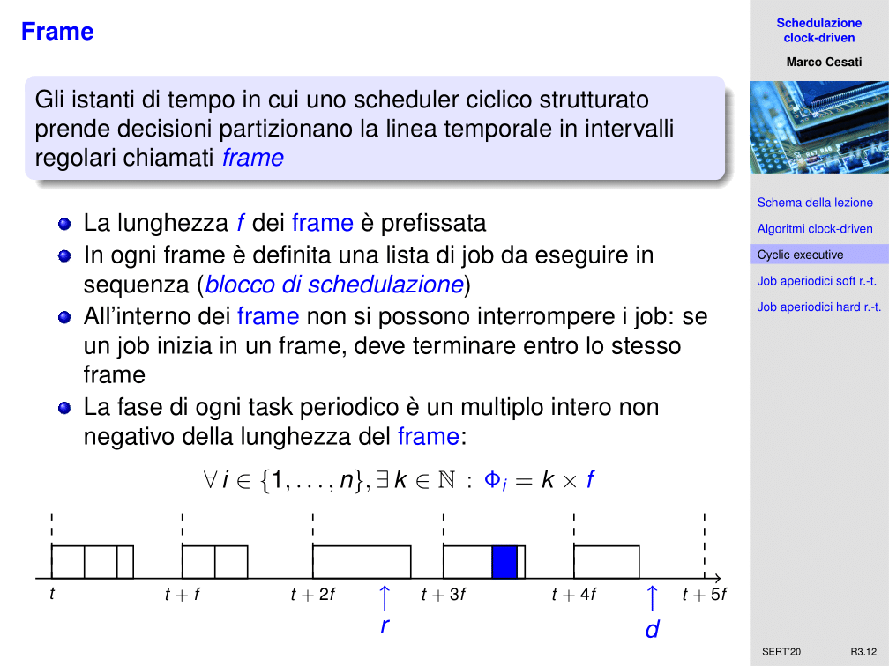

Gli instanti di tempo in cui lo **scheduler ciclico strutturato** prende decisioni, partizionano la linea temporale in intervalli regolari chiamati frame. Un problema critico è capire quanto è lungo il frame. La lunghezza del frame è fissata dal progettista. Quando devo far lungo questo frame? Consideriamo che dentro ad ogni frame devo definire la lista dei job che vanno eseguiti nel frame che sta partendo. Questa lista è chiamata **blocco di schedulazione**. Il compito dello scheduler all'inizio del frame è di dire: "Di tutti i job che il progettista ha definito dover essere eseguiti dentro questo frame che arriva, quali effettivamente sono stati rilasciati?". Questi che sono stati rilasciati vengono messi nel blocco di schedulazione del prossimo frame di questo frame. Quindi verranno eseguiti uno dopo l'altro senza che lo scheduler intervenga più dentro al frame. Finito il frame, lo scheduler si risveglia. Di questo blocco di schedulazione precedente, quali frame hanno effettivamente rispettato le scadenze e quali le hanno mancate? E poi va a vedere il prossimo frame. Chi dovrebbe essere eseguito? Costruisco un nuovo blocco di schedulazione e così via.

All'interno dei frame i job non si possono interrompere. Se un job inizia in un frame, deve terminare entro lo stesso frame. A meno che io non abbia un modo per suddividere il lavoro di un job in due sotto job che posso eseguire in due frame. Questo si può fare, ma di per se non si può interrompere un unico job. Se il progettista ha un insieme di job prefissati, che non può più suddividere, allora questi job devono essere eseguiti ciascuno dentro ad un frame. Non si può scavalcare il frame. 

Un altro vincolo è che la fase di ogni task periodico deve essere un multiplo intero non negativo della lunghezza del frame. La fase è l'istante di rilascio del primo job di un task. Questo istante di rilascio deve cadere esattamente su un frame. In altre parole, per ogni task $t_i$, la fase del task $i$ deve essere uguale esattamente ad un $k \cdot f$, dove $k$ è un qualsiasi numero naturale, mentre $f$ è la lunghezza del frame. Perché abbiamo questo vincolo? Lo vediamo in figura.

Abbiamo un frame che inizia al tempo $t$, un altro al tempo $t\ +\ f$ e così via. Ad ogni frame è presente un insieme di job che in qualche modo sono arrivati e che devono essere eseguiti. Il progettista assume che tutti i job che possono arrivare siano arrivati. Per il progettista questi sono esattamente tutti job che devono essere eseguiti all'interno del frame. Se qualche job non arriva, vuol dire che questo frame non avrà il corrispondente job e quindi non avrà più tempo libero. Il punto è che dentro ad ogni frame, il progettista ha piazzato un po di job. Considerando il job in blu, eseguito tra $t\ +\ 3f$ e $t\ +\ 4f$. Il punto è che se arriva all'istante $r$ non può essere eseguito appena arriva, ma bisogna eseguirlo nel frame successivo a quello di arrivo. Se proprio arriva sulla scadenza di un frame e l'inizio del successivo, anche in quello successivo, ma non certamente se arriva in mezzo ad un frame come in questo caso.

Il job ha una scadenza, $d$. Questa scadenza, se cade in mezzo ad un frame, implica che il job non può essere eseguito in questo frame. Mettiamo che il job sia eseguito nel frame e termini entro la scadenza. Il problema è che chi deve fare il controllo che lui abbia terminato, cioè lo scheduler, e verrebbe invocato in un momento successivo alla scadenza. Quindi lo scheduler dice che il job è completato, ma non sa dire se è completato entro la scadenza oppure no. L'unico modo è se lo scheduler interviene prima della scadenza del job. Dunque ogni job deve essere completato nel frame che precede la sua scadenza altrimenti lo scheduler non può controllare. 

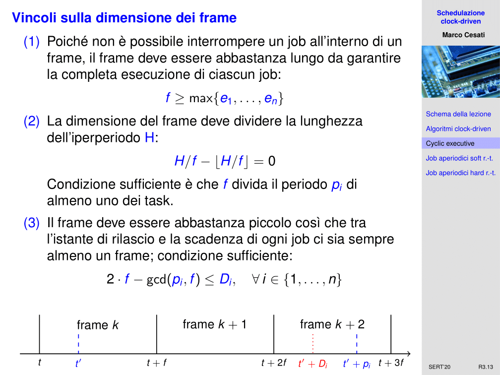

38.57

Questo pone alcuni vincoli sulle dimensioni del frame. Ad esempio, non è possibile interrompere un job all'interno di un frame, quindi il frame deve essere abbastanza lungo da garantire la completa esecuzione di ciascun job. Quindi il frame deve essere $\ge$ dei tempi di esecuzione di tutti i task.

Il secondo vincolo è che la divisione del frame deve dividere la lunghezza dell'iperperiodo. Perché? Altrimenti finisce l'iperperiodo ma non finisco un frame, e quindi l'iperperiodo successivo si ritroverebbe in mezzo ad un frame. Nulla di male, ma questo significherebbe che debbo considerare l'iperperiodo successivo come una schedulazione da fare diversa da quella dell'iperperiodo precedente. Non sono più nelle stesse condizioni dell'iperperiodo precedente. Se invece vale la condizione che il frame divide la lunghezza dell'iperperiodo, allora ovviamente quando finisce l'iperperiodo finisce anche un frame. Quando inizia un iperperiodo inizia un frame, e quindi tutti gli iperperiodi sono uguali. La condizioni sufficiente affinché questo sia vero è che il frame divida il periodo di almeno uno dei task. Se questo è vero, è vero anche che divide la lunghezza dell'iperperiodo.

La terza condizione è che, siccome deve esserci un intero frame tra rilasci e scadenze di un intero job, allora questo deve essere abbastanza piccolo. Frame troppo grandi si, sicuramente rispettano la condizione, ma non mi permettono di rispettare la condizione che lo scheduler deve controllare che tutti i job rispettino le scadenze. Se il frame fosse troppo lungo, tra il rilascio di un job e la sua scadenza non c'entrerebbe un intero frame, e quindi il discorso di prima: lo scheduler non potrebbe completare effettivamente che il job ha terminato entro la scadenza. In maniera non ovvia, una condizione sufficiente perché questo sia vero è che $2\cdot f - gcd (p_i, f) \le D_i$. Se questa condizione è vera per tutti i task, allora è vero che tra l'istante di rilascio e la scadenza di ogni job c'è sempre almeno un frame.

Piccola divagazione. In questa parte del corso parleremo di teoremi, parleremo di dimostrazioni. A che servono? Dimostrazioni servono a capire quello che c'è dietro. Fino a che vediamo un teorema che dice qualcosa ma non vediamo la dimostrazione, il teorema rimane qualcosa che si impara a memoria ma che non si capisce veramente il motivo. La dimostrazione, i dettagli, passaggi, possono essere scordati, ma l'idea di fondo rimane. L'idea di fondo sul perché un teorema è vero rimane, ed in qualche modo sono le idee di fondo del perché questa teoria della computazione RT è efficace e funzione. Dunque è essenziale da fare. Spesso e volentieri faremo dimostrazioni.

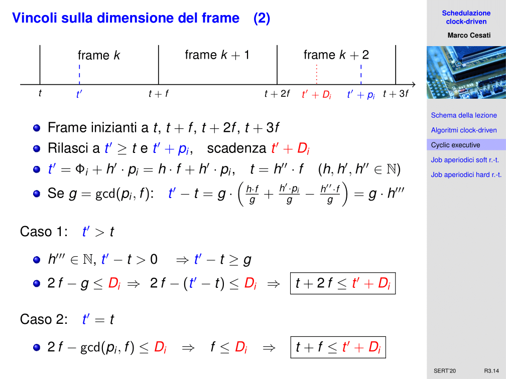

Vediamo perché quella condizione è sufficiente per dire che tra rilasci e la scadenza e la scadenza di un task c'è sempre un frame. Abbiamo questa situazione. Supponiamo di avere tre frame. Abbiamo un job che arriva all'istante $t'$. Il suo successivo rilascio è a $t'+p_i$. Ovviamente questi possono cadere in mezzo ai frame. Inoltre la scadenza assoluta di questo job è $t' + D_i$, ed anche questo cade in mezzo ad un frame. Quello che voglio dimostrare è che tra il rilascio $t'$ e $t' + D_i$, c'è sempre un intero frame. In altri termini, questa distanza è sempre in qualche modo $f$.

Allora, che cosa possiamo dire? Cosa è $t'$? E' l'istante di rilascio di un job di quel task. Quindi il primo job di quel task è stato rilasciato all'istante $\phi_i$. Questi sono task periodici, quindi tutti gli altri arrivano a multipli del periodo generato da questo $\phi_i$. Questo t' quindi è $\phi_i + h' \cdot p_i$. Ma adesso abbiamo una condizione. La condizione era che la fase di ogni task periodico è un multiplo intero, non negativo, della lunghezza del frame: $\phi_i = k \cdot f$, dove k è un numero intero. Quindi questo $\phi_i$ è $h \cdot f$, dunque abbiamo che $t' = h \cdot f + h' \cdot p_i$, dove $h$ ed $h'$ sono numeri interi. Che cosa è $t$? E' dove c'è un frame. Iniziano a 0 e ne abbiamo uno ogni $f$. Dunque $t = h'' \cdot f$.

Supponiamo che, per brevità, $g = gcd(p_i, f)$, allora cosa possiamo dire di $t' - t$? Possiam dire che $t'-t = g (\frac {h \cdot f} g + \frac {h' \cdot è_i} g - \frac {h'' \cdot f} g) = g \cdot h''$. $\frac {h\cdot f} g$ è un numero intero in quanto $g$ è il massimo comune divisore tra $pi$ ed $f$. Tutti e tre sono numeri interi, quindi tutto è un numero intero. $t' - t$ è un numero intero moltiplicato per $g$. Il numero intero è $\ge 0$, in quanto $t'$ entra nel frame che inizia a $t$. A questo punto distinguiamo due casi.

1. Supponiamo che $t' > t$
   1. Questo vuol dire che $t'-t >0$, dunque $t' - t \ge g$
   2. $2f - g \le D_i$, $2f - (t'-t)\le D_i$, $t+2f \le t'+ D_i$. Dunque tra il rilascio e la scadenza c'è lo scheduler che interviene e dunque può controllare se il job ha finito entro la scadenza oppure no
2. Supponiamo $t' = t$
   1. Questa condizione significa che $2f - fcd(p_i, f) \le D_i$. In quanto il massimo comune divisore non può essere più grande di $f$, allora $f \le D_i$. Quindi $t+f \le t' + D_i$

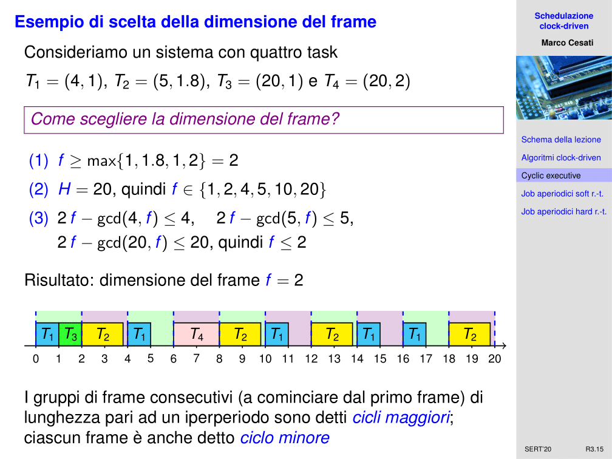

Facciamo un esempio. Prendiamo un sistema che ha quattro task.

- $T_1 = (4,1)$
- $T_2 = (5, 1.8)$
- $T_3 = (20, 1)$
- $T_4 = (20, 2)$

Siccome sono coppie, la fase è sempre 0, e la scadenza relativa è sempre uguale al periodo. Come facciamo a scegliere la dimensione del frame? Seguiamo le regolette che ci siamo dati.

1. Controllo che il frame abbiamo una dimensione maggiore dei tempi di esecuzione di ciascun job
   1. $f \ge max(1, 1.8, 1.2) = 2$
2. Quanto è lungo l'iperperiodo? $H=20$, dunque $f = (1, 2, 4, 5, 10, 20)$. Non può essere diverso, perché altrimenti quando finisce l'iperperiodo il frame non sarebbe finito ed invece no. $f$ deve essere un divisore dell'iperperiodo
3. $2 \cdot f - gcd(4, f) \le 4$, $2 \cdot f - gcd(5, f) \le 5$, $2 \cdot f - gcd(20, f) \le 20$, quindi $f \le 2$
   1. Se vado a fare questi controlli, mi accorgo che il valore $2$ va bene. Le condizioni sono sempre rispettate

Prendo il frame uguale a 2, dunque il mio iperperiodo lo partiziono in un certo numero di frame. In realtà nel *ciclic executive*, la lunghezza dell'iperperiodo è chiamato **ciclo maggiore**, è quello che si ripete all'infinito sempre uguale. Ciascun frame è chiamato **ciclo minore**. Dopo di che non ho finito in quanto devo *piazzare* dentro questo frame di questo ciclo maggiore i vari job. Questo lo deve fare il progettista. In realtà, se il sistema è complesso, ci sono tanti job ecc. ci sono dei tool che fanno questo in modo automatico. Noi, per fare l'esercizio, facciamo a mano.

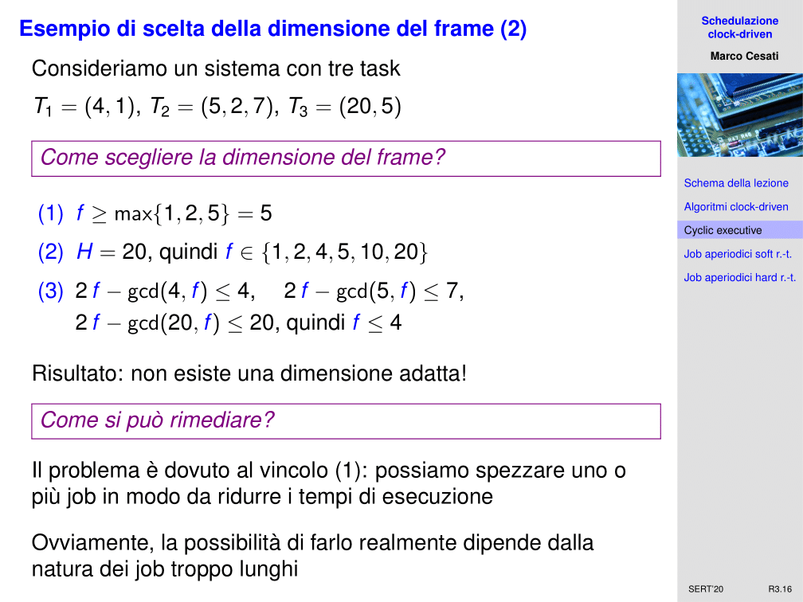

Vediamo un altro sistema di task. Qui abbiamo tre task.

- $T_1 = (4,1)$
- $T_2 = (5,2,7)$
- $T_3 = (20, 5)$

Come scegliamo la dimensione del frame?

1. $f \ge max(1,2,5) = 5$
2. $H = 20$, quindi $f = (1, 2, 4, 5, 10, 20)$
3. $2f - gcd (4,f) \le 4$, $2f - gcd (7,f) \le 7$, $2f - gcd (20,f) \le 20$, quindi $f \le 4$

I valori di $f$ che vanno bene solo solamente $1,\ 2,\ 4$. Qui però ho un problema. Perché in realtà la prima condizione pone $f \ge 5$. Dunque il risultato è che non esiste una dimensione del frame adatta. O non riesco a schedulare un intero job, se è troppo piccolo, ma se è troppo grande per schedulare almeno un intero job risulterebbe che non c'è sempre un frame tra un rilascio ed una scadenza.

Come si può rimediare? Ovviamente il problema è dovuto al primo vincolo. Se il progettista ha la possibilità di spezzare il job $T_3$ in due job più piccoli, allora riduce il tempo di esecuzione massimo e può ridisegnare il sistema con il primo vincolo rilassato.

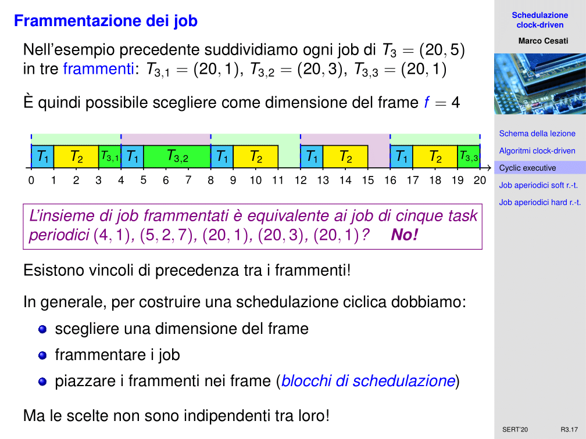

Per esempio possiamo dire di prendere il job $T_3$ e lo spezziamo in:

- $T_{3,1} = (20, 1)$
- $T_{3,2} = (20, 3)$
- $T_{3,3} = (20, 1)$

A questo punto posso rifare tutti i conti. **Attenzione però**. L'insieme di job frammentati, è equivalente ai job di cinque task periodici? In realtà non proprio. Questo nuovo insieme di task frammentati impone dei vincoli di precedenza tra i frammenti che non esistevano prima. Dal punto di vista delle precedenze è il progettista che fa la schedulazione che si deve assicurare che non eseguirò un $(3,1)$ prima di un $(3,2)$. Però non si può dire che i task siano equivalenti. Nel primo caso non ho vincoli di precedenza, mentre qui li ho.

In generale quando costruisco una schedulazione ciclica devo scegliere la dimensione dei frame, frammento i job e dopo piazzo i frammenti nel blocco di schedulazione. Le scelte non sono indipendenti tra loro! Come abbiamo visto, posso avere casi in cui devo frammentare e ricominciare.

Vediamo qualche altro problema che si ha quando si progettano questo tipo di sistemi. Uno dei problemi è che i task potrebbero non essere armonici. Cosa è un **task armonico**? I task sono armonici quando i periodi sono uno multiplo dell'altro. Prendiamo questi tre task.

- $T_1=(3,1)$
- $T_2=(7,3)$
- $T_3=(25, 3)$

L'iperperiodo è $H = 3 \cdot 7 \cdot 25 = 525$. Il problema è che questi tre numeri sono tutti coprimi, quindi il minimo comune multiplo è $525$. Quindi il ciclo maggiore dello scheduler ha $525$ unità di tempo. Se vado a fare i conti come prima, l'unica dimensione ammissibile per i frame è 3. Questo vuol dire che il ciclo maggiore ha 175 frame. Questo è un problema in quanto questi scheduler sono implementati con le tabelle, ed è richiesto un elemento della tabella per ogni ciclo minore. Quando ho tabelle molto grandi, occupo memoria, e questi scheduler in realtà sono pensati per sistemi molto semplici, dove di memoria non ne abbiamo molto.

Quindi devo trovare una soluzione. Quale? La soluzione potrebbe essere di abbassare i periodi dei task nei requisiti di progetto. Cerchiamo di avere dei periodi "meno problematici". 

- $T_1 = (3,1)$
- $T_2 = (6,3)$
- $T_3 = (24, 3)$

Da cui deriva che $H = 24$, con il ciclo maggiore che ha 8 frame ora. La tabella ora è molto più piccola. Quando abbasso il periodo di un task, alzo la frequenza. Questo vuol dire che se avevo un certo requisito che quell'attività dovesse essere svolta abbastanza frequentemente, probabilmente andrà ugualmente bene farla più spesso. Il problema è che questo alza l'utilizzazione del sistema. Sto aumentando il carico di lavoro del processore. In questo caso particolare, il processore ha un carico di lavoro che aumenta del 7.6%. 

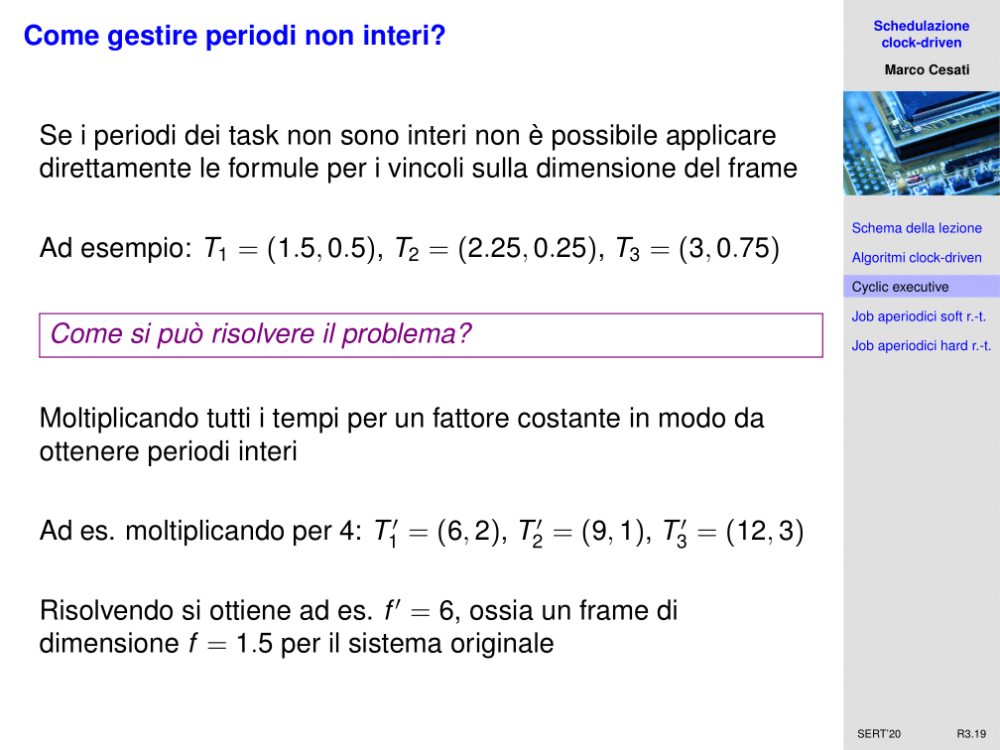

1.02.26