# SERT - 08/10/2020 - Algoritmi priority-driven - R04

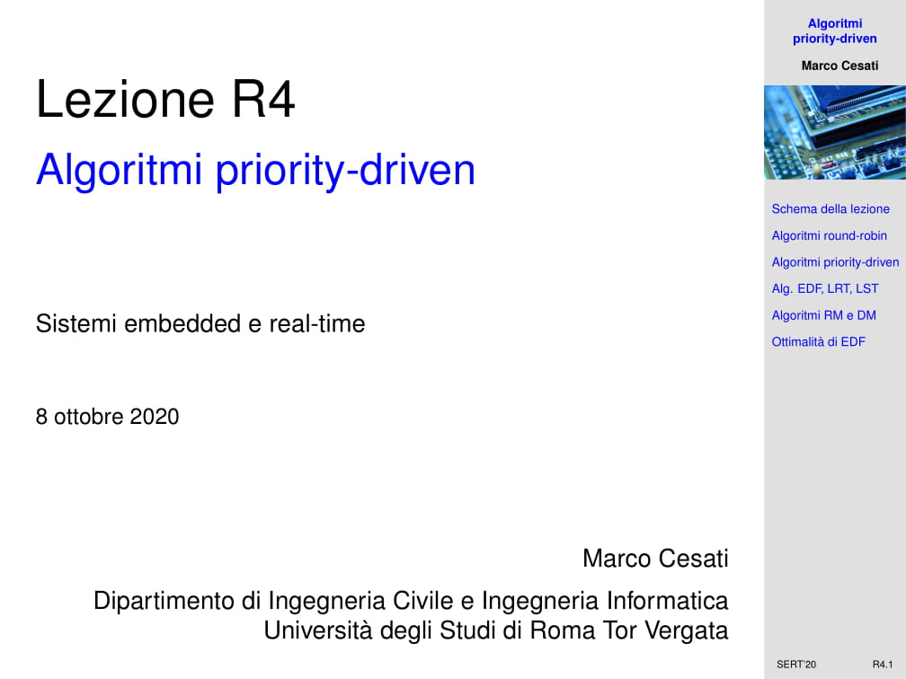

Benvenuti, siamo alla quarta lezione dedicata ai sistemi RT. Oggi parliamo di algoritmi priority driven.

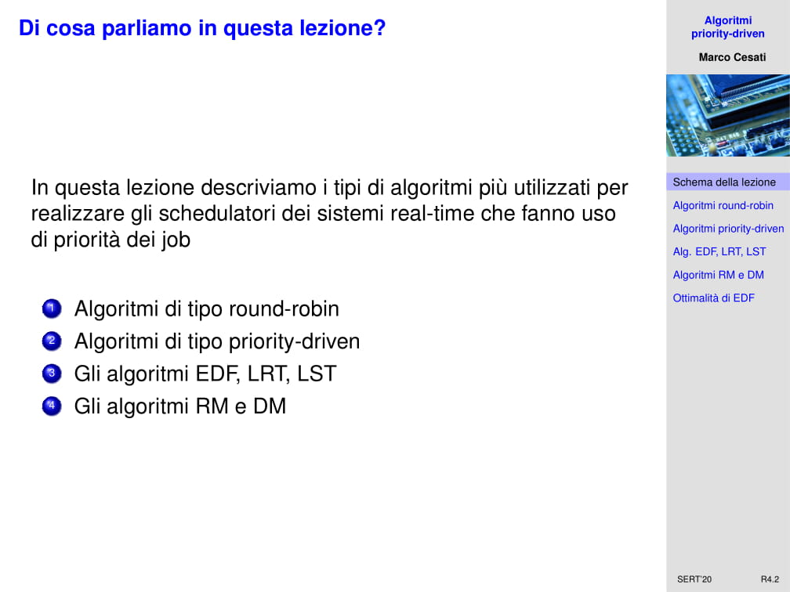

In realtà ci porteremo appresso questi algoritmi per tutto il resto del corso. Questi sono gli algoritmi più diffusi quando si tratta di schedulare i task nei sistemi RT. Inizieremo a parlare di algoritmi round-robin giusto per dare un contesto al nostro discorso. Dopo di che affronteremo un discorso più proprio degli algoritmi priority driven utilizzati nei sistemi RT.

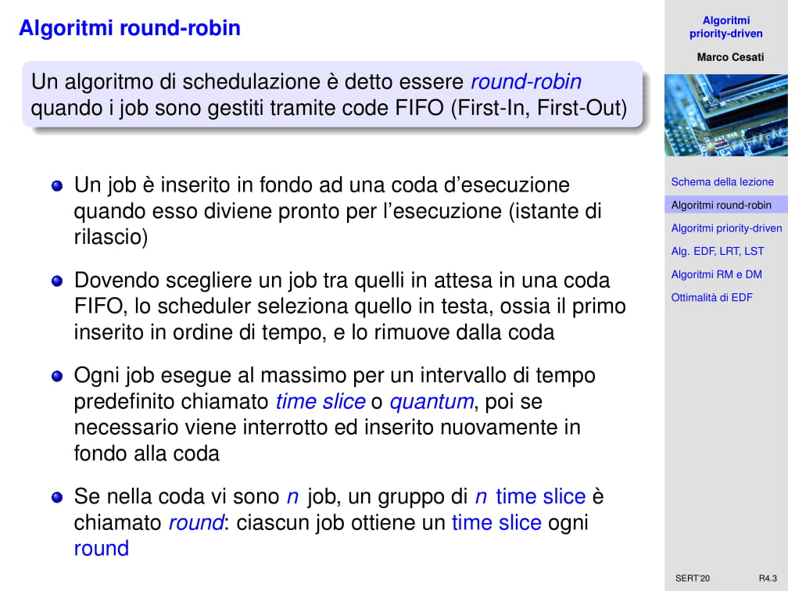

Che cosa è un algoritmo **round-robin**? E' gestito tramite una coda di job, di processi, *FIFO*(First in first out). Il primo job che arriva in coda è anche il primo ad essere servito. In realtà, quindi, abbiamo che quando un job arriva è messo in coda di esecuzione e, se devo scegliere fra tanti job, seleziono quello che è in cima alla coda, cioè quello inserito da più tempo. Lo rimuovo dalla coda e lo eseguo. Tipicamente non lo eseguo fino a che termina, ma lo eseguo per un certo tempo predefinito, chiamato *time slice* o *quanto di tempo*. Nel momento in cui il quanto di tempo scade ed il job non ha finito, viene interrotto ed inserito nuovamente in coda. In realtà passa indietro a tutti gli altri job nel sistema.

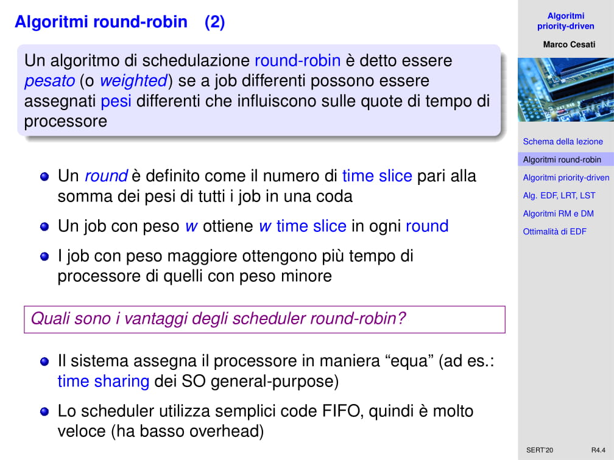

Quindi se nella coda ci sono $n$ job attivi nel sistema, un gruppo di questi $n$ time slice è chiamato un **round**, intervallo di tempo pari ad $n$ volte il quanto di tempo dedicato ad ogni processo attivo. Ciascun job ottiene un time slice determinato. Questo è lo schema di base. In realtà in generale si adotta uno schema leggermente più complicato, che è il **round-robin pesato**. E' possibile fare in modo che i job differenti abbiano in qualche modo una percentuale di allocazione del processore diversa. Quindi posso assegnare un peso. Un job più pesante ottiene più processore di un job meno pesante. Come possiamo definire formalmente questo tipo di algoritmo? Un **round** lo definisco come un numero di time slice pari alla somma di tutti i pesi dei job nella coda. Un job con peso $w$, in ogni round ottiene $w$ time slices. Quindi è chiaro che un job più pesante, in ogni round ottiene più processore di un job più leggero.

Quali sono i vantaggi degli scheduler round-robin? Innanzitutto sono abbastanza equi. Cioè fondamentalmente job dello stesso peso ottengono la stessa quantità di risorse, di processore. Questa è una proprietà, il **time sharing** cioè la suddivisione del tempo del processore in modo equo tra i processi del sistema, una caratteristica importante dei sistemi operativi general purpose. Un'altra caratteristica importante di questi algoritmi è la loro semplicità di implementazione, in quanto si usano delle code FIFO molto semplici. Tipicamente se mi limito a questo algoritmo di base, è estremamente efficiente e veloce da implementare. Gli algoritmi round-robin sono algoritmi utilizzati sopratutto nei sistemi operativi general purpose, già visti in una forma o nell'altra nei corsi di sistemi operativi di base ed avanzati. In realtà, se ne usano delle versioni molto più sofisticate perché in qualche modo voglio cercare di discriminare job di tipologie differenti, o posso cercare di fare assegnare all'utente stesso delle priorità, dei pesi, su questi job. Oppure posso cercare di contemplare il caso in cui i job effettuano operazioni che sono particolarmente onerose rispetto ad altri che non lo sono. Gli algoritmi che usano nei sistemi operativi reali sono molto sofisticati, ma alla base di tutto c'è questo schema round-robin in cui i processi si alternano sul processore.

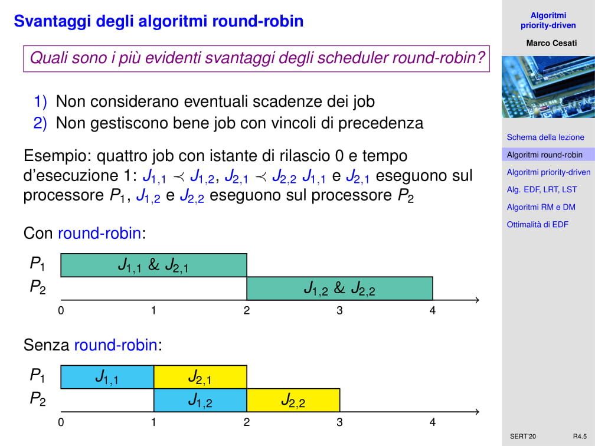

A questo punto quindi possiamo domandarci: ma nell'ambito dei sistemi RT, cioè dei sistemi in cui la schedulazione deve occuparsi del fatto che tutti i job devono rispettare le scadenze, quali sono gli svantaggi di questi scheduler round-robin? Ovviamente lo svantaggio principale è che questi algoritmi non consentono di valutare le scadenze del job. Se io inserisco un job in coda, quando arriva il suo turno esegue, in realtà non sto considerando quanto è vicina o lontana la scadenza di quel job. E quindi poiché non considera la scadenza dei job, fa un pessimo lavoro nel cercare di far rispettare le scadenze dei job. C'è un altro problema. Un problema abbastanza serio. Questi algoritmi non gestiscono bene i job che hanno dei vincoli di precedenza. I vincoli di precedenza è una situazione per la quale un certo job non può cominciare se un job precedente non ha terminato. Sappiamo che chiamo questa relazione d'ordine *precedenza immediata* con il simbolo sulle slide. Supponiamo di avere $J_{1,1}$ e $J_{1,2}$ con vincolo di precedenza, dunque il secondo non può iniziare se il primo non è finito. Poi abbiamo anche $J_{2,1}$ e $J_{2,2}$. Supponiamo di avere due processori. Questa semplice situazione, quando questi algoritmi sono schedulati sul processore con round robin, fondamentalmente le cose vanno come in slide. Siccome tutti i job che devono eseguire sul processore due non possono partire fin quando i job del processore 1 non sono terminati, nella prima parte per due unità di tempo si alternano sul processore 1 i job $J_{1,1}$ e $J_{2,1}$. Fondalmente possiamo assumere che il time slice sia così piccolo che questi fanno un'alternanza molto rapida sul processore. E' come "se andassero avanti in parallelo". Dopo di che però il loro tempo di esecuzione totale è più o meno la somma dei singoli job. Quindi all'istante 2, $J_{1,1}$ e $J_{2,1}$ terminano più o meno. Quindi all'istante 2 possono iniziare gli altri job che finiscono all'istante 4. Con il round robin, l'ultimo job completa all'istante 4. Il tempo di completamento dell'ultimo job è quattro.

Ma questo algoritmo è particolarmente cattivo se lo confrontiamo con un algoritmo che non usa il round-robin. Se io non lo uso, io posso dire che sul processore 1 eseguo tutto prima tutto il job $J_{1,1}$, ed a questo punto all'istante 1 posso eseguire il job $J_{2,1}$ e $J_{1,2}$. All'istante 2 terminate $J_{2,1}$ e può essere eseguito $J_{2,2}$. L'istante di terminazione dell'ultimo job è l'istante 3. Dove è il guadagno del tempo? Sta nel fatto che tra 1 e 2, ci sono stati due job in esecuzione contemporaneamente. Cioè ho sfruttato veramente il sistema multiprocessore. Mentre con l'algoritmo round-robin, questo sistema multiprocessore non l'ho potuto utilizzare a causa dei vincoli di precedenza. Morale, questi round-robin funzionano male con i job con vincoli di precedenza.

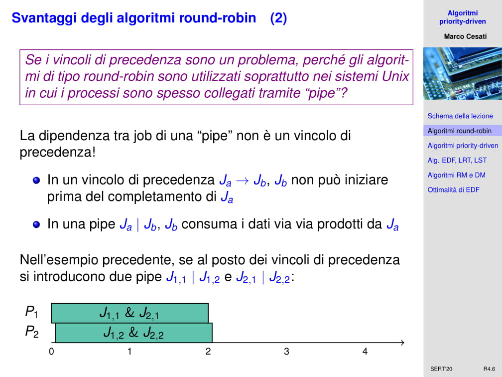

A questo punto una domanda è legittima da parte nostra e quindi è d'obbligo anche una domanda da parte sua: ma se i vincoli di precedenza sono un problema, perché gli algoritmi round-robin sono utilizzati sopratutto nei sistemi general purpose, per esempio nei sistemi Unix in cui ho tanti processi che spesso sono collegati tramite *pipe*, dunque dei vincoli di collegamento tra processi? La risposta a questa apparente contraddizione è che la pipe non è un vincolo di precedenza. In un vincolo di precedenza, io ho che un certo job non può iniziare se prima il job che lo precede non è terminato. In una pipe invece questo non è vero. In una pipe un certo job si limita a consumare i dati che produce un altro job. Siccome nulla vieta che i due job eseguono contemporaneamente, $J_b$ può consumare i dati man mano che $J_a$ li produce. Un esempio con i due processori ed i quattro job di prima, se al posto dei vincoli di precedenza ci metto le pipe, in realtà il round-robin funziona benissimo perché nel round-robin si alternano i job sui vari processori. Alla fine tutti quanti terminano più o meno poco dopo l'istante 2. Quindi il round-robin non è un problema per le pipe, ma lo è per i job con i vincoli di precedenza che sono un'altra cosa.

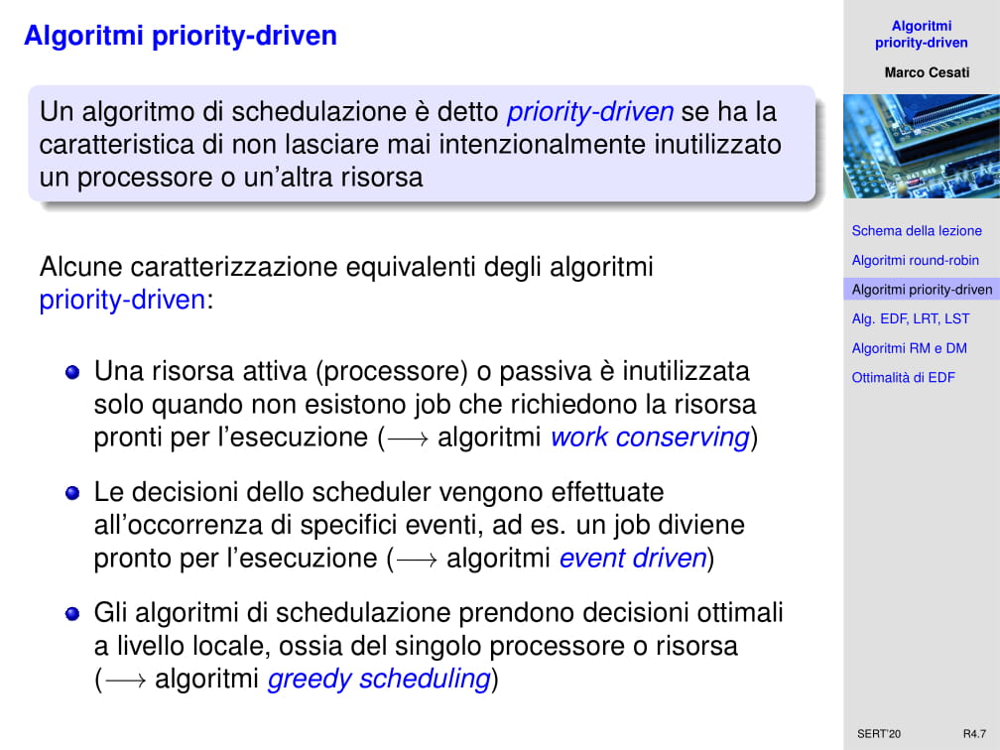

In realtà abbiamo un altro grosso problema per gl algoritmi di round-robin è che non hanno nessuna nozione del concetto di scadenza. Facciamo un passo indietro. Che cosa è un algoritmo **priority-driven**? E' un algoritmo che ha la caratteristica di non lasciare mai intenzionalmente inutilizzato un processore o un'altra risorsa. Cioè questa è una caratterizzazione molto generale, e come vedremo si possono dare tante caratterizzazioni diverse degli algoritmi priority driven, ma per noi sono più o meno tutte equivalenti. Questa caratterizzazione sta dicendo: "se c'è un processore o una risorsa che è libera, e se c'è un job che può utilizzare quella risorsa, l'algoritmo assegna la risorsa al job". Non lascia mai la risorsa libera perché magari in futuro può succedere qualcosa. Questo è quindi una definizione di base dell'algoritmo priority driven. Di questa caratterizzazione se ne possono dare altre formulazioni.

- Una risorsa attiva (processore) o passiva è inutilizzata soltanto quando non esistono job che richiedono di usare la risorsa stessa pronti per l'esecuzione. Si chiamano anche algoritmi **work conserving**
- Le decisioni dello scheduler vengono effettuate all'occorrenza di eventi specifici, ad esempio se un job diviene pronto per l'esecuzione. Si chiamano anche algoritmi **event driven**
- Questi algoritmi prendono decisioni ottimali ma soltanto a livello locale. cioè a livello del singolo processore o risorsa. Il singolo processore o risorsa viene utilizzato il più possibile, ma non è detto che questa scelta poi a livello globale sia ottimale. Si chiamano anche algoritmi **greedy scheduling**

Di fatto nei nostri algoritmi priority-driven introdurremo una serie di sotto-algoritmi, rilasseremo un po di queste condizioni, per cui non sempre per esempio il processore sarà utilizzato anche se c'è una risorsa che potrà utilizzarlo. Non sempre un job verrà considerato appena viene rilasciato. Motivi di convenienza dal punto di visto dell'implementazione pratica, oppure di evitare che fenomeni sgradevoli possano verificarsi, possono imporre di fare delle eccezioni a questo schema generale. Lo schema generale però rimane. Come algoritmi di schedulazione pura, questi sono caratterizzati in questo modo.

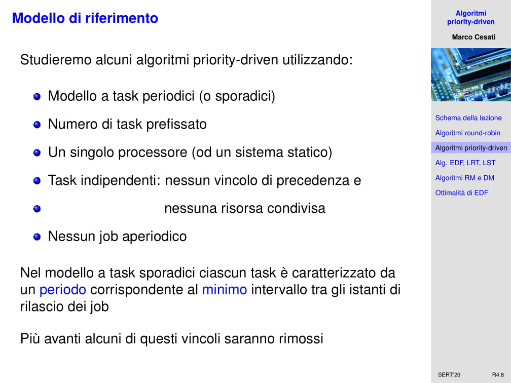

Come studiamo gli algoritmi priority-driven? Li studiamo utilizzando il nostro modello a task periodici, ovvero task sporadici già introdotto in una lezione precedente. Ma cerchiamo di cominciare a considerarli con un modello un po semplificato. Diciamo che il numero di task è prefissato, non può aumentare e ne diminuire. Ci poniamo nel caso in cui ci sia un singolo processore, oppure un sistema statico, ma di questo ne parleremo più avanti. Ci poniamo nel caso in cui i task sono indipendenti, ovvero non ci siano vincoli di precedenza tra i task e non ci siano conflitti di accesso sulle risorse. Cioè le risorse condivise non esistono. Ciascun job quando vuole una risorsa è tutta sua. Non ci son job aperiodici, e fondamentalmente questo modello semplificato è quello con cui cominciamo a studiare questi classi di algoritmi. Teniamo presente che alcuni di questi vincoli, in realtà quasi tutti, li rilasseremo più avanti. Man mano cercheremo di capire come fare a modellare sistemi reali in cui non potrò avere un modello così rigido ma dovrò rilassare questi vincoli. Cominciamo con un modello molto rigido. Ricordiamo che nel modello a task sporadici il periodo è il minimo intervallo che c'è tra il rilascio di job dello stesso task. Mentre nel modello a task periodici è l'intervallo esatto.

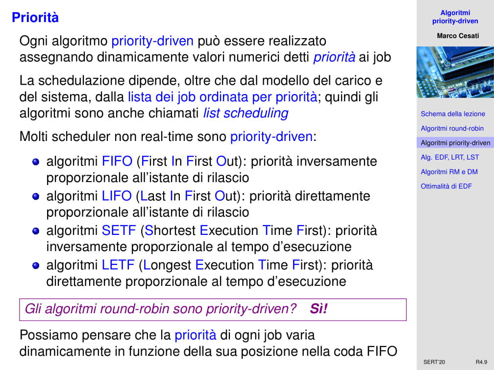

Perché si chiamano algoritmi a priorità? Perché in realtà gli algoritmi possono essere descritti facilmente considerando un valore numerico che viene assegnato ai job Questo valore numerico è chiamato proprità. Fondamentalmente la schedulazione dipende non solo dal modello del carico, quindi quali sono i task nel sistema, ma anche dalla lista dei job ordinata per priorità. Quindi un altro nome di questa classe di algoritmi è **list scheduling**, cioè algoritmi basati su una lista. Ma la lista è ordinata per priorità. In ogni istante lo scheduler sceglie il job che ha priorità maggiore. Maggiore non significa necessariamente numericamente maggiore. Cioè dipende dall'implementazione. Ne abbiamo alcune in cui un numero numerico inferiore rappresenta un'importanza maggiore. Posso anche fare la scelta opposta e dire che in altre implementazioni un job che ha valore numerico maggiore deve essere eseguito in modo prioritario rispetto ad uno che ha un valore numerico inferire. Questa p una scelta implementativa. Non cambia la sostanza del discorso. La sostanza del discorso è che, chi ha priorità superiore, quello sarà schedulato.

Molti scheduler non RT che conosciamo, sono in realtà scheduler priority driven. Facciamo un esempio. L'algoritmo *FIFO* può essere descritto come un algoritmo a priorità, perché la priorità è inversamente proporzionale all'istante di rilascio assoluto. Si tratta di una valore numerico e, più è piccolo, più è precedente l'istante di arrivo e vuol dire che la priorità è inversamente proporzionale all'istante di rilascio del job. L'algoritmo *LIFO* è esattamente l'opposto, in quanto la proprità è direttamente proporzionale all'istante di rilascio. Abbiamo gli algoritmi *SETF (Shortest Execution Time First)*, dove la priorità è inversamente proporzionale al tempo di esecuzione: più è piccolo, più la priorità è maggiore, nel senso che provoca l'esecuzione rispetto a quelli che hanno priorità minore. Gli algoritmi *LETF (Longest Execution Time First)*, dove la priorità è direttamente proporzionale al tempo di esecuzione. Abbiamo visti gli algoritmi di tipo round-robin. **Sono priority driven?** Si. Sono una classe particolare di algoritmi FIFO, in cui però c'è un quanto di tempo. Niente di male, vuol dire che la priorità è data dall'istante di arrivo del job nella coda, quindi l'istante di rilascio del job. Dopodiché però questa priorità varia dinamicamente in funzione della posizione nella coda FIFO. Quindi ad un certo punto arrivo in cima alla coda, verrà eseguito per un certo tempo, dopodiché però quando il quanto di tempo termina, dovrà essere rimesso in fondo alla coda e ri-aggionerò la sua priorità per renderla inferiore a quella di tutti gli altri job in coda. 

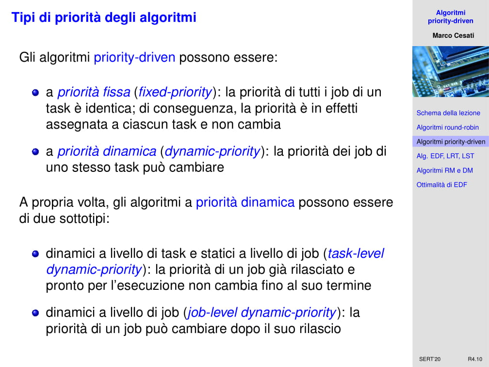

Questo significa che non tutti gli altoritmi priority-driven sono adatti per essere impiegati nei sistemi RT. Come possiamo caratterizzare questi algoritmi priority-driven?

- **La priorità può essere fissa (fixed-priority)**. Se guardo un certo task, tutti i job dello stesso task hanno la stessa priorità. Non è assegnata ai job ma ai task, e non può cambiare. Stesso task, ha una priorità che non cambia mai
- **La priorità è dinamica (dynamic-priority)**. La priorità dei job di uno stesso task può cambiare
  - **Dinamici a livello di task e statici a livello di job** (*task-level dynamic-priority*). Job differenti dello stesso task possono avere priorità differenti, ma nel momento in cui un job è rilasciato, quel job non potrà cambiare la sua priorità.
  - **Dinamici a livello di job** *(job-level dynamic-priority)*. La priorità di un job può cambiare dopo il suo rilascio

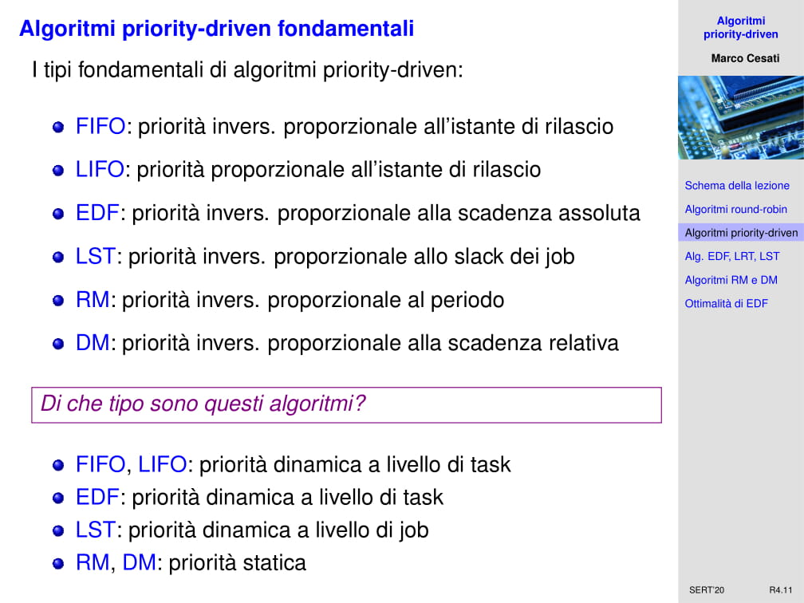

Vediamo un po. Abbiamo visto:

- **FIFO**, priorità inversamente proprozionale all'istante di rilascio
- **LIFO**, priorità direttamente proporzionale all'istante di rilascio
- **EDF (Earliest Deadline First)**, priorità inversa proporzionale alla scadenza assoluta. Più è vicina la scadenza, più quel job è urgente eseguirlo perché c'è più probabilità che manchi la scadenza
- **LST**, priorità inversamente proporzionale allo slack dei job. Lo slack è un concetto che abbiamo già visto e che ora riprenderemo, ed è il margine di sicurezza che ho per completare il job prima che manchi la scadenza. Più è piccolo lo slack, meno margine di sicurezza ho, più aumento la priorità del job
- **RM**, priorità inversamente proprozionale al periodo del task. Quindi è direttamente proporzionale alla frequenza con quale vengono rilasciati i job del task
- **DM**, priorità inversamente proporzionale alla scadenza relativa

Di che tipo sono questi algoritmi? 

- **FIFO, LIFO**: *priorità dinamica a livello di task*. Perché? Fondamentalmente una volta che io rilascio il job e quindi lo inserisco nella coda, quel job non cambia la sua priorità rispetto agli altri nel sistema. L'istante di arrivo è fissato, determina la priorità del job rispetto a tutti quelli nel sistema. Quindi una volta che arriva il job la sua priorità non cambia. Per è ovvio che job dello stesso task hanno istante di arrivo differenti e quindi cambia. Pe questo la priorità è dinamica a livello di task e fissa a livello di job.
- **EDF**: la scadenza assoluta cambia da job a job anche dello stesso task, ma non cambia per uno stesso job. *priorità dinamica a livello di task*, ma fissa a livello di job.
- **LST**: *priorità dinamica a livello di job*, in quanto lo slack è qualcosa che si modifica nel tempo. Quando un job viene rilasciato ha un certo slack, ma se continuo a non essere eseguito il suo margine di sicurezza continua a ridursi e la sua priorità dinamica aumenta.
- **RM, DM**: il periodo del task è fisso. Dunque sono algoritmi con *priorità statica*, in quanto la priorità è del task e non dei job del task. Tutti i job dello stesso task hanno la stessa priorità.

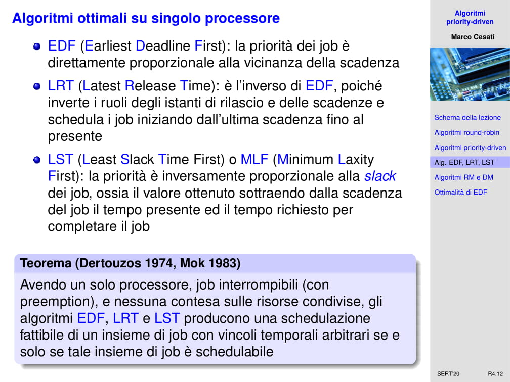

Ci sono algoritmi ottimali, cioè algoritmi che funzionano molto bene nel garantire che le scadenze siano rispettate. Ci sono degli algoritmi che sono in particolare ottimali sul singolo processore. Nel nostro modello abbiamo un solo processore ed esistono algoritmi di schedulazione ottimali. **EDF (Earliest Deadline First)**, in cui la priorità dei job è direttamente proprozionale alla vicinanza della scadenza, questo è un algoritmo ottimale. Se esiste un modo per far rispettare le scadenze a questo insieme di task, l'algoritmo **EDF** trova una schedulazione che rispetta le scadenze.

Un altro algoritmo ottimale è **LRT (Latest Release Time)**, è anche chiamato **EDF** inverso. E' come se fosse un **EDF** ma applicato dal futuro verso il passato. Abbiamo **LST (Least Slack Time First)**, che significa che prima va il job che ha lo slack più piccolo, o anche **MLF (Minimum Laxity First)**. Il margine di sicurezza è lo slack. Più questo è piccolo, più il mio lavoro diventa urgente. La priorità è dunque inversamente proporzionale allo slack.

Quindi possiamo formulare un teorema, del 1974 per *EDF* e dell'83 per gli altri.

> Se ho un solo processore, job interrompibili (con preemption) e non ci sono contese sulle risorse condivise, sia **EDF, LRT ed LST** producono una schedulazione fattibile, che rispetta le scadenze di un insieme di job con vincoli temporali arbitrati, se e solo se tale insieme di job è schedulabile.

Non importa come è fatto l'insieme di job. Se esiste un modo per fare rispettare le scadenze, **EDF, LRT ed LST** trovano questa schedulazione che rispetta le scadenze. Non importa come è fatto il sistema, non importano i parametri del sistema di task. Gli algoritmi sono ottimali.

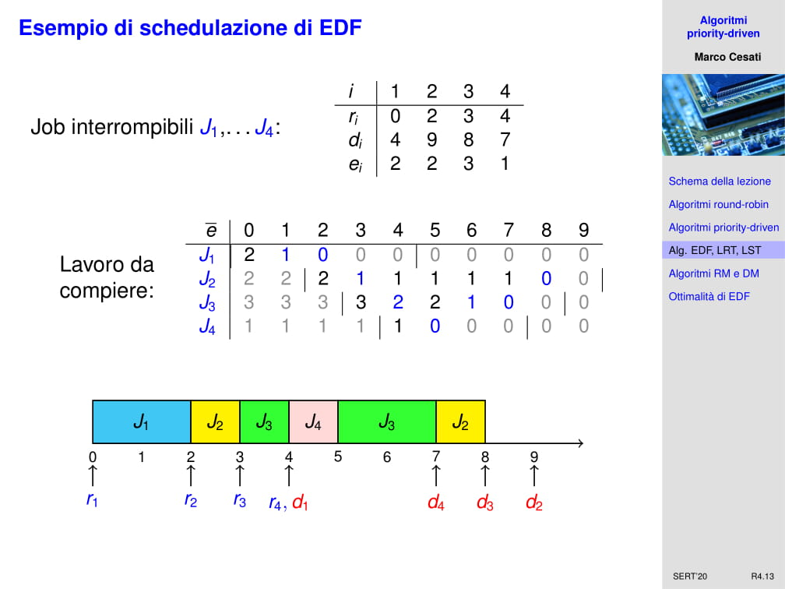

Vediamo un esempio di schedulazione di EDF. Supponiamo di avere quattro job interrompibili, con gli istanti di rilascio, scadenza assoluta e tempo di esecuzioni disponibili in tabella. Nella tabella al centro mettiamo il lavoro ancora da compiere. All'istante 0 tutti devono essere ancora svolti, dunque il lavoro da compiere corrisponde alla lunghezza dei job. In fondo troviamo la linea del tempo, dove abbiamo segnato gli istanti di rilascio e le scadenze. Ovviamente **EDF** schedula dando priorità a quelli che hanno scadenza più vicina.

All'istante 2 va in esecuzione l'unico eseguibile nel sistema, $J_2$. All'istante 3, viene rilasciato il job $J_3$. Badiamo che $J_2$ non è terminato, perché lui deve eseguire per due unità di tempo. La scadenza di $J_3$ è 8, mentre la scadenza di $J_2$ è 9. $J_3$ dunque ha priorità superiore, dunque da 3 a 4 va in esecuzione il job $J_3$. All'istante quattro, vieene rilasciato il job $J_4$, che ha scadenza assoluta 7, quindi ancora superiore come priorità agli altri job in esecuzione. E quindi viene interrotta l'esecuzione di $J_3$ e viene eseguito al suo posto. All'istante 5 $J_4$ è terminato, non ha lavoro da compiere. Quindi all'istante 5 va messo in esecuzione uno dei due job che ancora non è stato completato. Chi vince? Dipende sempre dalla scadenza assoluta. La più vicina è quella di $J_3$, quindi va avanti lui. All'istante 7 viene eseguito l'ultimo job del sistema. La schedulazione è finita. Questa è una schedulazione **EDF**. Notiamo che in questa schedulazione tutti i job rispettano le scadenze.

L'algoritmo **LRT** è chiamato anche **EDF** inverso. Inverte i ruoli degli istanti di rilascio e di scadenza. Tutto quello che prima dicevamo sui rilasci, ora lo diciamo sulle scadenze. Schedulo a partire dalle scadenze e vado a ritroso verso i rilasci. Ovviamente questo significa che la priorità assegnata ad un jb è proporzionale al suo istante di rilascio. Più avanti è l'istante di rilascio, maggiore è la proprità. Qual'è il vantaggio di **LRT** rispetto ad **EDF**?

**LRT** cerca di completare i job in corrispondenza della loro scadenza. Quindi è meno aggressivo nell'uso del processore, dunque l'istante di completamento dei job è più regolare. Se io mi chiedo quale è il tempo di risposta dei job, questo tempo di risposta tende ad avvicinarsi molto a quello che sono le scadenze naturali dei job. Questa cosa è positiva, perché in un sistema RT quello ceh io voglio è ridurre il più possibile l'impredicibilità del sistema, e quindi anche le variazioni nei tempi di risposta dei job. Io li voglio regolari. Ma è un algoritmo di tipo priority-driven? No, non lo è, perché per poter realizzare tutto questo, l'algoritmo potrebbe lasciare un processore inutilizzato anche in presenza di job presenti per l'esecuzione. Questo significa che è un algoritmo offline. Non si può applicare se non conosco esattamente tutto l'insieme dei job che devono essere schedulati. Non posso schedulare questo job di cui non conosco nulla. Se ad un certo punto arriverà un job ed io non lo sapevo, non posso applicare **EDF** inverso, in quanto la schedulazione sarebbe stata completamente differente nel momento in cui quel job non ci fosse stato.

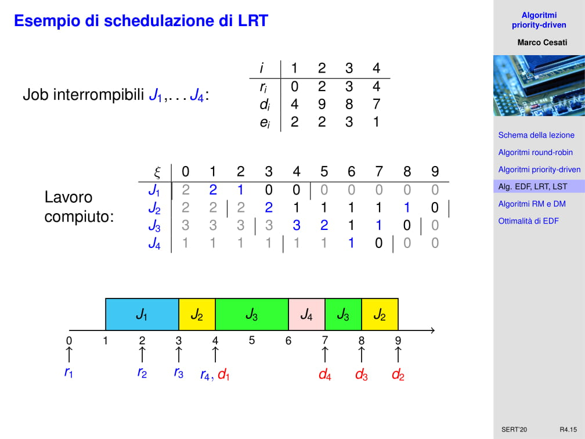

Vediamo un esempio, stesso di prima. Qui si va a ritroso. Si comincia dall'istante 9. E' la prima scadenza, è la scadenza del job $J_2$. Dico questo è il suo rilascio e vado all'indietro. all'istante 8 c'è un'altra scadenza. Rovesciando i discorsi tra rilascio e scadenza, $J_3$ ha priorità superiore a $J_2$ in quanto il suo rilascio è più vicino. All'instante 7 viene ho la scadenza di $J_4$, che ha rilascio più vicino e dunque ha priorità maggiore. All'istante 6 $J_4$ ha terminato l'esecuzione, quindi può ritornare in esecuzione il job $J_3$ che aveva priorità superiore a $J_2$. All'istante 4 $J_3$ ha completato l'esecuzione, quindi ha eseguito per tre unità di tempo. Chi deve andare in esecuzione? Abbiamo la scadenza di $J_1$ e $J_2$ che non ho ancora completato. Chi vince? Vince $J_2$, in quanto il suo rilascio è più *vicino*. All'istante di tempo 3 viene terminato $J_2$, ed all'istante di tempo 1 viene terminato $J_1$. Ovviamente questa è la stessa identica schedulazione, nell'ordine, di **EDF**, però abbiamo compattato tutte le esecuzioni per avvicinarle a quelle che sono le scadenze naturali dei job. E quindi che significa? Che all'istante iniziale, a 0, c'era un job che si poteva eseguire, ma lo scheduler ha scelto di non eseguire niente.

Questo non è un algoritmo **work conservative**. Lo citiamo, in quanto esiste in alcuni contesti e può essere conveniente utilizzarlo, ma non è un algoritmo che si può applicare per schedulare job online, cioè un algoritmo che può prendere decisioni su un insieme di task che il progettista non conosce. E' un algoritmo che si usa in casi particolari ma non lo approfondiremo perché appunto non è particolarmente flessibile.

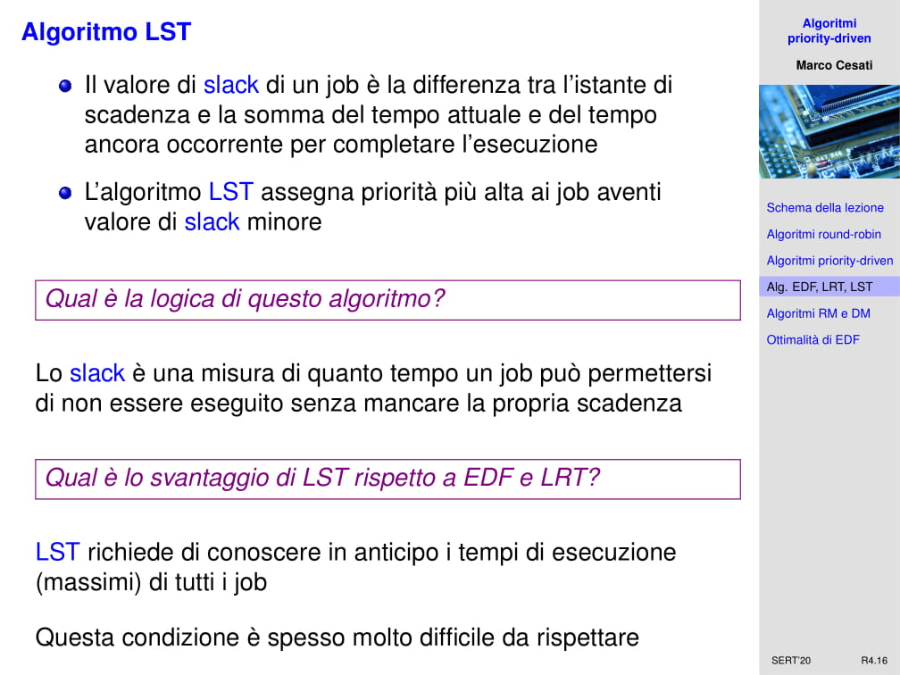

L'algoritmo **LST**. **LST** è basato sullo slack, cioè sul margine di sicurezza. E' la differenza fra l'istante della scadenza e l'istante attuale, quindi dice quanto tempo manca alla scadenza, e ci devo togliere anche quanto lavoro mi resta da fare per completare l'esecuzione del job. Lo **slack** è una proprietà del job che cambia in continuazione. L'algoritmo assegna una priorità più alta ai job che hanno uno slack, un margine di sicurezza, minore. Ovviamente la logica è che più è basso lo *slack*, meno tempo mi posso permettere di perdere senza mancare la scadenza. Quale è lo svantaggio di **LST** rispetto ad **EDF ed LRT**? C'è uno svantaggio assolutamente evidente in questa funzione dell'algoritmo. Lo svantaggio molto evidente è che **LST** a differenza di **EDF** deve conoscere il tempo di esecuzione dei job. Perché per calcolare lo slack, con il quale calcola la priorità, devo conoscere quanto tempo ho eseguito e quanto tempo mi manca per completare l'esecuzione. Quindi devo avere una misura accurata di quello che è il tempo di esecuzione dei job. Posso basarmi sul **worst case**, ma non è detto che questa scelta sia conveniente. Calcolare il worst case di per se già è difficile, e comunque è una scelta pessimistica. L'algoritmo **LST** si deve basare su questa scelta pessimistica, e comunque costringe, quando implemento l'algoritmo, a tenere conto nella logica dell'algoritmo di questo parametro, il tempo di esecuzione.

C'è una differenza sostanziale rispetto ad **EDF**. E' vero che per la validare **EDF** devo conoscere il tempo di esecuzione dei job, ma questa cosa serve solamente per certificare che il sistema è fatto a regola d'arte. Non è necessario implementare la logica dei tempi di esecuzione dentro allo scheduler, in quanto EDF non ragione per i tempi di esecuzione. Si chiede solamente quanta è vicina la scadenza di un job rispetto all'altro. Nella logica del programma, dunque, deve essere introdotto questo parametro numerico che deve essere aggiornato ogni volta, rendendo l'implementazione più costosa.

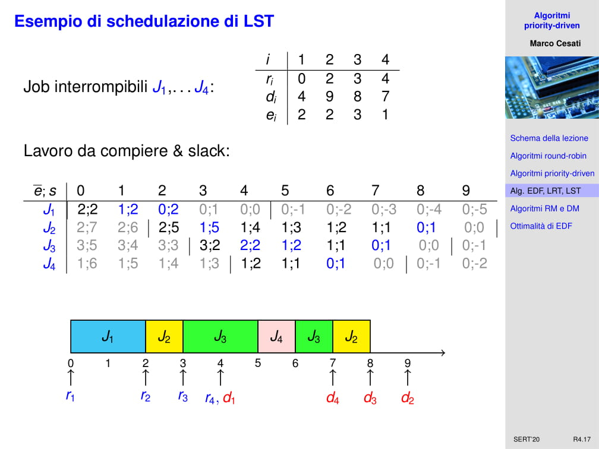

Vediamo lo stesso esempio. Lo slack di $J_1$ all'inizio è 2. Non ha molto senso calcolare lo slack degli altri job in quanto non sono stati ancora rilasciati. All'istante 0 metto in esecuzione $J_1$ che continua fino all'istante 2. All'istante 2 viene rilasciato il job $J_2$. Teniamo presente che fin quando il job $J_1$ rimane in esecuzione, lo slack rimane costante. Lo slack è il margine di sicurezza, eseguendo non lo posso aumentare, lo posso solamente far rimanere costante. Se io mi posso permettere di perdere tre giorni prima di mancare la scadenza del progetto, mano a mano che io lavoro questi tre giorni me li mantengo, non posso aumentarli. Il margine di sicurezza può soltanto rimanere costante. Se vado al mare un giorno, ho perso lo slack di un giorno, si è ridotto. Lo slack si riduce se non lavoro, ma rimane costante se lavoro. Quindi $J_1$ che viene eseguito tra 0 e 2, mantiene il suo slack costante tra 0 e 2. All'istante due viene rilasciato $J_2$. Il suo slack è 5 unità di tempo. Chi viene eseguito? Ovviamente $J_2$ che è l'unico in esecuzione.

All'istante 3 viene rilasciato $J_3$, il suo rilascio è 8, il suo tempo di esecuzione è 5 ed il suo slack in esecuzione è 2. Ora ci sono due job eseguibili nel sistema, $J_2$ e $J_3$. Chi ha lo slack più piccolo? $J_3$, che quindi va in esecuzione. All'istante 4 viene rilasciato il job $J_4$, quanto è il suo slack iniziale? La sua scadenza è 7, adesso siamo all'istante 4, 7 meno 4 fa 3. Quante serve per completarlo? 1 unità di tempo. Dunque 3 meno 1 fa 2. All'istante iniziale il job $J_4$ ha slack uguale a 2. Quanto è lo slack del job $J_3$? Siccome sta venendo eseguito non è cambiato. Era 2 all'istante tre, rimane 2 all'istante 4. Invece, lo slack del job $J_2$ è diminuito perché era 5 all'istante tre, ma è passato un'unità di tempo che non ha eseguito, quindi adesso è diventato quattro. Adesso siamo all'istante 4, la scadenza di $J_2$ è 9, 9 meno quattro fa 5. Quanto devo ancora eseguire? Devo ancora eseguire per un'unità di tempo, quindi lo slack è quattro. Ora fra 4, 2 e 2 potrebbero vincere a pari merito $J_3$ e $J_4$, ma $J_3$ è già sul processore. Nessuno scheduler prende un job e lo sostituisce con un altro job che ha la stessa priorità, in quanto significa fare un lavoro in più senza una reale motivazione. Interrompo un job solamente se c'è un job di priorità superiore. Se ho la stessa priorità, lascio quello che ho in esecuzione così non spendo il tempo per toglerli o dal processore e rimettercene un altro. Quindi all'istante 4 continua il job $J_3$ che arriva fino all'istante 5.

All'istante 5 che succede? $J_4$ e $J_2$, che non stanno in esecuzione, hanno ridotto di un'unità lo slack rispetto all'istante 4. $J_2$ passa a 3 e $J_2$ passa ad 1. $J_3$ è in esecuzione, il suo slack era 2 e rimane 2. A questo punto lo slack di $J_4$ è strettamente minore di $J_3$, dunque entra lui in esecuzione sul processore. $J_4$ termina dopo un'unità di tempo. A questo punto $J_2$ e $J_3$ vengono eseguiti, entrambi hanno lo slack ridotto che passa da 3 a 2 e da 2 a 1, rispettivamente. $J_3$ ha slack inferiore, quindi priorità superiore, e viene eseguito lui. A questo punto $J_3$ completa, e l'unico job rimanente è $J_2$.

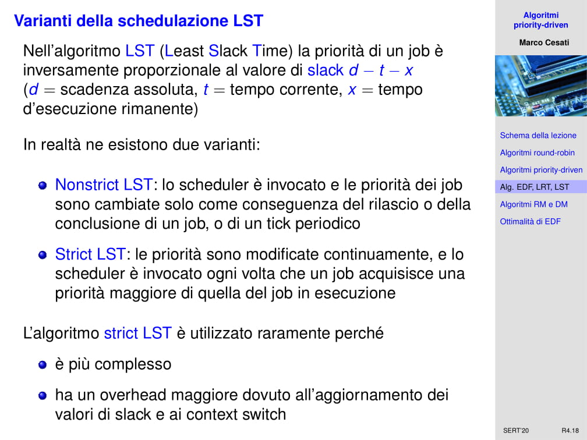

Qui potremmo chiederci, ma perché proprio all'istante 5 mi accorgo che lo slack di $J_4$ è diventato inferiore allo slack di $J_3$? In effetti ci sono due varianti di **LST**. Sappiamo che la priorità è inversamente proporzionale allo slack, ma nella variante non stretta, lo scheduler viene invocato, e dunque le proprità dei job vengono cambiate, solo in conseguenza del rilascio o della conclusione di un job, ovvero di un tic periodico. Mettiamo che in questo esempio c'era un tic periodico di un secondo. Dopo un secondo vado a ricontrollare, aggiorno gli slack e mi accorgo che $J_4$ ha proprità superiore. Ma non lo faccio continuamente, ma ad intervalli di tempo regolari, il tic periodico. Questo è **LST non rigido, non stretto**.

C'è poi anche la variante **rigida**. Le priorità le modifoci n continuazione, e lo scheduler è invocato ogni volta che un job acquisisce una priorità maggiore di quella del job in esecuzione. Ovviamente questo è praticamente impossibile da realizzare. Vuol dire che il tic periodico con cui realizzo questi controlli ha una frequenza molto grande, e quindi fondamentalmente in modo continuo vado a confrontare le priorità e gli slack dei job in esecuzione. Questa seconda variante di **LST** è molto più complicata da realizzare e molto più costosa, in quanto devo fare tanti controlli ed aggiornamenti, e quindi fondamentalmente ha un overhead estremamente più alto dovuto all'aggiornamento dei valori dello slack ed ai context switch. Si usa molto raramente.

In realtà l'algoritmo **LST** si utilizza molto raramente. Perché fondamentalmente **EDF, LRT ed LST** sono algoritmi ottimali sul singolo processore. Ciascuno di questi può far rispettare le scadenze se esiste un modo per schedulare con le scadenze rispettate. Non vale la pena andare ad implementare un algoritmo complicato come **LST** una volta che un algoritmo sempice come **EDF** ottiene gli stessi risultati. L'ottimalità garantisce che **EDF**, in quanto al rispetto delle scadenze, è buono quanto **LST** ma è molto più semplice. In questo corso ne parliamo in questa lezione, ma per il resto del corso ce ne dimentichiamo. Perché appunto, dal punto di vista della pratica, non ha giustificazioni, per lo meno sui sistemi uniprocessore.

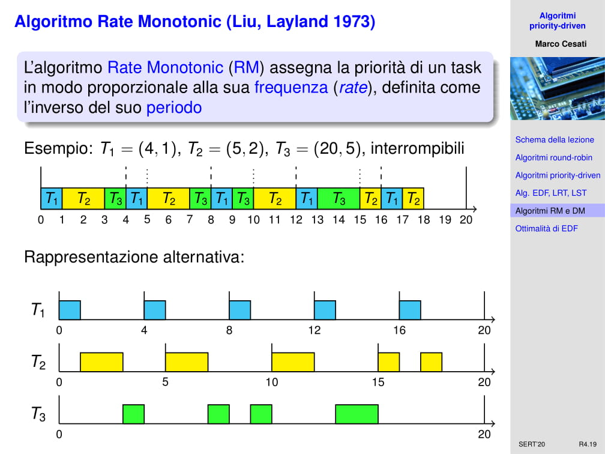

Vediamo gli algoritmi **Rate Monotonic (RM)**. La priorità è definita, assegnata, in modo proporzionale alla frequenza con cui viene rilasciato il job. Quindi è l'inverso del periodo. E' un algoritmo molto vecchio, il primo in assoluto RT. Come funziona? Vediamo un esempio:

- $T_1 = (4,1)$
- $T_2 = (4,2)$
- $T_3 = (20,5)$

I tre task sono interrompibili. L'iperperiodo dei task è 20. Su 4, 8, 16 e 20 ci sono delle linee che indicano i periodi del task $T_1$. A 5, 10, 15 e 20 ci sono i periodi del task $T_2$. Ed a 0 e 20 ci sono i periodi del task $T_3$. Come viene schedulato? All'istante 0 mettiamo che siano tutti in fase. All'istante 0 sono rilasciati i job di $T_1$, di $T_2$ e di $T_3$. Chi vince? I job di $T_1$, in quanto ha una frequenza superiore (*periodo più piccolo degli altri task*). Tra 0 ed 1, viene eseguito $J_1$. All'istante 1 ci sono da eseguire ancora $J_2$ e $J_3$. Chi vince? Vince il job di $T_2$ perché ha periodo 5 contro periodo 20. Infine, si comincia ad eseguire il job di $T_3$, ma all'istante 4 viene rilasciato il secondo job di $T_1$.

La priorità è fissa, $T_1$ ha sempre priorità superiore a $T_3$, in quanto il periodo di $T_1$ non cambia mai. Tra 4 e 5 viene eseguito il secondo job di $T_1$. All'istante 4 viene rilasciato il secondo job di $T_2$, che ha priorità superiore a $T_3$ All'istante 7 finalmente $J_3$ può tornare in esecuzione, ma all'istante 8 viene nuovamente interrotto da $J_1$, all'istante 9 recupera ma all'istante 10 viene interrotto, e così via. Sulla slide abbiamo la schedulazione risultante. D'ora in poi cercheremo di adottare quest'altra rappresentazione grafica delle schedulazioni. Fermo restando che si tratta di un singolo processore in questo caso, in realtà avremo una linea temporale per ciascun task. In ciascun task, in ogni linea temporale metteremo in modo esplicito i periodi. Qual'è il vantaggio di questa rappresentazione grafica? Occupa un po più di spazio ma è molto più chiara. Notiamo che non ci può mai essere il caso che due job si sovrappongano sulla stessa linea verticale. Ci deve essere u solo job in esecuzione, il processore è uno solo. Al massimo ci possono essere degli istanti in cui nessun job è in esecuzione, ed il processore è idle, libero.

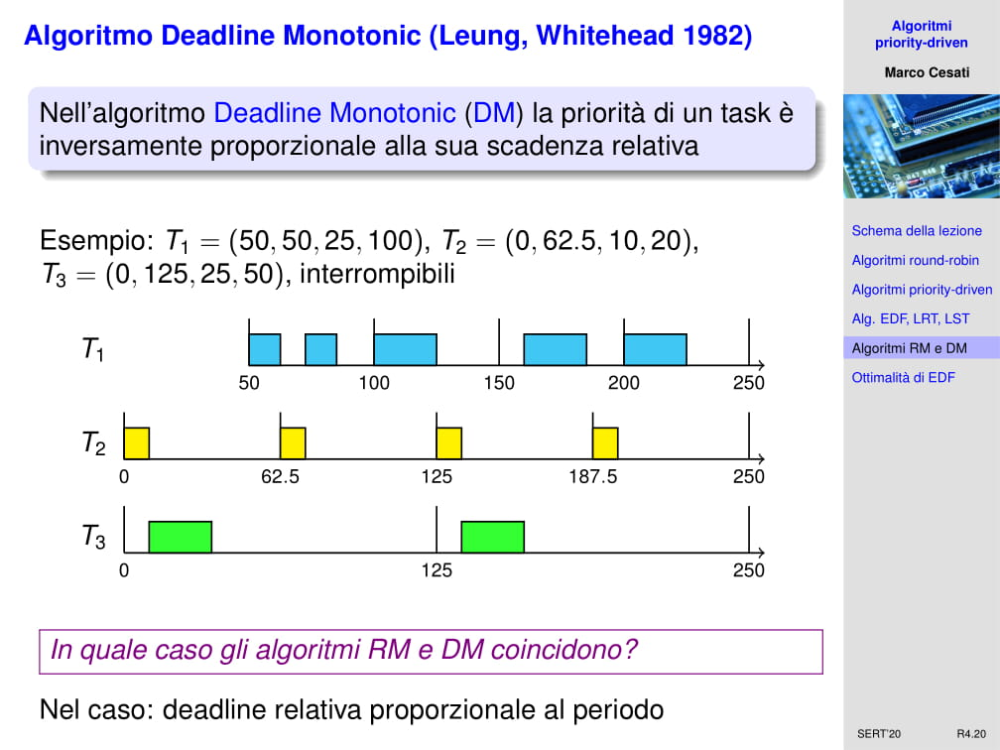

Infine andiamo a guardare l'algoritmo **Deadline Monotonic (DM)**. La priorità di un job è inversamente proporzionale alla sua scadenza relativa del task. Ovviamente è un algortimo la cui priorità è legata alle caratteristiche del task, perché job dello stesso task hanno tutti la stessa scadenza relativa. Supponiamo di avere questi task.

- $T_1 = (50, 50, 25, 100)$
- $T_2 = (0, 62.5, 10, 20)$
- $T_3 = (0, 125, 25, 50)$

I tre job sono interrompibili. Il primo termine è la fase del task, il momento di rilascio del primo job del task, successivamente abbiamo periodo, tempo di esecuzione e la scadenza relativa. Come scheduliamo? ALl'istante 0, $T_1$ non è stato ancora rilasciato. Si contendono il processore $T_2$ e $T_3$. Chi vince? Guardiamo la scadenza relativa. La scadenza relativa più piccola vince, quindi vince $T_2$. Dopo un certo tempo finisce $T_2$ e va in esecuzione $T_3$. All'istante $50$ viene rilasciato il job di $T_1$, che ha una scadenza relativa superiore alle scadenze relative 20 e 50, quindi tra tutti quanti $T_1$ è quello che ha la priorità più piccola.

Quando viene rilasciato il secondo job di $T_2$, viene interrotto $T_1$ e va in esecuzione lui. Questo fino a quando il job di $T_1$ completa. All'istante 100 viene rilasciato un altro job di $T_1$, ma viene interrotto visto che all'istante 125 cè un rilascio di $T_2$ e di $T_3$. Chi vince? Ovviamente $T_2$, perché la sua scadenza relativa è tale per cui la sua priorità è maggiore. Dopo di che va $T_3$, con scadenza relativa 50 contro i 100 di $T_1$ e così via. Questo completa la schedulazione. In quale case gli algoritmi **RM e DM** coincidono? In realtà è facile, uno potrebbe semplicemente dire: *quando lavoro con sistemi di task che hanno scadenze implicite*, cioè in cui la scadenza relativa di un task coincide con il periodo. **RM** assegna la scadenza in base al periodo. **DM** in base alla scadenza relativa. Se le due cose coincidono, allora i due algoritmi danno la stessa schedulazione. In realtà la risposta generale è che coincidono nel caso in cui la deadline relativa è sempre proporzionale al periodo.

Per esempio un insieme di task in cui la scadenza relativa è sempre la metà del periodo per tutti i task, ovviamente questa proprietà da luogo a delle priorità relative fra vari task che coincidono con quelle di **RM** e quindi da la stessa schedulazione di **DM**.

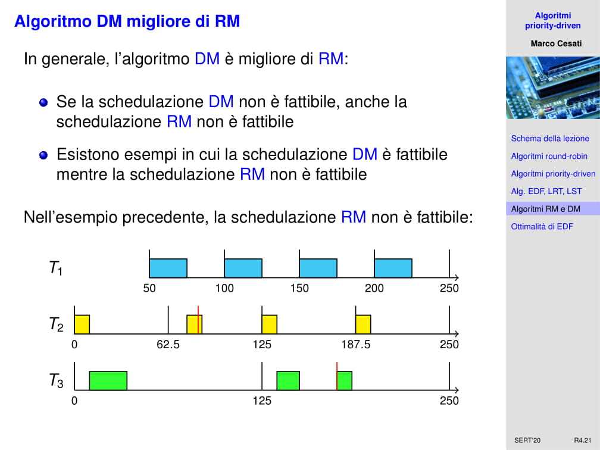

In generale l'algoritmo **DM** è migliore di **RM**. Perché? Se la schedulazione nata da **DM** non riesce a rispettare le scadenze, allora si può dimostrare che neanche la schedulazione costruita da **RM** riesce a rispettare le scadenze. D'altra parte però, esistono esempi in cui **DM** riesce a rispettare le scadenze mentre **RM** non ci riesce. Un esempio è esattamente quello fatto nella slide precedente. Questa schedulazione, se questo sistema di task lo vado a schedulare con **RM**, qualcuno manca la scadenza. In questo caso è il secondo job del task $T_2$ che manca la scadenza. Se schedulo rispetto ai periodi, non riesco a soddisfare tutte le scadenze. **DM** in assoluto ha più capacità di schedulare sistemi di task rispetto a **RM**. In alcuni casi ha la stessa capacità, ma in alcuni altri casi è migliore.

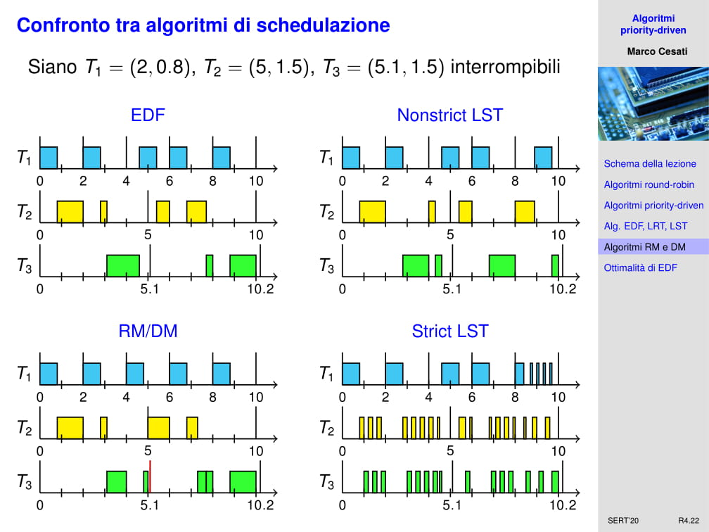

Prendiamo un qualunque sistema di tre task interrompibili.

- $T_1 = (2,0.8)$
- $T_2 = (5, 1.5)$
- $T_3 = (5.1, 1.5)$

La schedulazione con **EDF** rispetta le scadenze. **LST non stretto**, con un tic periodico di 1, da la schedulazione in figura. Schedulazione molto differente da quella fatta da un **LST stretto**, nel senso che in questo caso come possiamo vedere, ad un certo punto i vari job tendono ad uniformare tutti i loro slack e quindi a quel punto lo scheduler non fa altro che alternare fra tre job perché mano a mano che ciascuno esegue gli altri diminuiscono il proprio slack ed a quel punto lo scheduler è costretto a fare un context switch e dare loro il processore. Questo per un po ricrea la situazione per gli altri due. Fondamentalmente è un continuo di context switch. E' ovvio che questo algoritmo  poco pratico. Infine abbiamo la schedulazione data da **DM ed RM**. Siccome in questo caso la scadenza è proprio il periodo, danno la stessa schedulazione. Proviamo a rifarle e verifichiamo che in questa schedulazione c'è un job che manca la scadenza. Quindi **RM e DM** in questo particolare caso non riescono a schedulare rispettando le scadenze e quindi già sappiamo che non sono ottimali in generale. Cioè fondamentalmente in generale c'è un modo per rispettare le scadenze, vedi per esempio *EDF*, ma loro due non riescono a trovarla. La schedulazione che producono non rispetta le scadenze.

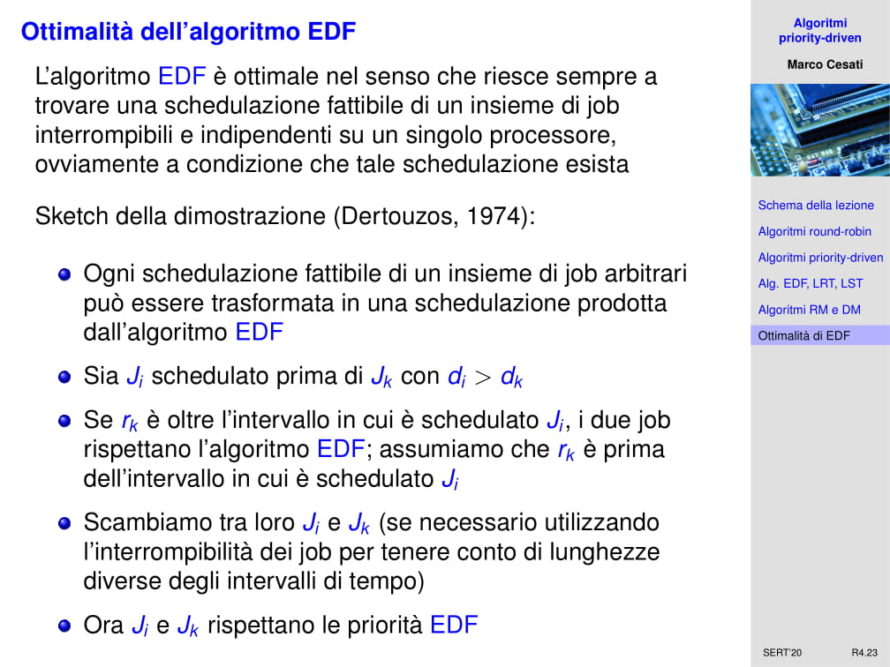

Vediamo di capire in che senso e come **EDF** è ottimale. E' ottimale nel senso che, se un insieme di task ha una schedulazione fattibile, quindi c'è un modo di combinare i vari job in modo tale che tutti rispettino le scadenze e questi job sono *interrompibili* ed *indipendenti* sul singolo processore, allora qualunque sia la schedulazione che mi da il rispetto delle scadenze, ne posso trovare un'altra prodotta da EDF che rispetta le scadenze.

E' ovvio che posos sempre dare esempi di insiemi di job di task che non sono schedulabili, peri quali non è possibile trovare un modo di eseguirli in modo che tutti rispettino le scadenze. E' sempre possibile farlo, basta aggiungere sempre più task al sistema. Ad un certo punto il processore non ce la fa più ad eseguirli tutti. Però, quello che stiamo dicendo è che se abbiamo un sistema di task che, in astratto qualcuno riesce a rispettare le scadenze, allora riesce a farlo anche EDF.

La dimostrazione è del '74 ed è fatta cos':

1. Suppongo che esista una schedulazione che rispetta le scadenze. Non mi importa chi l'h fatta o quale algoritmo l'ha prodotto. Esiste. E quindi è un insieme di job arbitrati schedulati in un certo ordine. Io posso trasformare una schedulazione arbitraria i una schedulazione prodotta dall'algoritmo EDF. Come faccio?
2. In realtà, supponiamo che non sia una schedulazione EDF. Vuol dire che ad un certo punto dovrei schedulare un certo job, secondo l'algoritmo EDF, ma in realtà ne schedulo un altr. quindi supponiamo che ci siano $J_i$ che è schedulato prima di $J_k$, ma in realtà $d_i > d_k$. Secondo **EDF**, se la scadenza assoluta di $d_i$ è oltre quella di $d_k$, vuol dire che la priorità $J_i$ è minore di $J_k$. Invece in questa schedulazione avviene il contrario.
3. La dimostrazione mostra come è possibile mettere a posto le cose. Supponiamo che il rilascio di $J_k$ sia oltre l'intervallo in cui è schedulato $J_i$. In questo caso non c'è una violazione di **EDF**. Se il rilascio di $J_k$ è dopo l'esecuzione di $J_i$, è ovvio che **EDF** è rispettato. Non si può schedulare un job prima del rilascio. In realtà la violazione si ha quando il rilascio di $J_k$ precede il momento in cui ho schedulato $J_i$. Quindi $r_k$ è prima dell'intervallo in cui è schedulato $J_i$
4. A questo punto, possiamo scambiare tra loro $J_i$ e $J_k$. Perché possiamo farlo? Perché i job sono interrompibili, e posso quindi aggiustare il job, interromperlo quando serve e riprenderlo nello slot che rimane libero scambiando i due job. Questo scambio di $J_i$ e $J_k$ porta ad avere una schedulazione i cui $J_i$ e $J_k$ rispettano le priorità, per ciascuna coppia di job in cui si viola la priorità di **EDF**

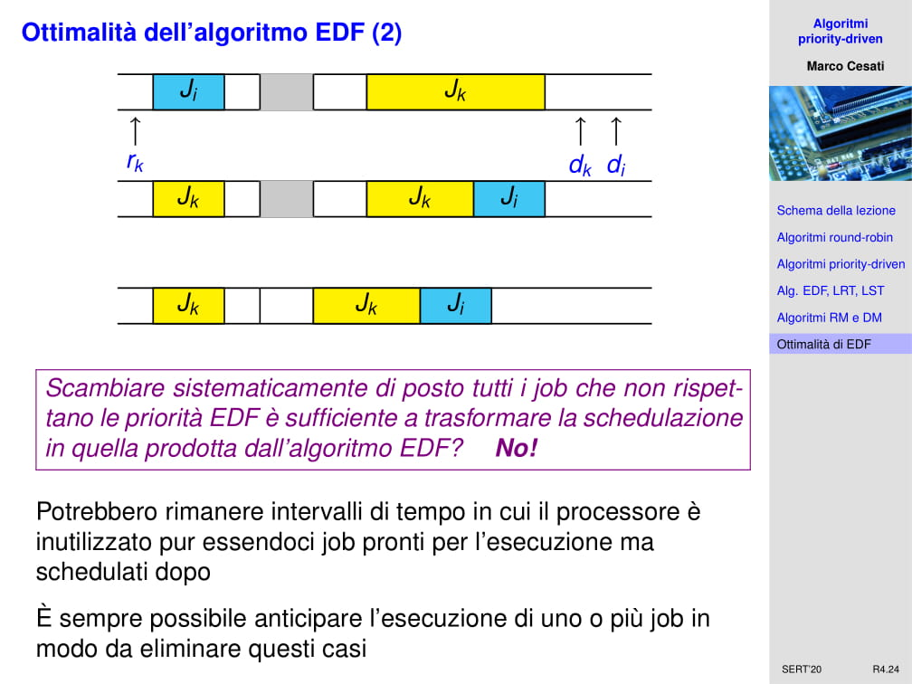

Quello che ottengo alla fine è una schedulazione in cui tutti i job sono schedulati secondo le priorità date da **EDF**. Questo è l'esempio di prima, uno schema che ci aiuta a capire quello che abbiamo appena detto. In questa schedulazione, $J_i$ che è schedulato prima di $J_k$, ma la scadenza di $J_k$ è prima. Dunque second **EDF**, la priorità di $J_k$ è superiore. D'altra parte $J_k$ è rilasciato prima di $J_i$. Se fosse rilasciato dopo, è chiaro che non era una violazione della scadenza. quindi in queste condizioni è lecito scambiare di posto $J_i$ con $J_k$. Ora però qua ci possono essere tanti casi, ma qui $J_i$ è più piccolo di $J_k$. Anche questa schedulazione si interrompe ed in realtà vado ad eseguire qualche altro job. Quando ritoccava a $J_k$, continuo ad eseguire $J_k$ ma finisco prima. Quanto tempo ho prima che vengano eseguiti altri job nella schedulazione originale? Esattamente la dimensione $J_i$ che ho risparmiato, ed allora a questo punto eseguo $J_i$.

quindi ho ricambiato di posto i due job sfruttando l'interrompibilità dei job, e facendo così ho fatto in modo di rispettare le priorità date da **EDF**. Scambiare sistematicamente di posto tutti i job che non rispettano le priorità di **EDF**. Ripetere sistematicamente fino a quando rispetto tutte le priorità di EDF, è sufficiente a trasformare la schedulazione nella stessa prodotta dall'algoritmo *EDF*? La risposta è **no.** Perché alla fine ci potrebbero essere, come in questo caso, degli intervalli in cui la schedulazione che magari non era nemmeno priority-driven aveva lasciato il processore inutilizzato. Questa schedulazione rispetta le priorità EDF, ma non è EDF in quanto **EDF è priority driven** (work conservative). Niente di male, mi basta muovere tutti i job in modo da riempire tutti i punti in cui il processore era inutilizzato. In realtà anticipo l'esecuzione di tutti i job. Ovviamente questo non può far mancare le scadenze. Se prima le rispettavo, continuo a farlo anche ora. Anticipando l'esecuzione ottengo effettivamente una schedulazione **EDF**. Quindi, **EDF** è ottimale.

Se c'è una qualunque schedulazione per un insieme di task che sono interrompibili e i cui job non hanno vincoli di precedenza tra i vari task ed ho un solo processore, qualunque sia la schedulazione, se io applico però **EDF** riesco a trovare una schedulazione che allo stesso modo rispetta le scadenze. Quindi se l'insieme di task è schedulabile, è schedulabile anche **EDF**. In questo senso EDF è ottimale.

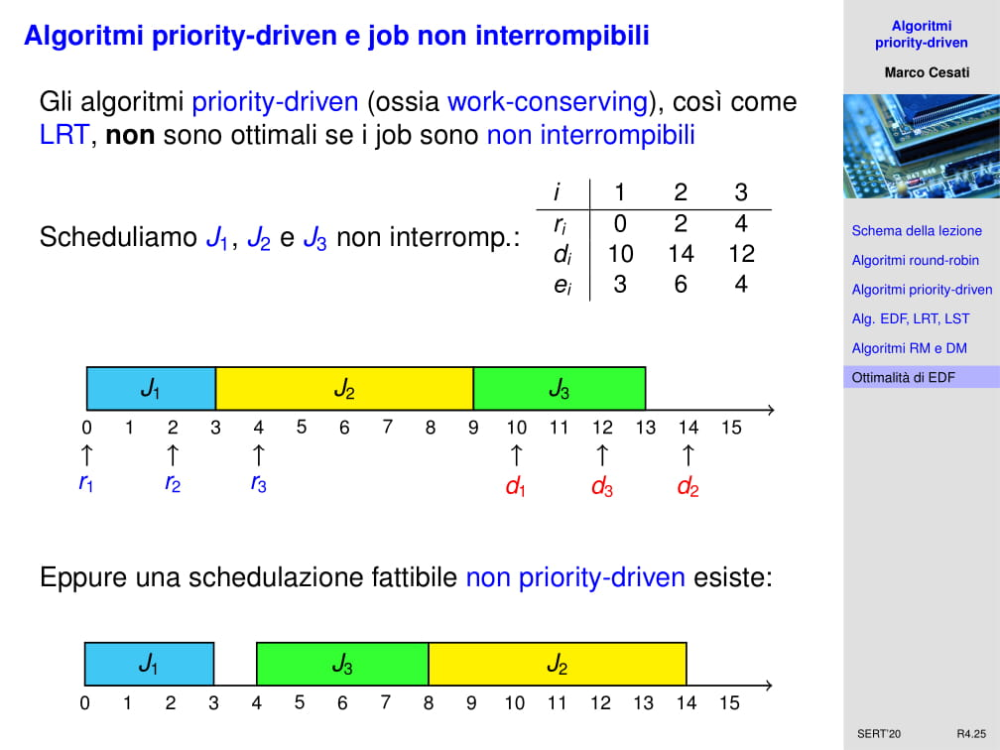

Tutto questo in realtà non è vero se alcune di queste condizioni che abbiamo detto non sono verificate. Ad esempio non è vero per i sistemi di job multiprocessore, ma questo lo vedremo più avanti. Non è vero se per esempio *i job non sono interrompibili*. Gli algoritmi priority-driven, così come **LRT**, non sono in assoluto ottimali se i job non sono interrompibili.

Vediamo di fare un esempio. Diciamo che questi tre job non sono interrompibili, dunque una volta che inizio il job devo finirlo prima di schedulare. All'istante 0 arriva $J_1$, c'è solamente lui, ma una volta che lo inizio lo devo finire. Solamente all'istante 3 potrò pormi il problema di chi eseguire in quel momento. All'istante 3 ci sarà solamente $J_2$, che terminerà all'istante 13. Ora però $J_3$ manca la scadenza, che termina a 13 ma aveva scadenza 12. Il problema è che una schedulazione che rispetta le scadenze esiste, non priority-driven in quanto lascio il processore idle anche se potrei eseguire il job $J_2$. Qualunque algoritmo a priorità, in realtà non permette di soddisfare le scadenze, anche se il sistema di task è schedulabile. 

Perché quindi uno si concentra su questi algoritmi a priorità? Perché in effetti è vero che una schedulazione non priority-driven esiste, ma è una schedulazione che deve in qualche modo prevedere il futuro, cioè prevedere che all'istante 4 arriverà un job e mi converrà aspettare per eseguirlo. Quindi in qualche modo bisogna conoscere in anticipo i task che arriveranno. Il sistema di task deve essere conosciuto a priori. E' un algoritmo che mal si adatta ad un sistema dinamico in cui l'insieme di task può cambiare e quindi in qualche modo è vero che gli algoritmi priority-driven incerte situazioni non sono ottimali, ma comunque continuano ad essere ancora quelli più pratici.