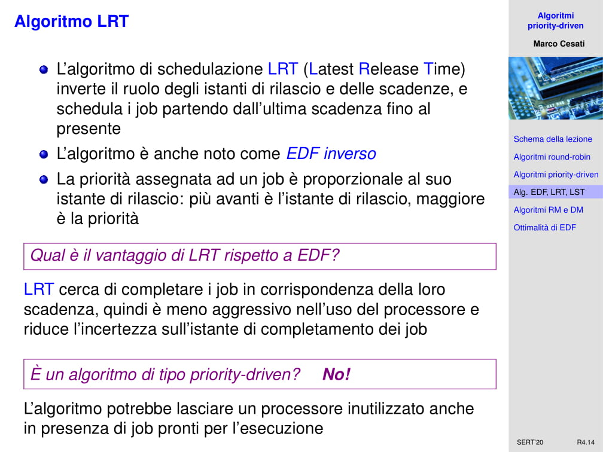

# SERT - 08/10/2020 - Algoritmi priority-driven - R04

Benvenuti, siamo alla quarta lezione dedicata ai sistemi RT. Oggi parliamo di algoritmi priority driven.

In realtà ci porteremo appresso questi algoritmi per tutto il resto del corso. Questi sono gli algoritmi più diffusi quando si tratta di schedulare i task nei sistemi RT. Inizieremo a parlare di algoritmi round-robin giusto per dare un contesto al nostro discorso. Dopo di che affronteremo un discorso più proprio degli algoritmi priority driven utilizzati nei sistemi RT.

Che cosa è un algoritmo **round-robin**? E' gestito tramite una coda di job, di processi, *FIFO*(First in first out). Il primo job che arriva in coda è anche il primo ad essere servito. In realtà, quindi, abbiamo che quando un job arriva è messo in coda di esecuzione e, se devo scegliere fra tanti job, seleziono quello che è in cima alla coda, cioè quello inserito da più tempo. Lo rimuovo dalla coda e lo eseguo. Tipicamente non lo eseguo fino a che termina, ma lo eseguo per un certo tempo predefinito, chiamato *time slice* o *quanto di tempo*. Nel momento in cui il quanto di tempo scade ed il job non ha finito, viene interrotto ed inserito nuovamente in coda. In realtà passa indietro a tutti gli altri job nel sistema.

Quindi se nella coda ci sono $n$ job attivi nel sistema, un gruppo di questi $n$ time slice è chiamato un **round**, intervallo di tempo pari ad $n$ volte il quanto di tempo dedicato ad ogni processo attivo. Ciascun job ottiene un time slice determinato. Questo è lo schema di base. In realtà in generale si adotta uno schema leggermente più complicato, che è il **round-robin pesato**. E' possibile fare in modo che i job differenti abbiano in qualche modo una percentuale di allocazione del processore diversa. Quindi posso assegnare un peso. Un job più pesante ottiene più processore di un job meno pesante. Come possiamo definire formalmente questo tipo di algoritmo? Un **round** lo definisco come un numero di time slice pari alla somma di tutti i pesi dei job nella coda. Un job con peso $w$, in ogni round ottiene $w$ time slices. Quindi è chiaro che un job più pesante, in ogni round ottiene più processore di un job più leggero.

Quali sono i vantaggi degli scheduler round-robin? Innanzitutto sono abbastanza equi. Cioè fondamentalmente job dello stesso peso ottengono la stessa quantità di risorse, di processore. Questa è una proprietà, il **time sharing** cioè la suddivisione del tempo del processore in modo equo tra i processi del sistema, una caratteristica importante dei sistemi operativi general purpose. Un'altra caratteristica importante di questi algoritmi è la loro semplicità di implementazione, in quanto si usano delle code FIFO molto semplici. Tipicamente se mi limito a questo algoritmo di base, è estremamente efficiente e veloce da implementare. Gli algoritmi round-robin sono algoritmi utilizzati sopratutto nei sistemi operativi general purpose, già visti in una forma o nell'altra nei corsi di sistemi operativi di base ed avanzati. In realtà, se ne usano delle versioni molto più sofisticate perché in qualche modo voglio cercare di discriminare job di tipologie differenti, o posso cercare di fare assegnare all'utente stesso delle priorità, dei pesi, su questi job. Oppure posso cercare di contemplare il caso in cui i job effettuano operazioni che sono particolarmente onerose rispetto ad altri che non lo sono. Gli algoritmi che usano nei sistemi operativi reali sono molto sofisticati, ma alla base di tutto c'è questo schema round-robin in cui i processi si alternano sul processore.

A questo punto quindi possiamo domandarci: ma nell'ambito dei sistemi RT, cioè dei sistemi in cui la schedulazione deve occuparsi del fatto che tutti i job devono rispettare le scadenze, quali sono gli svantaggi di questi scheduler round-robin? Ovviamente lo svantaggio principale è che questi algoritmi non consentono di valutare le scadenze del job. Se io inserisco un job in coda, quando arriva il suo turno esegue, in realtà non sto considerando quanto è vicina o lontana la scadenza di quel job. E quindi poiché non considera la scadenza dei job, fa un pessimo lavoro nel cercare di far rispettare le scadenze dei job. C'è un altro problema. Un problema abbastanza serio. Questi algoritmi non gestiscono bene i job che hanno dei vincoli di precedenza. I vincoli di precedenza è una situazione per la quale un certo job non può cominciare se un job precedente non ha terminato. Sappiamo che chiamo questa relazione d'ordine *precedenza immediata* con il simbolo sulle slide. Supponiamo di avere $J_{1,1}$ e $J_{1,2}$ con vincolo di precedenza, dunque il secondo non può iniziare se il primo non è finito. Poi abbiamo anche $J_{2,1}$ e $J_{2,2}$. Supponiamo di avere due processori. Questa semplice situazione, quando questi algoritmi sono schedulati sul processore con round robin, fondamentalmente le cose vanno come in slide. Siccome tutti i job che devono eseguire sul processore due non possono partire fin quando i job del processore 1 non sono terminati, nella prima parte per due unità di tempo si alternano sul processore 1 i job $J_{1,1}$ e $J_{2,1}$. Fondalmente possiamo assumere che il time slice sia così piccolo che questi fanno un'alternanza molto rapida sul processore. E' come "se andassero avanti in parallelo". Dopo di che però il loro tempo di esecuzione totale è più o meno la somma dei singoli job. Quindi all'istante 2, $J_{1,1}$ e $J_{2,1}$ terminano più o meno. Quindi all'istante 2 possono iniziare gli altri job che finiscono all'istante 4. Con il round robin, l'ultimo job completa all'istante 4. Il tempo di completamento dell'ultimo job è quattro.

Ma questo algoritmo è particolarmente cattivo se lo confrontiamo con un algoritmo che non usa il round-robin. Se io non lo uso, io posso dire che sul processore 1 eseguo tutto prima tutto il job $J_{1,1}$, ed a questo punto all'istante 1 posso eseguire il job $J_{2,1}$ e $J_{1,2}$. All'istante 2 terminate $J_{2,1}$ e può essere eseguito $J_{2,2}$. L'istante di terminazione dell'ultimo job è l'istante 3. Dove è il guadagno del tempo? Sta nel fatto che tra 1 e 2, ci sono stati due job in esecuzione contemporaneamente. Cioè ho sfruttato veramente il sistema multiprocessore. Mentre con l'algoritmo round-robin, questo sistema multiprocessore non l'ho potuto utilizzare a causa dei vincoli di precedenza. Morale, questi round-robin funzionano male con i job con vincoli di precedenza.

A questo punto una domanda è legittima da parte nostra e quindi è d'obbligo anche una domanda da parte sua: ma se i vincoli di precedenza sono un problema, perché gli algoritmi round-robin sono utilizzati sopratutto nei sistemi general purpose, per esempio nei sistemi Unix in cui ho tanti processi che spesso sono collegati tramite *pipe*, dunque dei vincoli di collegamento tra processi? La risposta a questa apparente contraddizione è che la pipe non è un vincolo di precedenza. In un vincolo di precedenza, io ho che un certo job non può iniziare se prima il job che lo precede non è terminato. In una pipe invece questo non è vero. In una pipe un certo job si limita a consumare i dati che produce un altro job. Siccome nulla vieta che i due job eseguono contemporaneamente, $J_b$ può consumare i dati man mano che $J_a$ li produce. Un esempio con i due processori ed i quattro job di prima, se al posto dei vincoli di precedenza ci metto le pipe, in realtà il round-robin funziona benissimo perché nel round-robin si alternano i job sui vari processori. Alla fine tutti quanti terminano più o meno poco dopo l'istante 2. Quindi il round-robin non è un problema per le pipe, ma lo è per i job con i vincoli di precedenza che sono un'altra cosa.

In realtà abbiamo un altro grosso problema per gl algoritmi di round-robin è che non hanno nessuna nozione del concetto di scadenza. Facciamo un passo indietro. Che cosa è un algoritmo **priority-driven**? E' un algoritmo che ha la caratteristica di non lasciare mai intenzionalmente inutilizzato un processore o un'altra risorsa. Cioè questa è una caratterizzazione molto generale, e come vedremo si possono dare tante caratterizzazioni diverse degli algoritmi priority driven, ma per noi sono più o meno tutte equivalenti. Questa caratterizzazione sta dicendo: "se c'è un processore o una risorsa che è libera, e se c'è un job che può utilizzare quella risorsa, l'algoritmo assegna la risorsa al job". Non lascia mai la risorsa libera perché magari in futuro può succedere qualcosa. Questo è quindi una definizione di base dell'algoritmo priority driven. Di questa caratterizzazione se ne possono dare altre formulazioni.

- Una risorsa attiva (processore) o passiva è inutilizzata soltanto quando non esistono job che richiedono di usare la risorsa stessa pronti per l'esecuzione. Si chiamano anche algoritmi **work conserving**
- Le decisioni dello scheduler vengono effettuate all'occorrenza di eventi specifici, ad esempio se un job diviene pronto per l'esecuzione. Si chiamano anche algoritmi **event driven**
- Questi algoritmi prendono decisioni ottimali ma soltanto a livello locale. cioè a livello del singolo processore o risorsa. Il singolo processore o risorsa viene utilizzato il più possibile, ma non è detto che questa scelta poi a livello globale sia ottimale. Si chiamano anche algoritmi **greedy scheduling**

Di fatto nei nostri algoritmi priority-driven introdurremo una serie di sotto-algoritmi, rilasseremo un po di queste condizioni, per cui non sempre per esempio il processore sarà utilizzato anche se c'è una risorsa che potrà utilizzarlo. Non sempre un job verrà considerato appena viene rilasciato. Motivi di convenienza dal punto di visto dell'implementazione pratica, oppure di evitare che fenomeni sgradevoli possano verificarsi, possono imporre di fare delle eccezioni a questo schema generale. Lo schema generale però rimane. Come algoritmi di schedulazione pura, questi sono caratterizzati in questo modo.

Come studiamo gli algoritmi priority-driven? Li studiamo utilizzando il nostro modello a task periodici, ovvero task sporadici già introdotto in una lezione precedente. Ma cerchiamo di cominciare a considerarli con un modello un po semplificato. Diciamo che il numero di task è prefissato, non può aumentare e ne diminuire. Ci poniamo nel caso in cui ci sia un singolo processore, oppure un sistema statico, ma di questo ne parleremo più avanti. Ci poniamo nel caso in cui i task sono indipendenti, ovvero non ci siano vincoli di precedenza tra i task e non ci siano conflitti di accesso sulle risorse. Cioè le risorse condivise non esistono. Ciascun job quando vuole una risorsa è tutta sua. Non ci son job aperiodici, e fondamentalmente questo modello semplificato è quello con cui cominciamo a studiare questi classi di algoritmi. Teniamo presente che alcuni di questi vincoli, in realtà quasi tutti, li rilasseremo più avanti. Man mano cercheremo di capire come fare a modellare sistemi reali in cui non potrò avere un modello così rigido ma dovrò rilassare questi vincoli. Cominciamo con un modello molto rigido. Ricordiamo che nel modello a task sporadici il periodo è il minimo intervallo che c'è tra il rilascio di job dello stesso task. Mentre nel modello a task periodici è l'intervallo esatto.

Perché si chiamano algoritmi a priorità? Perché in realtà gli algoritmi possono essere descritti facilmente considerando un valore numerico che viene assegnato ai job Questo valore numerico è chiamato proprità. Fondamentalmente la schedulazione dipende non solo dal modello del carico, quindi quali sono i task nel sistema, ma anche dalla lista dei job ordinata per priorità. Quindi un altro nome di questa classe di algoritmi è **list scheduling**, cioè algoritmi basati su una lista. Ma la lista è ordinata per priorità. In ogni istante lo scheduler sceglie il job che ha priorità maggiore. Maggiore non significa necessariamente numericamente maggiore. Cioè dipende dall'implementazione. Ne abbiamo alcune in cui un numero numerico inferiore rappresenta un'importanza maggiore. Posso anche fare la scelta opposta e dire che in altre implementazioni un job che ha valore numerico maggiore deve essere eseguito in modo prioritario rispetto ad uno che ha un valore numerico inferire. Questa p una scelta implementativa. Non cambia la sostanza del discorso. La sostanza del discorso è che, chi ha priorità superiore, quello sarà schedulato.

Molti scheduler non RT che conosciamo, sono in realtà scheduler priority driven. Facciamo un esempio. L'algoritmo *FIFO* può essere descritto come un algoritmo a priorità, perché la priorità è inversamente proporzionale all'istante di rilascio assoluto. Si tratta di una valore numerico e, più è piccolo, più è precedente l'istante di arrivo e vuol dire che la priorità è inversamente proporzionale all'istante di rilascio del job. L'algoritmo *LIFO* è esattamente l'opposto, in quanto la proprità è direttamente proporzionale all'istante di rilascio. Abbiamo gli algoritmi *SETF (Shortest Execution Time First)*, dove la priorità è inversamente proporzionale al tempo di esecuzione: più è piccolo, più la priorità è maggiore, nel senso che provoca l'esecuzione rispetto a quelli che hanno priorità minore. Gli algoritmi *LETF (Longest Execution Time First)*, dove la priorità è direttamente proporzionale al tempo di esecuzione. Abbiamo visti gli algoritmi di tipo round-robin. **Sono priority driven?** Si. Sono una classe particolare di algoritmi FIFO, in cui però c'è un quanto di tempo. Niente di male, vuol dire che la priorità è data dall'istante di arrivo del job nella coda, quindi l'istante di rilascio del job. Dopodiché però questa priorità varia dinamicamente in funzione della posizione nella coda FIFO. Quindi ad un certo punto arrivo in cima alla coda, verrà eseguito per un certo tempo, dopodiché però quando il quanto di tempo termina, dovrà essere rimesso in fondo alla coda e ri-aggionerò la sua priorità per renderla inferiore a quella di tutti gli altri job in coda. 

Questo significa che non tutti gli altoritmi priority-driven sono adatti per essere impiegati nei sistemi RT. Come possiamo caratterizzare questi algoritmi priority-driven?

- **La priorità può essere fissa (fixed-priority)**. Se guardo un certo task, tutti i job dello stesso task hanno la stessa priorità. Non è assegnata ai job ma ai task, e non può cambiare. Stesso task, ha una priorità che non cambia mai
- **La priorità è dinamica (dynamic-priority)**. La priorità dei job di uno stesso task può cambiare
  - **Dinamici a livello di task e statici a livello di job** (*task-level dynamic-priority*). Job differenti dello stesso task possono avere priorità differenti, ma nel momento in cui un job è rilasciato, quel job non potrà cambiare la sua priorità.
  - **Dinamici a livello di job** *(job-level dynamic-priority)*. La priorità di un job può cambiare dopo il suo rilascio

Vediamo un po. Abbiamo visto:

- **FIFO**, priorità inversamente proprozionale all'istante di rilascio
- **LIFO**, priorità direttamente proporzionale all'istante di rilascio
- **EDF (Earliest Deadline First)**, priorità inversa proporzionale alla scadenza assoluta. Più è vicina la scadenza, più quel job è urgente eseguirlo perché c'è più probabilità che manchi la scadenza
- **LST**, priorità inversamente proporzionale allo slack dei job. Lo slack è un concetto che abbiamo già visto e che ora riprenderemo, ed è il margine di sicurezza che ho per completare il job prima che manchi la scadenza. Più è piccolo lo slack, meno margine di sicurezza ho, più aumento la priorità del job
- **RM**, priorità inversamente proprozionale al periodo del task. Quindi è direttamente proporzionale alla frequenza con quale vengono rilasciati i job del task
- **DM**, priorità inversamente proporzionale alla scadenza relativa

Di che tipo sono questi algoritmi? 

- **FIFO, LIFO**: *priorità dinamica a livello di task*. Perché? Fondamentalmente una volta che io rilascio il job e quindi lo inserisco nella coda, quel job non cambia la sua priorità rispetto agli altri nel sistema. L'istante di arrivo è fissato, determina la priorità del job rispetto a tutti quelli nel sistema. Quindi una volta che arriva il job la sua priorità non cambia. Per è ovvio che job dello stesso task hanno istante di arrivo differenti e quindi cambia. Pe questo la priorità è dinamica a livello di task e fissa a livello di job.
- **EDF**: la scadenza assoluta cambia da job a job anche dello stesso task, ma non cambia per uno stesso job. *priorità dinamica a livello di task*, ma fissa a livello di job.
- **LST**: *priorità dinamica a livello di job*, in quanto lo slack è qualcosa che si modifica nel tempo. Quando un job viene rilasciato ha un certo slack, ma se continuo a non essere eseguito il suo margine di sicurezza continua a ridursi e la sua priorità dinamica aumenta.
- **RM, DM**: il periodo del task è fisso. Dunque sono algoritmi con *priorità statica*, in quanto la priorità è del task e non dei job del task. Tutti i job dello stesso task hanno la stessa priorità.

Ci sono algoritmi ottimali, cioè algoritmi che funzionano molto bene nel garantire che le scadenze siano rispettate. Ci sono degli algoritmi che sono in particolare ottimali sul singolo processore. Nel nostro modello abbiamo un solo processore ed esistono algoritmi di schedulazione ottimali. **EDF (Earliest Deadline First)**, in cui la priorità dei job è direttamente proprozionale alla vicinanza della scadenza, questo è un algoritmo ottimale. Se esiste un modo per far rispettare le scadenze a questo insieme di task, l'algoritmo **EDF** trova una schedulazione che rispetta le scadenze.

Un altro algoritmo ottimale è **LRT (Latest Release Time)**, è anche chiamato **EDF** inverso. E' come se fosse un **EDF** ma applicato dal futuro verso il passato. Abbiamo **LST (Least Slack Time First)**, che significa che prima va il job che ha lo slack più piccolo, o anche **MLF (Minimum Laxity First)**. Il margine di sicurezza è lo slack. Più questo è piccolo, più il mio lavoro diventa urgente. La priorità è dunque inversamente proporzionale allo slack.

Quindi possiamo formulare un teorema, del 1974 per *EDF* e dell'83 per gli altri.

> Se ho un solo processore, job interrompibili (con preemption) e non ci sono contese sulle risorse condivise, sia **EDF, LRT ed LST** producono una schedulazione fattibile, che rispetta le scadenze di un insieme di job con vincoli temporali arbitrati, se e solo se tale insieme di job è schedulabile.

Non importa come è fatto l'insieme di job. Se esiste un modo per fare rispettare le scadenze, **EDF, LRT ed LST** trovano questa schedulazione che rispetta le scadenze. Non importa come è fatto il sistema, non importano i parametri del sistema di task. Gli algoritmi sono ottimali.

Vediamo un esempio di schedulazione di EDF. Supponiamo di avere quattro job interrompibili, con gli istanti di rilascio, scadenza assoluta e tempo di esecuzioni disponibili in tabella. Nella tabella al centro mettiamo il lavoro ancora da compiere. All'istante 0 tutti devono essere ancora svolti, dunque il lavoro da compiere corrisponde alla lunghezza dei job. In fondo troviamo la linea del tempo, dove abbiamo segnato gli istanti di rilascio e le scadenze. Ovviamente **EDF** schedula dando priorità a quelli che hanno scadenza più vicina.

All'istante 2 va in esecuzione l'unico eseguibile nel sistema, $J_2$. All'istante 3, viene rilasciato il job $J_3$. Badiamo che $J_2$ non è terminato, perché lui deve eseguire per due unità di tempo. La scadenza di $J_3$ è 8, mentre la scadenza di $J_2$ è 9. $J_3$ dunque ha priorità superiore, dunque da 3 a 4 va in esecuzione il job $J_3$. All'istante quattro, vieene rilasciato il job $J_4$, che ha scadenza assoluta 7, quindi ancora superiore come priorità agli altri job in esecuzione. E quindi viene interrotta l'esecuzione di $J_3$ e viene eseguito al suo posto. All'istante 5 $J_4$ è terminato, non ha lavoro da compiere. Quindi all'istante 5 va messo in esecuzione uno dei due job che ancora non è stato completato. Chi vince? Dipende sempre dalla scadenza assoluta. La più vicina è quella di $J_3$, quindi va avanti lui. All'istante 7 viene eseguito l'ultimo job del sistema. La schedulazione è finita. Questa è una schedulazione **EDF**. Notiamo che in questa schedulazione tutti i job rispettano le scadenze.

L'algoritmo **LRT** è chiamato anche **EDF** inverso. Inverte i ruoli degli istanti di rilascio e di scadenza. Tutto quello che prima dicevamo sui rilasci, ora lo diciamo sulle scadenze. Schedulo a partire dalle scadenze e vado a ritroso verso i rilasci. Ovviamente questo significa che la priorità assegnata ad un jb è proporzionale al suo istante di rilascio. Più avanti è l'istante di rilascio, maggiore è la proprità. Qual'è il vantaggio di **LRT** rispetto ad **EDF**?

**LRT** cerca di completare i job in corrispondenza della loro scadenza. Quindi è meno aggressivo nell'uso del processore, dunque l'istante di completamento dei job è più regolare. Se io mi chiedo quale è il tempo di risposta dei job, questo tempo di risposta tende ad avvicinarsi molto a quello che sono le scadenze naturali dei job. Questa cosa è positiva, perché in un sistema RT quello ceh io voglio è ridurre il più possibile l'impredicibilità del sistema, e quindi anche le variazioni nei tempi di risposta dei job. Io li voglio regolari. Ma è un algoritmo di tipo priority-driven? No, non lo è, perché per poter realizzare tutto questo, l'algoritmo potrebbe lasciare un processore inutilizzato anche in presenza di job presenti per l'esecuzione. Questo significa che è un algoritmo offline. Non si può applicare se non conosco esattamente tutto l'insieme dei job che devono essere schedulati. Non posso schedulare questo job di cui non conosco nulla. Se ad un certo punto arriverà un job ed io non lo sapevo, non posso applicare **EDF** inverso, in quanto la schedulazione sarebbe stata completamente differente nel momento in cui quel job non ci fosse stato.

Vediamo un esempio, stesso di prima. Qui si va a ritroso. Si comincia dall'istante 9. E' la prima scadenza, è la scadenza del job $J_2$. Dico questo è il suo rilascio e vado all'indietro. all'istante 8 c'è un'altra scadenza. Rovesciando i discorsi tra rilascio e scadenza, $J_3$ ha priorità superiore a $J_2$ in quanto il suo rilascio è più vicino. All'instante 7 viene ho la scadenza di $J_4$, che ha rilascio più vicino e dunque ha priorità maggiore. All'istante 6 $J_4$ ha terminato l'esecuzione, quindi può ritornare in esecuzione il job $J_3$ che aveva priorità superiore a $J_2$. All'istante 4 $J_3$ ha completato l'esecuzione, quindi ha eseguito per tre unità di tempo. Chi deve andare in esecuzione? Abbiamo la scadenza di $J_1$ e $J_2$ che non ho ancora completato. Chi vince? Vince $J_2$, in quanto il suo rilascio è più *vicino*. All'istante di tempo 3 viene terminato $J_2$, ed all'istante di tempo 1 viene terminato $J_1$. Ovviamente questa è la stessa identica schedulazione, nell'ordine, di **EDF**, però abbiamo compattato tutte le esecuzioni per avvicinarle a quelle che sono le scadenze naturali dei job. E quindi che significa? Che all'istante iniziale, a 0, c'era un job che si poteva eseguire, ma lo scheduler ha scelto di non eseguire niente.

Questo non è un algoritmo **work conservative**. Lo citiamo, in quanto esiste in alcuni contesti e può essere conveniente utilizzarlo, ma non è un algoritmo che si può applicare per schedulare job online, cioè un algoritmo che può prendere decisioni su un insieme di task che il progettista non conosce. E' un algoritmo che si usa in casi particolari ma non lo approfondiremo perché appunto non è particolarmente flessibile.

L'algoritmo **LST**. **LST** è basato sullo slack, cioè sul margine di sicurezza. E' la differenza fra l'istante della scadenza e l'istante attuale, quindi dice quanto tempo manca alla scadenza, e ci devo togliere anche quanto lavoro mi resta da fare per completare l'esecuzione del job. Lo **slack** è una proprietà del job che cambia in continuazione. L'algoritmo assegna una priorità più alta ai job che hanno uno slack, un margine di sicurezza, minore. Ovviamente la logica è che più è basso lo *slack*, meno tempo mi posso permettere di perdere senza mancare la scadenza. Quale è lo svantaggio di **LST** rispetto ad **EDF ed LRT**? C'è uno svantaggio assolutamente evidente in questa funzione dell'algoritmo. Lo svantaggio molto evidente è che **LST** a differenza di **EDF** deve conoscere il tempo di esecuzione dei job. Perché per calcolare lo slack, con il quale calcola la priorità, devo conoscere quanto tempo ho eseguito e quanto tempo mi manca per completare l'esecuzione. Quindi devo avere una misura accurata di quello che è il tempo di esecuzione dei job. Posso basarmi sul **worst case**, ma non è detto che questa scelta sia conveniente. Calcolare il worst case di per se già è difficile, e comunque è una scelta pessimistica. L'algoritmo **LST** si deve basare su questa scelta pessimistica, e comunque costringe, quando implemento l'algoritmo, a tenere conto nella logica dell'algoritmo di questo parametro, il tempo di esecuzione.

C'è una differenza sostanziale rispetto ad **EDF**. E' vero che per la validare **EDF** devo conoscere il tempo di esecuzione dei job, ma questa cosa serve solamente per certificare che il sistema è fatto a regola d'arte. Non è necessario implementare la logica dei tempi di esecuzione dentro allo scheduler, in quanto EDF non ragione per i tempi di esecuzione. Si chiede solamente quanta è vicina la scadenza di un job rispetto all'altro. Nella logica del programma, dunque, deve essere introdotto questo parametro numerico che deve essere aggiornato ogni volta, rendendo l'implementazione più costosa.

Vediamo lo stesso esempio. Lo slack di $J_1$ all'inizio è 2. Non ha molto senso calcolare lo slack degli altri job in quanto non sono stati ancora rilasciati. All'istante 0 metto in esecuzione $J_1$ che continua fino all'istante 2. All'istante 2 viene rilasciato il job $J_2$. Teniamo presente che fin quando il job $J_1$ rimane in esecuzione, lo slack rimane costante. Lo slack è il margine di sicurezza, eseguendo non lo posso aumentare, lo posso solamente far rimanere costante. Se io mi posso permettere di perdere tre giorni prima di mancare la scadenza del progetto, mano a mano che io lavoro questi tre giorni me li mantengo, non posso aumentarli. Il margine di sicurezza può soltanto rimanere costante. Se vado al mare un giorno, ho perso lo slack di un giorno, si è ridotto. Lo slack si riduce se non lavoro, ma rimane costante se lavoro. Quindi $J_1$ che viene eseguito tra 0 e 2, mantiene il suo slack costante tra 0 e 2. All'istante due viene rilasciato $J_2$. Il suo slack è 5 unità di tempo. Chi viene eseguito? Ovviamente $J_2$ che è l'unico in esecuzione.

10.16

35.06

49.17