# SERT - 09/10/2020 - Ottimalità di algoritmi priority-driven - R05

Oggi continuiamo a parlare dell'ottimalità degli algoritmi priority-driven. Abbiamo già introdotto il concetto di ottimalità, e continuiamo ad esplorare questo concetto, in particiolare al problema della validazione, cioè a decidere con una dimostrazione formale, se effettivamente in un certo sistema progettato in una certa maniera con un certo algoritmo di schedulazione, le scadenze saranno sempre rispettato oppure no.

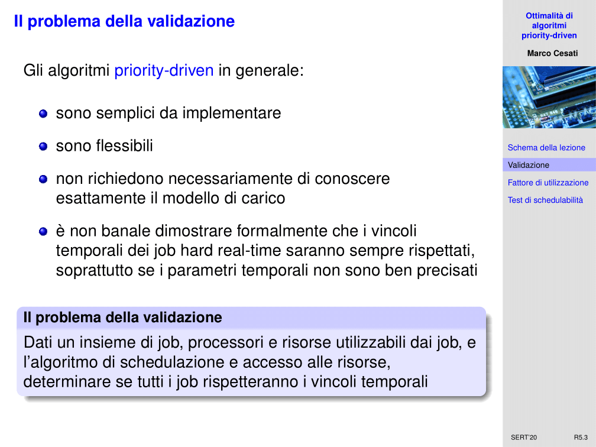

In generale gli algoritmi priority-driven sono semplici da implementare. Sono facili da spiegare. Abbiamo visto come **EDF** è facile da spiegare, in quanto basta dire che la priorità è inversamente proporzionale alla scadenza assoluta. Quanto più vicina a noi è la scadenza assoluta di un job, tanto più deve avere prioritù rispetto a job che hanno una scadenza più grande. Più vicina è la scadenza più urgente è completare il job. 

Tutto sommato sono semplici da implementare e sono flessibili, in quanto il concetto di priorità può essere molto generale. Possiamo assegnare le priorità in modo molto diverso, ed abbiamo come risultato degli algoritmi molto differenti. **EDF** ad esempio assegna le priorità alla scadenza assoluta del job, che è molto differente da **Rate Monotonic** che assegna le priorità in base alla scadenza relativa. Abbiamo visto che sono due algoritmi completamente differenti, anche come capacità di schedulare gli insiemi di task in modo da rispettare le scadenza. Il problema è che questo tipo di algoritmi, non riechiedono necessariamente di conoscere esattamente il modello di carico. Questa è una differenza sostanziale rispetto all'altra classe di algoritmi che abbiamo visto, quelli cyclic-executive / clock driven, in cui per poter costruire la schedulazione devo conoscere per filo e per segno come è fatto il carico del sistema: quali sono i task, quanti sono, che frequenza hanno, quale è il tempo di esecuzione dei job e così via. Per non parlare dei vincoli di dipendenza ecc.

Se non conosco tutto, non posso costruire una schedulazione. La schedulazione a quel punto la posso fare offline, la fa il progettista, e dopo lo scheduler si limita solamente ad applicarla come una partitura musicale. Però ovviamente questo tipo di algoritmi sono poco flessibili, mentre gli algoritmi *prioruty-driven*, sono molto flessibili perché il progettista non deve sapere quali sono i task che interverranno nel sistema. Possono esserci job rilasciati, task creati, e l'unica cosa in qualche modo lo scheduler deve sapere è come calcolare le priorità e dunque le relazioni di priorità tra i job. Ma non che il progettista del sistema deve conoscere in anticipo l'intero sistema di task. Quindi effettivamente sono molto più semplici anche da progettare e da implementare. 

Mentre con gli algoritmi clock-driven la schedulazione era fatta online, dunque convincere qualcuno che tutti rispettano le scadenze è facile, con questo tipo di algoritmi invece è molto più difficile. Non è banale riuscire a dimostrare che l'algoritmo riuscirà sempre a rispettare le scadenze, dato che in astratto non è detto che il progettista conosca in anticipo l'intera configurazione di task che si presenterà nel sistema. Il problema dunque è tutto qua, è quello di, dato un insieme di job, processori e risorse utilizzabili da questi job, *capire se l'algoritmo che sto utilizzando per schedulare i job e per accedere alle risorse, se saranno in grado di fare in modo che tutti i job rispetteranno sempre le scadenze*. Per questo problema dovrò dimostrare matematicamente che le cose stanno così, dovrò dare una dimostrazione certa. Questo è il problema della validazione.

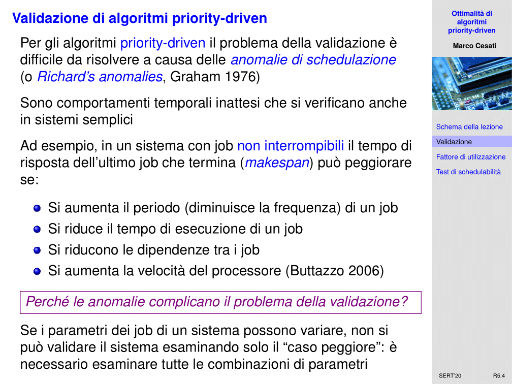

Questo problema è complicato da un fenomeno paradossale, chiamato **anomalie di schedulazione**. Ci si è resi conto molto presto, già dal '76 in poi, quasi fin dalla nascita dei sistemi RT, che c'erano degli aspetti di questa teoria dei sistemi RT che era paradossale. Si avevano risultati che erano contro il senso intuitivo, contro il senso comune. Queste **anomalie di schedulazione** sono dei comportamenti che non ci attendiamo. Per esempio supponiamo che io abbia dimostrato che in un certo sistema tutte le scadenze sono rispettate, con certi parametri temporali (rilasci, scadenze e tempi di esecuzione). Poi supponiamo che per qualche job, il tempo di esecuzione si riduca, oppure che un certo task rilasci i job con una frequenza più bassa di quella con cui ho fatto la supposizione, quindi con un carico del processore più basso. Il risultato inatteso è che in queste condizioni apparentemente più favorevoli, invece di continuare ad avere il rispetto delle scadenze, queste vengono mancate. 

Un esempio classico di questo fenomeno è un sistema in cui i job sono non interrompibili. Questa non interrompibilità dei job abbiamo già visto essere un problema, e qui ritorna. Per esempio in un sistema con job non interrompibili, il tempo di risposta dell'ultimo job che termina, il cosìddetto *next span*, può peggiorare se per esempio aumenta il periodo, dunque diminuisce la frequenza di un job: occupa meno il processore, ma il tempo con cui conclude l'ultimo job peggiora. Oppure un altro job riduce il suò tempo di esecuzione. Come può essere che in realtà l'ultimo job concluda più tardi rispetto a prima? Eppure è così, un comportamento inatteso ma possibile.

Oppure invece di aumentare, riduco le dipendenze che ci sono tra i job. Anche questo può portare ad un aumento dei tempi di completamento dell'ultimo job. O addirittura se aumenta la velocità del processore, daccapo, il tempo di risposta dell'ultimo job può peggiorare. Tutti fenomeni francamente inattesi, poco poco intuitivi. **Perché le anomalie complicano il problema della validazione?** La risposta è molto semplicemente che non abbiamo più un caso peggiore da esaminare. Se i parametri dei job possono variare, io in qualche modo non so dire qual'è il parametro che da il valore peggiore per il rispetto delle scadenze, allora dovrò validare, dovrò dimostrare che il mio sistema è schedulabile per qualunque variazione del valore dei miei parametri. Questo ovviamente diventa impossibile, perché ci sono infinite variazioni dei valori dei parametri. Se ad esempio i miei job possono variare il tempo di esecuzione, perchè ad esempio quello che indico è un worst case, ma poi invece il valore effettivo di esecuzione di un job può essere inferiore, se io valido il caso peggiore ma poi quel risultato non mi è valido quando il job ci mette di meno, è ovvio che quella validazione fatta nel caso peggiore non serve più a nulla. Il caso peggiore non esiste. Non è il caso peggiore per la validazione. Le anomalie di schedulazione hanno questo di problema. Ci impediscono di capire quale sia il caso peggiore, quindi ci impediscono di fare una validazione di quell'unico caso peggiore. Ci costringono quindi a fare infinite dimostrazioni, e questo ovviamente diventa impossibile.

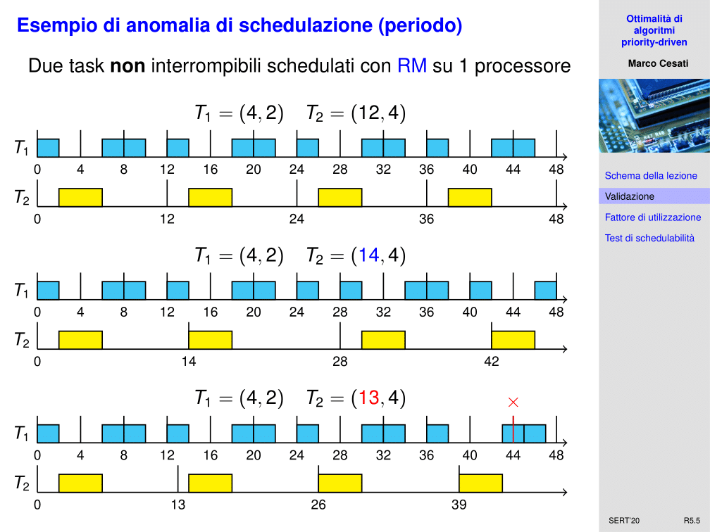

Vediamo qualche esempio di anomalia di schedulazione. Questo è un esempio relativo al periodo. Consideriamo due task, sempre non interrompibili, schedulati con **RM** su un processore. Abbiamo un task con periodo 4 e tempo di esecuzione 2, ed un task con periodo 12 e tempo di esecuzione 4. Qui troviamo, nel primo grafico, la schedulazione **RM**. Va tutto bene, tutti rispettano le scadenze. Adesso supponiamo di alzare il periodo del secondo task, facendolo passare da 12 a 14. Possiamo rifare la schedulazione **RM**, ed ancora una volta ci rendiamo conto che effettivamente tutti i task rispettano le scadenze. In realtà, però, se considero un periodo per il secondo task $13$, allora la schedulazione **RM** fallisce. Cioè la schedulazione *RM* non riesce a far rispettare le scadenze di tutti i job. Perché questo succede?

Succede perché i job non si possono interrompere. Con un periodo 12 le cose si combinano in una maniera tale per cui tutto funziona. Per un periodo 14 c'è abbastanza tempo per i task di $T_1$ di entrare sui task di $T_2$ in modo che tutti rispettino le scadenze. Ma quando il periodo noon è ne 12 e ne 14, am è 13, il job di $T_2$ entra in un momento particolarmente sfortunato. Siccome non si può interrompere, quando arriva il task di $T_1$ accumula un ritardo tale per cui non può completare le scadenze. Questo comportamento è inatteso, perché alzare un periodo da 12 a 13, vuol dire abbassare l'occupazione di questo task sul processore. Il processore ha meno da fare, ma nel primo caso rispetta le scadenze della schedulazione, nel secondo caso no. **Questa è propria unìanomalia**.

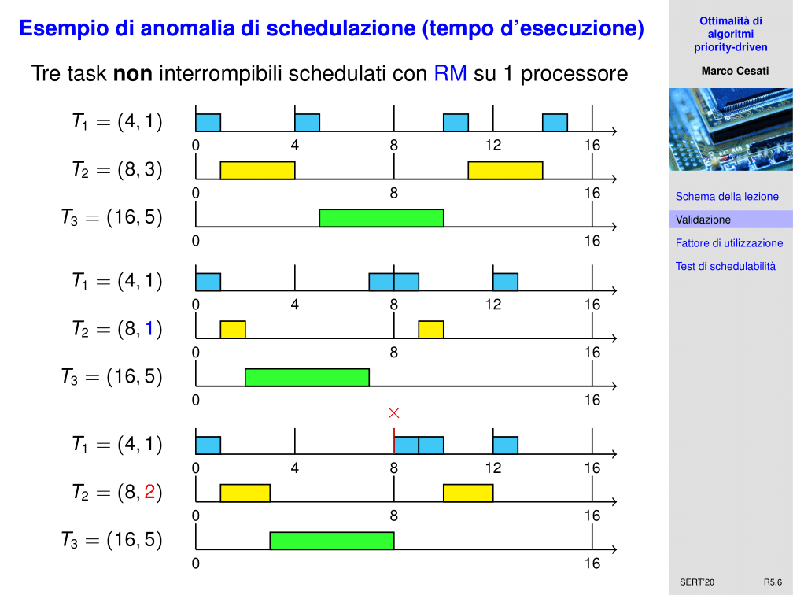

Vediamo un altro esempio, legato non più al periodo, ma al tempo di esecuzione. Abbiamo tre task non interrompibili, schedulati con **RM** su un solo processore. Tutti rispettano le scadenze. Adesso consideriamo un sistema di task in cui abbassiamo il tempo di esecuzione dei job di $T_2$ da 3 ad 1. Dunque i job di $T_2$ durano di meno. Ma anche in questo caso, tutti i job rispettano le scadenze. Dopo di che, consideriamo il caso in cui i job di $T_2$ non hanno tempo di esecuzione 1, ne tre, ma tempo di esecuzione 2. In questo caso particolare, il secondo job di $T_1$ nell'iperperiodo manca la sua scadenza.

Quale è la differenza tra questi casi? E' abbastanza evidente che nel primo caso il job di $T_2$ è abbastanza lungo da arrivare al momento in cui il job di $T_1$ viene rilasciato nuovamente, e quindi impedisce al job di $T_3$ che è lungo ed ingombrante, di eseguire. In questo caso quindi, il secondo job di $T_1$ ha il tempo di andare prima e completare. Questo è un comportamento inatteso. Abbassare i tempi di esecuzione di un job, vuol dire che il processore ha meno da fare. Quando ha il processore ha più da fare rispetto le scadenze, ma quando ha meno da fare vengono mancate. Quale è la causa di queste anomalie? Sembra essere la non interrompibilità dei job.

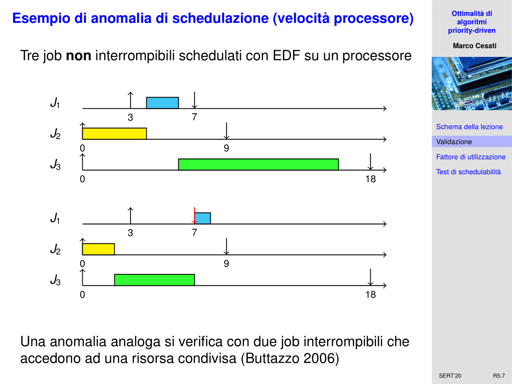

Questa cosa la possiamo vedere anche con questo altro esempio, in cui variamo la velocità con cui il processore esegue i task. Consideriamo per esempio tre job, eseguiti tanto per cambiare tramite schedulazione **EDF** su un singolo processore. Nel momento in cui però il processore è più veloce, cosa vuol dire? Vuol dire fondamentalmente che completa i job più rapidamente. Se ad esempio, grossomodo, raddoppiamo la velocità del processore, quindi tutti questi tempi dei job si dimezzano, allora che succede? Che il job $J_2$ completerà prima del rilascio del job di $J_1$. I tempi sono tempi, quelli non si riducono, e quindi entra in esecuzione il job $J_3$, non interrompibile, che non lascia spazio al job di $J_1$ per completare. Un'analoga anomalia significa anche per esempio quando job sono interrompibili, ma accedono ad una risorsa condivisa. Non è soltanto la non interrompibilità dei job a creare le anomalie di schedulazione, ma ci sono anche altri casi. Tutto questo ci complica parecchio la vita.

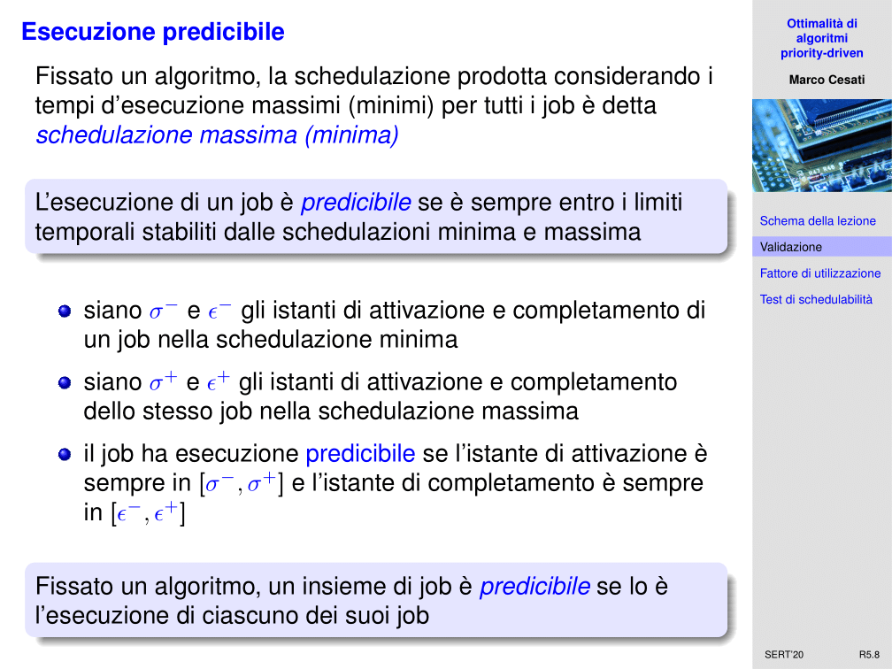

Però possiamo cercare di ricondurci al caso in cui i job sono effettivamente predicibili. Come? Fissato un algoritmo, consideriamo la schedulazione prodotta considerando tutti i tempi di esecuzione massimi (*worst case*). Questa schedulazione la chiamiamo **schedulazione massima**. Poi ci poniamo il caso in cui tutti i job hanno il tempo di esecuzione più piccolo possibile. Questa la chiamiamo **schedulazione minima**. Diciamo che un job, l'esecuzione di un job, è predicibile se cade sempre entro i limiti temporali stabiliti dalle schedulazioni minima e massima. Quindi, per spiegarci, consideriamo quando un job viene attivato e quando completa nella schedulazione minima, $\sigma^-$ e $\epsilon^-$. Consideriamo anche $\sigma^+$ e $\epsilon^+$ per la schedulazione massima. Noi diciamo che l'esecuzione è predicibile per quel job se l'istante di attivazione cade sempre tra $[\sigma^-, \sigma^+]$ e l'istante di completamento cade sempre tra $[\epsilon^-, \epsilon^+]$. Se un job ha un'esecuzione predicibile è predicibile. Se tutti i job di un certo insieme sono predicibili, allora tutto il sistema di task predicibile. Quindi diciamo che l'esecuzione è predicibile. La predicibilità dipende anche dall'algoritmo di schedulazione.

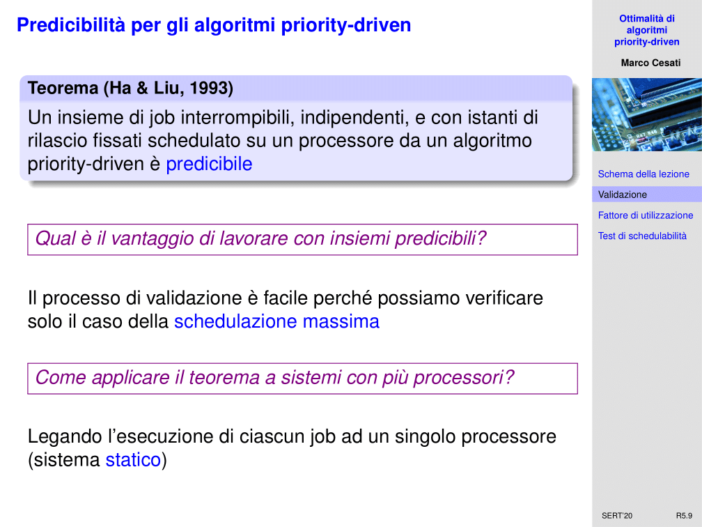

Questo perché è importante? Perché fondamentalmente noi possiamo trovare, daccapo, il caso peggiore, per lo meno per quanto riguarda i tempi di esecuzione. Possiamo dire: *se il tempo di completamento cade sempre entro i limiti della schedulazione minima o massima, vuol dire che il caso peggiore è la schedulazione massima. Oltre quello un job non potrà andare*. Quindi la schedulazione massima torna ad essere il caso peggiore da analizzare per la schedulazione.

Qui il punto è che il grosso problema è rispettare le scadenze, non si deve andare oltre. Ci possono anche essere delle scadenze alla rovescia, cioè posso anche avere dei vincoli che dicono che non posso completare prima di un certo tempo. Ma abbiamo visto che questi casi sono facili da gestire, perché se un job cerca di completare prima della scadenza lo posso artificialmente allungare. Il punto è che la grande difficoltà è fare in modo che i job non completino oltre la scadenza, in quanto non è un problema del job in se ma un problema comune. Siamo riusciti a dare la CPU a tutti in modo che tutti rispettino le scadenze? Questo è il grosso problema. Devo completare entro il tempo limite.

Quindi in questo senso se il sistema è predicibile, vuol dire che c'è il caso peggiore. Il caso in cui tutti i job hanno il *worst case*, cioè hanno il tempo di esecuzione peggiore possibile. Se io riesco a validare il sistema in quel caso peggiore, varrà sempre, cioè in ogni caso, anche quando i job potranno avere un tempo di esecuzione più piccolo. 

Il teorema del '93 dice che un insieme di job che sono interrompibili, quindi possono essere interrotti in esecuzione e sostituiti con un altro job di priorità superiore, indipendenti, dunque non hanno vincoli di precedenza tra i job, e con istanti di rilascio fissati, quindi in qualche modo non che arrivano ad istanti arbitrari, che è schedulato su un processore singolo con un algoritmo *priority-driven* è predicibile. 

Quindi un singolo processore, job interrompibili, indipendenti e con istanti di rilascio fissati, è un sistema predicibile, c'è un caso peggiore. Quindi il vantaggio di lavorare con i sistemi predicibili è che possiamo validare il sistema, possiamo fare una certificazione. Possiamo dimostrare che tutti rispettano le scadenze, perché lo dimostro nel caso peggiore che è la schedulazione massima. Che succede se queste condizioni non valgono? I problemi cominciano a presentarsi, e vedremo come modellarli ed affrontarli. Il primo problema in effetti è cosa succede se il sistema ha più processori. Potremmo cercare di ridurci al problema con un singolo processore. Per esempio posso partizionare l'insieme di job ed assegnare ogni job ad un processore. A quel punto ci sono tanti processori nel sistema, ma ho suddiviso i job ai vari processori e fondamentalmente mi riduco al caso in cui c'è solo un processore e su quello ragiono. Si parla di **sistema statico**. In realtà il discorso che stiamo facendo è molto semplificativo e verrà ripreso più avanti.

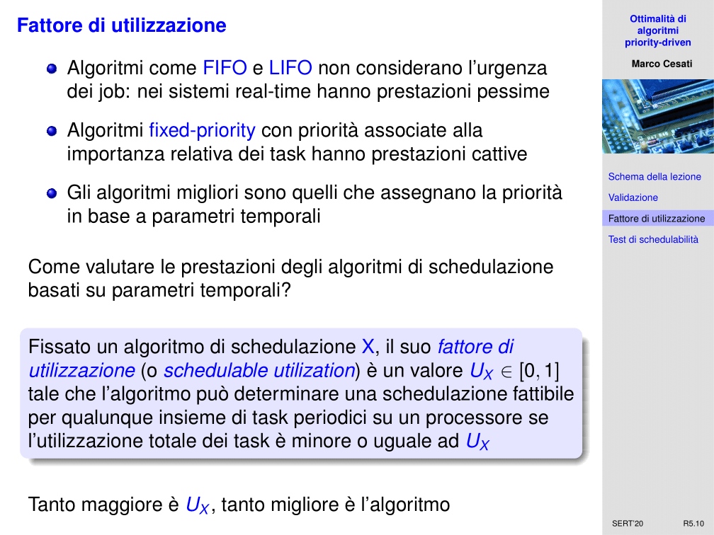

Cerchiamo adesso, avendo chiarito quale è il problema della validazione e del perchè è necessario avere un caso peggiore per poter validare il sistema, cerchiamo di capire come si fa a certificare che un sistema rispetterà le scadenze. Il concetto che ci serve è quello di **fattore di utilizzazione**, che avevamo già introdotto nelle prime lezioni quando parlavamo come erano fatti questi task e job, parlavamo di questo parametro. Per un modello a task periodici, *l'utilizzazione di un task* era il rapporto fra il tempo di esecuzione ed il periodo con cui questo task rilasciava il job. Quindi in qualche modo era quanto pesava sul processore. Ora possiamo cercare di utilizzare questo concetto di utilizzazione per fare un confronto fra alcuni algoritmi di schedulazione. Quale è l'idea? Partiamo dall'idea che ci sono degli algoritmi che vanno molto male per i sistemi RT. Per esempio, algoritmi *LIFO* o *FIFO* vanno male, in quanto non considerano l'urgenza dei job. La priorità di questi algoritmi non è legata al concetto di scadenza, ne in modo implicito e ne implicito. Quindi non abbiamo nessuna garanzia.

Ci sono poi una classe di algoritmi in cui il concetto di priorità lo posso legare in modo arbitraria, a gusto del progettista. Priorità associate all'importanza relativa dei task hanno prestazioni cattive. Che vuol dire? Vuol dire che non c'è un modo oggettivo di quantificare la bontà di questi algoritmi. In altri termini, finché le condizioni che aveva pensato il progettista valgono, in realtà gli algoritmi funzionano. Ma non si può escludere a priori che ci sia un insieme di task per i quali, fatti in una certa maniera, quell'algoritmo funzioni molto male e le scadenze vengano mancate. In realtà la teoria della schedulazione RT comincia nel momento in cui ci si rende conto che gli algoritmi per i sistemi RT devono essere basati unicamente su **parametri temporali oggettivi**: il periodo, la scadenza, la scadenza assoluta, lo slack rimanente. Ma devono essere parametri temporali *oggettivi*, cioè che non si possono mettere in discussione. Nel momento in cui questo è stabilito allora possiamo fare un discorso formale, matematico, su questi algoritmi.

Come valutare le prestazioni degli algoritmi di schedulazione che si basano su parametri temporali? Noi vogliamo che gli algoritmi *FIFO* e *LIFO* abbiano prestazioni pessime, e che sia il contrario per **EDF**. Abbiamo detto che **EDF** è ottimale. Vuol dire che se riesco a schedulare il sistema, allora **EDF** ci riesce. Allora vogliamo che questo algoritmo sia classificato come molto buono. Quello che possiamo fare è il concetto di **fattore di utilizzazione** dell'algoritmo di schedulazione, da non confondere con l'utilizzazione del task.

Si tratta di una valore $U_X$ compreso tra $[0, 1]$ tale che l'algoritmo riesce a determinare una schedulazione fattibile per qualunque insieme di task periodici su un singolo processore se l'utilizzazione totale dei task, cioè il rapporto di tutti i task sommati assieme, è minore o uguale a $U_X$. Se $U_X = 0$, l'algoritmo va malissimo, vuol dire che praticamente il processore è sempre libero. I task danno un carico infinitesimo al sistema, eppure non riesco a rispettare le scadenze. Se invece il fattore di utilizzazione è uguale ad 1, vuol dire che anche un insieme di task in cui il processore è occupato al 100%, perché la somma di tutti gli $e_p$ è uguale a uno, quindi vuol dire che il processore non ha più tempo libero. Pure questo sistema di task così oneroso per il processore, con quell'algoritmo tutte le scadenze verranno rispettate. *Tanto maggiore è $U_X$, tanto migliore è l'algoritmo.*

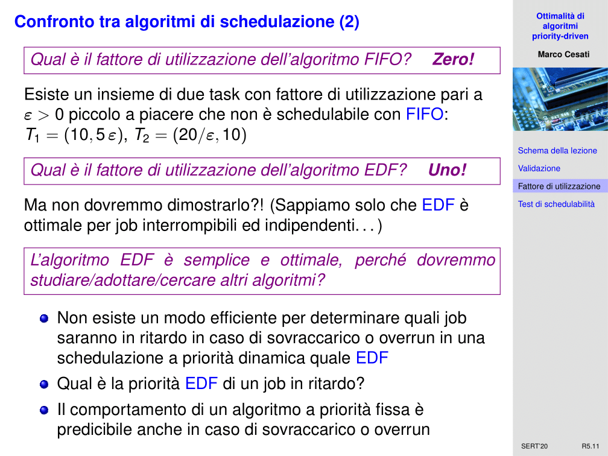

Quale è il fattore di utilizzazone dell'algoritmo **FIFO**? Esiste un insieme di due task con utilizzazione pari con $\epsilon > 0$ piccolo a piacere, ma che comunque non è schedulabile con **FIFO**. Quando vado a sommare le utilizzazioni di questi due task ottengo esattamente un'utilizzazione pari ad $\epsilon$.

Qual è il fattore di utilizzazione dell'algoritmo **EDF**? Uno! L'algoritmo *EDF* è ottimale, ma in realtà questa conclusione non è giustificata da quello che abbiamo sentito dire fino ad adesso. Dovremmo dimostrarlo. Noi sappiamo soltanto che *EDF* è ottimale per job iterrompibili, indipendenti su singolo processore. Abbiamo visto la dimostrazione, scorsa volta, che posso trasformare qualsiasi schedulazione ammissibile in una EDF. Ma non abbiamo mai detto che tutti i sistemi di task, anche quelli che occupano il processore al 100%, sono schedulabili, rispettano le scadenze. Questa è un'altra cosa. Per dire che **EDF** ha utilizzazione pari ad 1, vuol dire che riesce a schedulare anche gli insiemi di task che occupano il processore al 100%. Ma chi l'ha detto che questo sistema di task sia necessariamente schedulabile, anche se i job sono interrompibili, indipendenti e sul singolo processore? Dobbiamo dimostrarlo.

A questo punto, l'algoritmo **EDF** è ottimale. Allora perché spenderci e cercare e studiare altri algoritmi di schedulazione? La risposta è che EDF ha i suoi problemi. Uno dei problemi principali è che va benissimo se tutto va bene, ma nel momento in cui le cose cominciano ad andare male, cioè comincia a cedere l'hardware, per cui i job mancano la scadenze, rallentano, a quel punto in *EDF* è molto difficile capire che cosa succederà. Capire quali sono i job che soffriranno da questo rallentamento diventa molto difficile. Un altro problema è: *io so che EDF da la priorità in funzione della scadenza assoluta del job. Che succede se il job supera la scadenza? La priorità diventa negativa o continua ad avere una priorità più alta di tutti?* **EDF** in se non definisce cosa succede quando il job è in ritardo. La scelta di cosa fare quando il job è in ritardo è una scelta soggettiva, con tutti i problemi che torniamo ad avere in questo caso. Potrebbe essere una scelta che porta ad un disastro, e questo è un problema. 

D'altra parte, se io prendo un algoritmo a priorità fissa tipo **RM**, questo algoritmo ha un comportamento predicibile anche quando qualche job va in over-run, cioè supera le scadenze, o quando l'intero sistema è sovraccarico. Il comportamento dell'algoritmo continua ad essere predicibile, perché questo non è legato alla vicinanza della scadenza ma è legato a parametri del task che non cambiano, anche quando il sistema è sovraccarico.

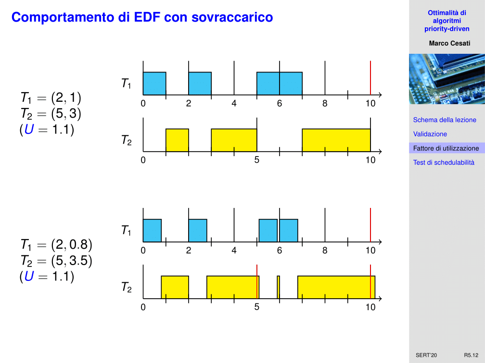

Vediamo un esempio. In questo esempio abbiamo in sistema di 2 task. Il sistema è volutamente sovraccarico. Se io faccio l'utilizzazione totale, abbiamo 1.1, quindi è ovvio che nessun algoritmo riuscirà a rispettare le scadenze. Vediamo però che in questo caso **EDF** manca la scadenza per un job di $T_1$. Se però il sovraccarico si verifica per parametri lievemente differenti, per cui l'utilizzazione totale è ancora 1.1, in realtà **EDF** da un comportamento completamente diverso. Mancano le scadenze non soltanto un certo job di $T_1$, ma anche job di $T_2$. Non c'era modo di prevedere ciò. Se ho un sovraccarico, non sappiamo dire a priori che cosa succederà. Questo per molti sistemi RT può essere un problema, ed è giustificato utilizzare un algoritmo a priorità fissa anche se ha prestazioni inferiori.

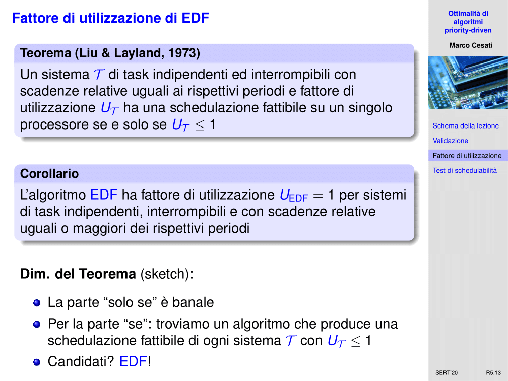

Teorema del 1973. Noi vogliamo dimostrare che effettivamente, se un sistema di job che sono interrompibili, indipendenti, che sono schedulati su un singolo processore, occupa il processore al più al 100%, allora necessariamente esiste una schedulazione che soddisfa le scadenze.

Corollario, dovuto al fatto che sappiamo che **EDF** è ottimale e quindi che se esiste una schedulazione che rispetta le scadenze, allora anche **EDF** lo fa, tutto questo ci porta ad enunciare il seguente corollario: l'algoritmo **EDF** ha un fattore di utilizzazione uguale ad uno, per sistemi di task indipendenti, interrompibili e con scadenze relative uguali o maggiori dei rispettivi periodi. Aggiungiamo che le scadenze possono essere maggiore dei rispettivi periodi, e continua a valere il corollario.

Non facciamo dimostrazioni formali per filo e per segno, ma facciamo degli abbozzi di dimostrazioni, cercando di spiegare perché i teoremi sono veri. Cerchiamo di spiegare perché il teorema è vero. Ovviamente la parte *solo se* è banale. Se ho un sistema di task che occupa il processore più del 100%, ovviamente qualcuno mancherà le scadenze, perché banalmente non ci sarà il tempo per completare tutti i job. 

In realtà quello che cerchiamo di dimostrare è la parte del *se*. Se $U_t \le 1$, allora esiste una schedulazione che rispetta le scadenze. Dobbiamo cercare un algoritmo che produce una schedulazione fattibile di ogni sistema con $U_t \le 1$. Ovviamente il candidato ideale è **EDF**. Non dobbiamo farci ingannare da questo gioco di rimandi. Dobbiamo dimostrare che **EDF** ha fattore di utilizzo uguale a 1. Sfrutto il fatto che è ottimale, cioè che esiste una schedulazione allora lui la trova. E poi dico: *perfetto, quindi se io dimostro che ogni sistema di task che occupa il processore al 100% ha una schedulazione qualunque che rispetta le scadenze, allora ho dimostrato questo teorema e quindi ho dimostrato che $U_t$ è uguale ad 1*. Per dimostrare che ogni sistema di task che occupa il processore al 100% con queste condizioni ha schedulazione fattibile, uso *EDF*. Lo sto usando per dimostrare non per il fattore di utilizzazione direttamente, ma che EDF è in grado di trovare questa schedulazione.

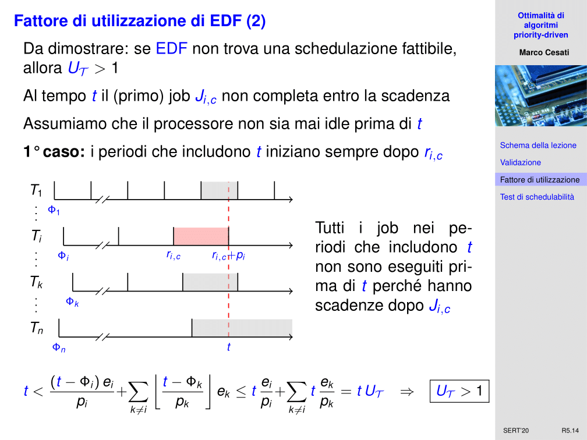

Come si fa? Supponiamo di avere un sistema di task in cui **EDF** non riesce a trovare una schedulazione fattibile, allora posso dimostrare che il fattore di utilizzazione del sistema di task è sicuramente maggiore di 1. E' chiaro, sto cercando di dimostrare l'opposto, la negazione del teorema. Se è $U_t \le 1$ vuol dire che è schedulabile. Se quindi **EDF** non trova una schedulazione fattibile, vuol dire che $U_t > 1$, questo sto cercando di dimostrare. Supponiamo quindi di avere una schedulazione fattibile, quindi in cui effettivamente si possono rispettare le scadenze, ma tale per cui **EDF** non trova questa schedulazione. In realtà ci basta dimostrare che: consideriamo una schedulazione per cui **EDF** non trova il rispetto delle scadenze. Questo cosa significa? Che esiste un job che non rispetta la scadenza.

Supponiamo che sia il primo job che non rispetta la scadenza, $J_{i,c}$, il c-esimo job del task $T_i$. Manca la scadenza al tempo $t$. Le scadenze sono implicite, quindi sono uguali ai periodi, quindi $t$ cade anche sul periodo del task $T_i$. Un'altra semplificazione è assumere che il processore dal tempo 0, in cui ho iniziato ad eseguire il sistema, al tempo $t$ non sia mai rimasto idle. 

Primo caso. Abbiamo $T_i$ che è il task che contiene il primo job che manca la scadenza, e la manca al tempo $t$. Al tempo $t$ cade il periodo del task $T_i$, qui il job che dovrebbe essere eseguito tra $r_{i,c}$ ed il momento del rilascio del job che manca la scadenza. Da $r_{i,c}$ ad $r_{i, c} + p_i$ qui deve eseguire il nostro job ma non riesce a completare entro la scadenza. Il primo cas in cui ci poniamo è il caso in cui i periodi di tutti gli altri task che includono il tempo $t$, mostrati in grigio, iniziano sempre dopo $r_{i,c}$, dunque dopo il rilascio del job di $T_i$ che manca la scadenza.

Siccome stiamo schedulando con **EDF**, vuol dire che le scadenze di tutti i job che vengono rilasciati nei periodi grigi, cioè quelli in cui cade $t$, hanno una priorità inferiore a quello che manca la scadenza. Perché la loro scadenza assoluta è oltre $t$, altrimenti sarebbe un periodo che precede, ed invece no. Questo è il periodo in cui cade $t4$, quindi la scadenza sta dopo. Ma siccome iniziano dopo il rilascio di questo job, non soltanto hanno una priorità inferiore perché, ma anche che non hanno preso nessun tempo di processore. Siccome vengono rilasciati quando il job di $T_i$ che manca la scadenza è stato già rilasciato, non hanno rubato nessun tempo di processore al job che manca la scadenza in quanto la loro priorità è inferiore. A questo punto facciamo il *conto della serva*. Che cosa vuol dire che manca la scadenza? 

Vuol dire che il processore non ce la fa ad eseguire tutto il carico che gli è stato chiesto. Dunque il tempo che passa tra l'istante iniziale e l'istante $t$, in cui si manca la scadenza, questo tempo $t$ è minore di tutto il lavoro da fare. Che cosa è il lavoro da fare? Innanzitutto c'è il lavoro da fare per il task $T_i$, dove c'è il job che manca la scadenza. Quanto devo fare di questo valore? 

- $\phi_i$ è la fase di $i$, il primo rilascio. $t - \phi_i$ è il numero di rilasci del job di job di $T_i$ tra $0$ e $t$. E' un numero multiplo di $p_i$, in quanto il periodo corrisponde a $t$
- Questo numero di rilasci lo moltiplico per $e_i$, il tempo di esecuzione dei job del task di $T_i$

Questo è quanto occupa il task $T_i$ fino al tempo $t$. Quanto occupano tutti gli altri task? Prendiamo il generico task $T_k$. Quanti periodi ci sono?

- $\frac {t - \phi_k} {p_k}$, che generalmente è un numero reale, visto che non è detto che $t$ cadesul confine di $T_k$. Per risolvere questo, ne considero la parte intera inferiore, in quanto la parte che eccede coincide all'ultimo periodo *grigio* in cui il job rilasciato non può aver rubato alcun tempo al processore per il task $T_i$. Dunque qui ha senso prendere la parte intera inferiore. La quantità di lavoro che i task, non $T_i$, occupano sul processore è esattamente parte intera inferiore del valore, moltiplicato ovviamente per il tempo di esecuzione $e_k$

In tutte queste dimostrazioni il gioco è capire se si tratta di un numero intero o reale. Nel secondo caso, considero la parte intera superiore o inferiore? Tutto, molto spesso, si gioca su questo meccanismo. Qui devo prendere la parte intera inferiore, in quanto i job rilasciati nell'intervallo in grigio non posso rubare tempo ai job che mancano la scadenza. Quindi, con un semplice passaggio, possiamo togliere tutte le fasi che sono valori $\ge 0$, e quello che ottengo è ancora $\le$. Posso togliere la parte intera in quanto quello che ottengo è ancora $\le$.

A questo punto, facendo questo maggiorazioni, ottengo che $t$ è strettamente minore di $t \cdot U_t$, ovvero che $U_t >1$. Abbiamo dunque dimostrato che in questo caso, se **EDF** non trova una schedulazione, necessariamente vuol dire che $U_t > 1$.

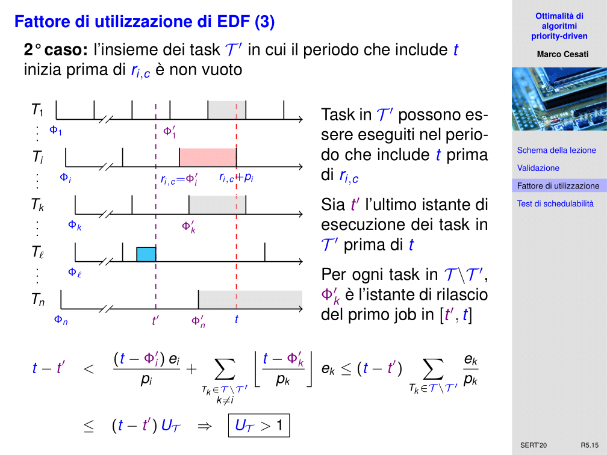

Vediamo il secondo caso, quello in cui esistono un po di task in cui effettivamente il periodo che include $t$ inizia dopo $r_{i,c}$, ma esiste anche un'insieme di task $T'$ in cui il periodo che include $t$ inizia prima, che nel nostro caso sarebbe il task $T_l$. Cosa possiamo fare? Possiamo dire: *però, di fatto, siccome $t$ cade dentro questo periodo, la priorità di questo job dentro $T_l$, ovvero dentro tutti i task di questo insieme $T'$, è comunque inferiore alla priorità del job che manca la scadenza. Quindi possono essere eseguiti soltanto prima che venga rilasciato il job all'istante $r_{i,c}.$*

Dunque i task in $T'$ possono essere eseguiti nel periodo che include $t$ soltanto prima di $r_{i,c}$. Non possono essere eseguiti dopo, in quanto l'algoritmo a priorità assegnerà una priorità più alta al job di $T_i$. Quindi posso definire un'istante $t'$ che è l'ultimo istante di esecuzione dei task di $T'$ prima di $t$. Tra tutti i task $T'$, che hanno il periodo che include $t$ che inizia prima di $r_{i,c}$, posso definire l'ultimo momento in cui viene eseguito uno di questi task, e lo chiamo l'istante $t'$. Poi applico il discorso precedente all'intervallo $[t', t]$. Chiamo $\phi'_k$ l'istante di rilascio del primo job tra l'intervallo $[t',t]$. Tutti i task in $T'$ contribuiranno 0 all'occupazione del processore in $[t', t]$, perché la loro scadenza sta oltre $t$. Fondamentalmente li posso non contare, e conto solo quelli che occupano il processore tra $t'$ e $t$ e rifaccio il discorso di prima, dove al posto dei $\phi$ ci stanno i $\phi'$.

Fondamentalmente ci riconduciamo al caso precedente, semplicemente considerano l'ultimo istante in cui i task $T'$ hanno eseguito. Questo da la dimostrazione. Dunque abbiamo dimostrato che se l'algoritmo **EDF** manca la scadenza, cioè non riesce a schedulare in modo che tutti rispettano le scadenze, nelle ipotesi di task interrompibili, indipendenti e con singolo processore, è perché la somma totale di tutte le utilizzazioni dei task è maggiore di 1. Quindi se l'utilizzazione totale dei task è minore o uguale di 1, **EDF** riesce a schedulare. Se l'utilizzazione totale di tutti i task è minore o uguale di 1 esiste un algoritmo di schedulazione che rispetta le scadenze. Quindi, **EDF** che è ottimale, rispetta le scadenze ed ha fattore di utilizzazione uguale ad 1. 

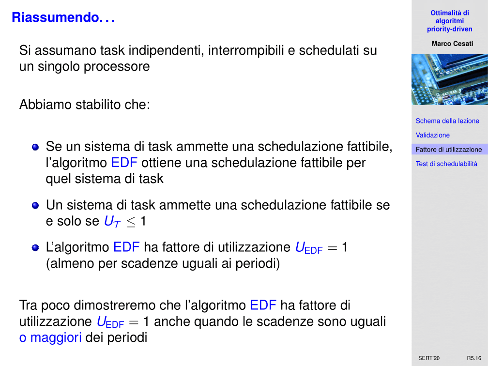

Riassumendo, abbiamo task indipendenti, interrompibili e schedulati sul singolo processore. Se un sistema di task ammette una schedulazione fattibile, **EDF** ottiene una schedulazione fattibile per quel sistema di task. Se un sistema di task ammette una schedulazione fattibile, allora la sua utilizzazione totale $U_t \le 1$, ma è vero anche il viceversa. Quindi, il fattore di utilizzazione di **EDF** è uguale ad 1, almeno per le scadenze uguali ai periodi. Tra un'istante potremo dimostrare che l'algoritmo **EDF** ha fattore di utilizzazione uguale ad 1 anche quando le scadenze sono maggiori o uguali ai periodi.

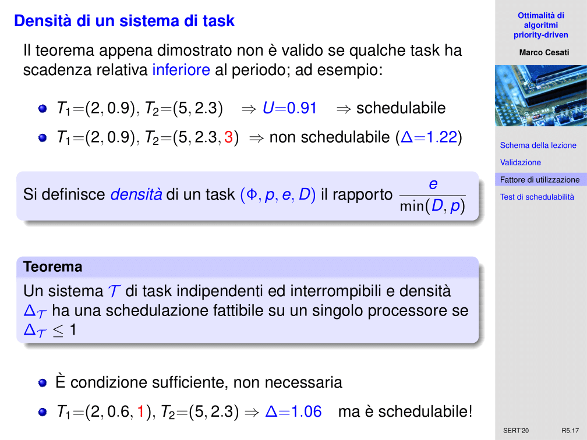

Che succede se non vale l'ipotesi per cui le scadenze relative sono almeno uguali ai periodi? Se qualche scadenza relativa è inferiore al periodo, tutto questo non vale. Abbiamo due task, con utilizzazione $U = 0.91$, quindi schedulabile. Se però dico che $T_2$ deve avere scadenza non più entro 5 ma entro 3, allora non riesco più a rispettare le scadenze, non c'è modo.

Come possiamo fare a capire, avere una dimostrazione, che questo succede? Quello che siamo interessati a fare è una dimostrazione che anche se le **densità** sono inferiori al periodo, le scadenze potranno essere rispettate. Per fare questo introduciamo il concetto di **densità** del task. E' il rapporto $\frac {e} {min (D, p)}$, dove $D$ è la scadenza relativa del task. Se la scadenza relativa è maggiore o uguale del periodo, allora la densità coincide con l'utilizzazione. Ma se la scadenza relativa è inferiore al periodo, allora la densità non è l'utilizzazione, ma è un numero più grande.

**Teorema.** Un sistema di task indipendenti, interrompibili e densità $\Delta_T$ ha una schedulazione fattibile su un singolo processore se $\Delta_T \le 1$.

*Questo teorema è una condizione sufficiente, non necessaria.* Ad esempio, qui la densità è 1.06 e non rispetta la condizione del teorema. Eppure, se vado a vedere, esiste una schedulazione che rispetta le scadenze per questo sistema di task. Non è vero che se la densità è $> 1$ il sistema non è schedulabile. Era vero per l'utilizzazione, quando le scadenze erano implicite o maggiori o uguali al periodo. Ma non è vero per la densità. Ci sono sistemi di task con densità maggiore di 1 che continuano ad essere schedulabili. Dobbiamo però leggere questi risultati in ottica di validazione. Se io costruisco un sistema in cui la densità dei task è minore o uguale di 1 allora sono sicuro che rispetterà le scadenze. E questo è quello che conta. Il fatto che possa costruire dei sistemi che hanno una densità maggiore di 1 e che continuano ad essere schedulabile, può essere interessante ma non è molto utile, perché fondamentalmente non ho un risultato analitico che mi dica quale di questi sistemi è schedulabile e quale no. Io sono interessato a dire che se questa condizione è rispettata, sicuramente rispetterò le scadenze, quindi rispetterò la condizione e vado sul sicuro. Quello che mi interessa di questi teoremi è la condizione sufficiente.

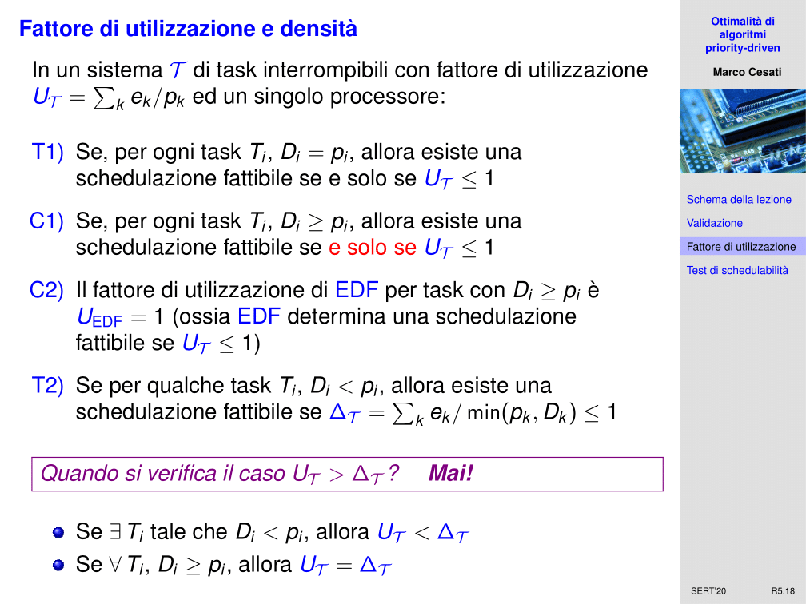

In un sistema di task interrompibili, con fattore di utilizzazione $U_t$ ed un singolo processore:

1. Se le scadenze sono implicite, quindi $D_i = p_i$ allora esiste una schedulazione fattibile se e solo se $U_t \le 1$
2. Se per ogni task la scadenza relativa $D_i \ge p_i$, allora esiste una schedulazione fattibile se e solo se $U_t \le 1$ 
   1. Questo in realtà dobbiamo ancora dimostrarlo. In realtà la parte se è facile, in quanto ci sta dicendo che l'utilizzazione totale è minore o uguale ad 1, quindi tutto il sistema di task sarà schedulato in un modo che tutti i job completano entro il periodo, perché valeva per le scadenze implicite. Ma se la scadenza è maggiore o uguale del periodo allora varrà a maggior ragione per il sistema di task inh cui le scadenze sono oltre il periodo. Quindi la parte se è facile. Il problema è il **solo se**, che va dimostrato.
   2. Vogliamo dire che il fatto che le scadenze siano oltre i periodi, non ci consente comunque di caricare un processore più del 100%. Anche se le scadenze sono sopra ai periodi. Questa cosa in realtà va dimostrata in modo formale, e lo facciamo tra un attimo
3. Il fattore di utilizzazione di **EDF**, per task con $D_i \ge p_i$ è uguale ad 1, $U_{EDF} = 1$. Se il sistema di task ha un'utilizzazione totale al massimo uguale ad 1, **EDF** riesce a trovare una schedulazione fattibile.
4. Se per qualche task la scadenza relativa è strettamente inferiore al periodo, $D_i < p_i$, non possiamo più parlare di utilizzazione ma si parla di densità. Esiste una schedulazione fattibile se la densità totale $\Delta_t \le 1$. 

Quando si verifica il caso che $U_t > \Delta_t$? Mai. Perché se esiste il caso in cui la scadenza relativa è minore del periodo, allora ovviamente per necessità il fattore di utilizzazione è strettamente minore della densità. Mentre se, all'opposto, per tutti i task la scadenza relativa è maggiore o uguale del periodo allora banalmente la densità e l'utilizzazione sono uguali. Dunque in nessun caso l'utilizzazione sarà maggiore della densità.

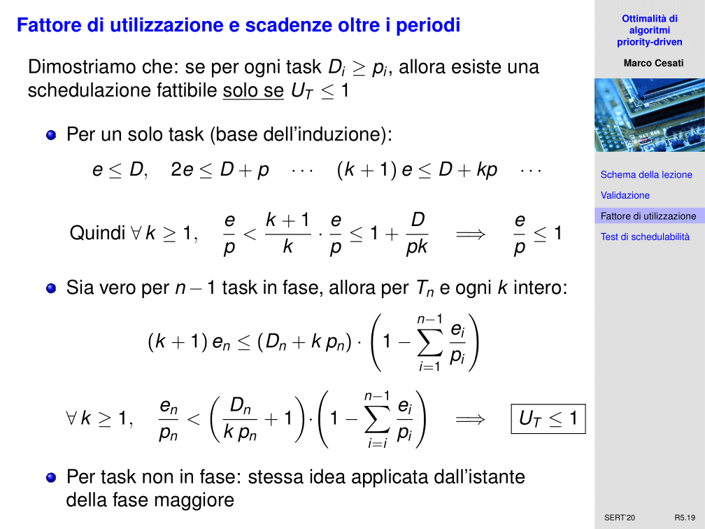

Vediamo di dimostrare questa cosa che ci manca. vogliamo dimostrare che se per ogni task la scadenza relativa è maggiore o anche uguale al periodo, allora esiste una schedulazione fattibile soltanto se $U_t \le 1$. In altri termini, che se $U_t > 1$ allora necessariamente non si potrà avere una schedulazione che rispetta le scadenze. Come lo dimostriamo? Anche questa è una bozza, che in realtà non troviamo sul libro di testo, l'ha inventata il professore. La facciamo per induzione. Cominciamo a ragionare su un singolo task. Questo task ha una scadenza oltre il periodo. Ci possiamo permettere quindi che abbia anche un'utilizzazione $\frac e p$ maggiore di 1? A prima vista uno direbbe di si, perché tanto, nel momento in cui vado oltre il periodo, in realtà la mia scadenza è ancora oltre, quindi fondamentalmente quello che è sufficiente è che il tempo di esecuzione sia minore o uguale della scadenza relativa. Però in realtà io questo discorso devo poterlo applicare anche al secondo job di quel task, che deve anche lui terminare entro la sua scadenza assoluta. E quindi la distanza che c'è tra $0$ e la scadenza assoluta del secondo job, quanto è? E' $p$, tempo di rilascio del secondo job, + $D$ scadenza relativa di questo task.

$D + P$ deve essere maggiore o uguale del tempo che impiego per eseguire non più un job, ma due, il primo ed il secondo. Questa cosa la posso iterare, la debbo iterare, per tutti gli infiniti job del task. Posso scrivere che $(k+1)-volte\ e$ deve essere minore o uguale di $D$, scadenza relativa, più $k-volte$ il periodo per ogni $k$. Ma questo quindi, cosa significa? Significa che se scriviamo $\frac e p$ e fissiamo un $k$ qualunque, possiamo scrivere la disuguaglianza sulle slide ed alla fine otteniamo $\frac e p \le 1$. Con un solo task ed era quello che volevamo dimostrare. Questa è la base dell'induzione. In realtà, data per assunto che sia vero per $n-1$ task, allora quello che posso dire è che per $T_n$ e per ogni $k$ intero posso dire che

- $(k+1)e_n$
  - Per poter eseguire $k+1$ job del task $T_n$ mi occorre un tempo che deve essere minore o uguale di cosa?
- $D_n + k p_n$
  - Della scadenza assoluta del $k+1-esimo$ job di $T_n$
- A questo punto il processore non è tutto per me, in quanto deve eseguire gli altri $n-1$ task precedenti che per ipotesi induttiva possiamo dire che occupano un tempo che è la sommatoria nella slide

A questo punto, stesso discorso di prima, ed arrivo al risultato per cui $U_t \le 1$. Al di la dei dettagli della dimostrazione che non sono difficili, l'idea è quella di avere l'idea intuitiva. Quale è? Ho delle scadenze relative che sono oltre il periodo. Ma il problema è che se io sfrutto il fatto che le scadenze relative sono oltre il periodo, vuol dire che nei periodi successivi io comincierò a poter eseguire i job rilasciati in quel periodo un po oltre i loro periodi, perché un po del tempo di quel periodo me lo sono mangiato perché l'utilizzazione precedente è andata oltre, cioè andava oltre il periodo. E questa cosa, io posso avere anche una scadenza che è mille volte più grande del periodo, ma è comunque una dimensione finita. E siccome i miei task vanno avanti all'infinito, ogni volta che rilascio un task io mi mangio un pezzettino di quel vantaggio che avevo, ed alla fine arriverò ad un task che mancherà la scadenza. Questa è l'idea della dimostrazione riformulata in maniera formale, ma l'idea è che qualunque sia la quantità, andando avanti con il rilascio dei job quel vantaggio me lo sono mangiato e quindi mancherò la scadenza.

Quindi quello che possiamo dire è che il risultato sul fattore di utilizzazione $U_t \le 1$ vale anche, non solo per le scadenze implicite, ma anche quando queste sono maggiori o uguali al periodo. Se i task non sono in fase si può complicare la dimostrazione, applicarla dall'istante della fase maggiore ecc.

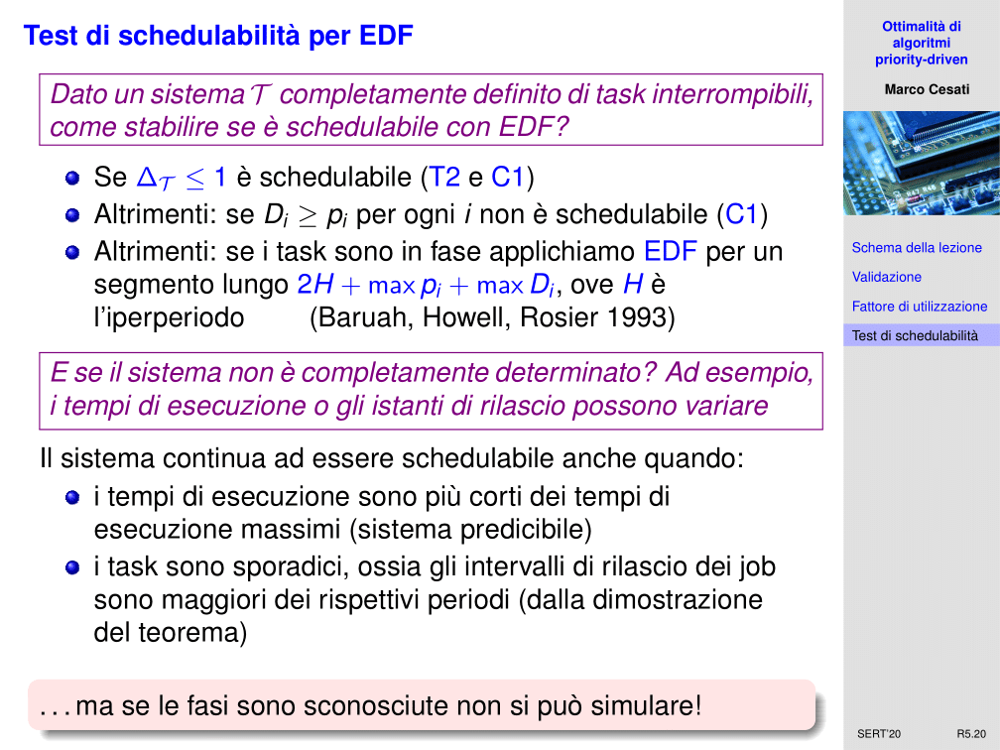

Ricapitolando. Se abbiamo un sistema di task, completamente definito, cioè conosiamo tutti i parametri temporali, ed i task sono interrompibili, un solo processore, indipendenti ecc. Come facciamo a stabilire se è schedulabile con **EDF**?

1. Vediamo la densità, o se sappiamo che le scadenze sono implicite, vediamo l'utilizzazione. Se $\Delta \le 1$ è schedulabile
2. Altrimenti: se $D_i \ge p_i$, in realtà sappiamo che questa densità è uguale all'utilizzazione, ma se l'utilizzazione è maggiore di 1 allora non è schedulabile
3. Altrimenti: se i task sono in fase applichiamo **EDF** per un segmento lungo $2H + max\ p_i + max\ D_i$ ove $H$ è l'iperperiodo. Se simulo per questo tempo ed **EDF** rispetta sempre le scadenze, allora posso concludere che tutti rispetteranno le scadenze

Qual'è il problema? Che il mio sistema di task potrebbe non essere completamente determinato. Potrei non avere tutte le informazioni necessarie per simulare. 

- Posso avere che i tempi di esecuzione non sono fissati, o che gli istanti di rilascio non sono fissati. In quel caso che simulo? Se i tempi di esecuzione sono più corti, questo non è un problema perché il sistema in queste condizioni è **predicibile**.
- D'altra parte, se i task sono sporadici, cioè i periodi non sono esatti ma gli intervalli minimi, d'accapo posso applicare tutto quello visto prima e dimostrare ancora che vale la schedulabilità ed il risultato che trovo

Ma se altri parametri come le *fasi* sono sconosciuti, a quel punto non c'è niente da fare. Non posso simulare perché dovrei simulare il sistema per ogni possibile fase, cosa impossibile. La simulazione quindi in questo caso non si può fare, se ho incertezza sulle fasi. Possiamo dire qualcosa di più se le fasi sono sconosciute? Possiamo avere un risultato analitico?

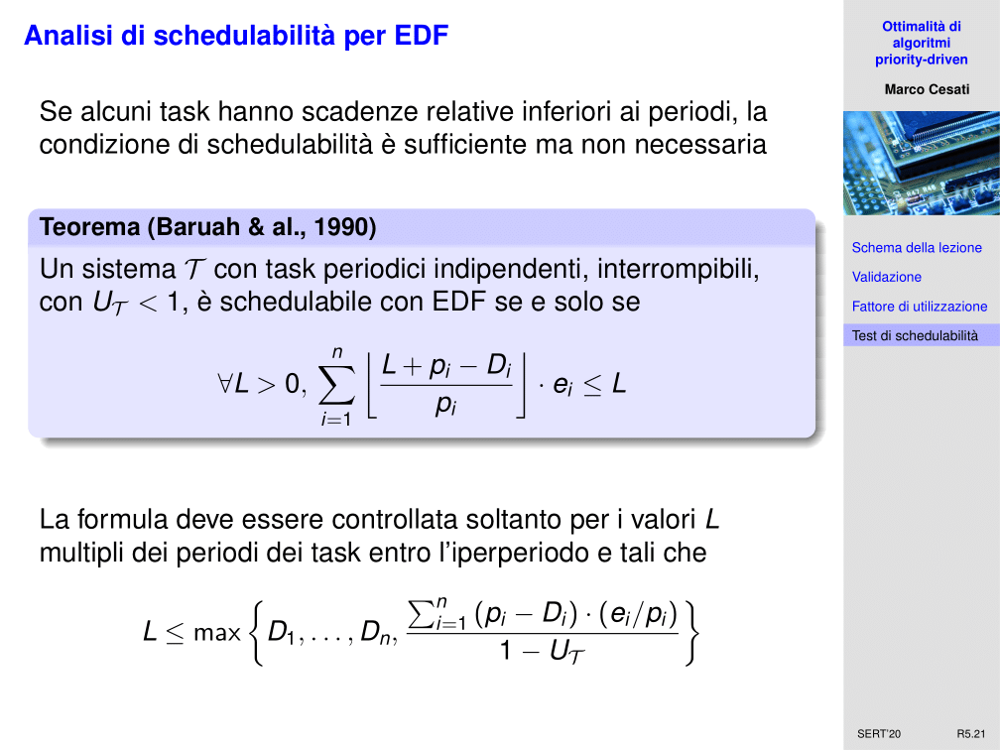

In realtà possiamo fare una così detta analisi di schedulabilità. Sappiamo che la condizione di schedulabilità sulla densità p una condizione sufficiente e non necessaria. In realtà posisamo fare un'analisi più precisa, in cui il risultato ci da una condizione necessaria e sufficiente. Si tratta del tel teorema del '90 e dice che se ho un sistema di task periodici, indipendenti, interrompibili, con un singolo processore e con $U_t < 1$, è schedulabile con **EDF** se e solo se per ogni valore di $L > 0$, la sommatoria su tutti i task di $L$ + il periodo del task meno la scadenza relativa, tutto diviso il periodo del task di cui prendo la parte intera inferiore e moltiplico per $e_i$, deve essere minore o uguale di L. Se questo è vero per qualunque valore di L allora è schedulabile. Se per qualunque valore di L questo non è vero, allora il sistema di task non è schedulabile con **EDF**.

Ovviamente quando applico questo teorema in pratica non devo controllare infiniti valori di L, ma ne posso controllare soltanto un numero finito. Sono tutti i valori multipli del periodo dei task che sono dentro l'iperperiodo tali comunque che è minore del valore massimo che è possibile ottenere sfruttando la formula sulle slide.